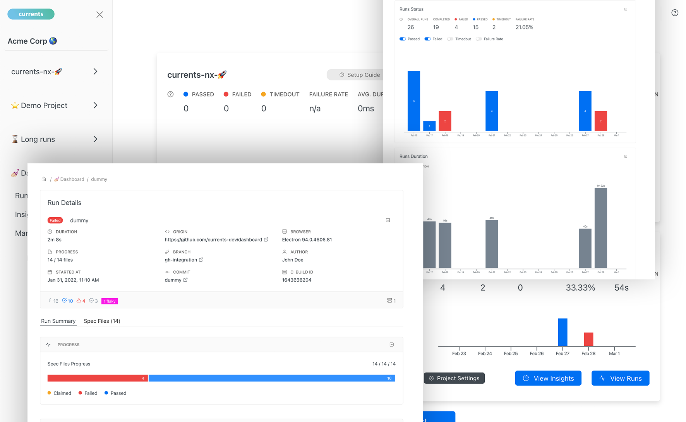

# What is Currents?

Currents is a cloud service for running, troubleshooting and analyzing cypress tests in scale for affordable price.

.png>)

With Currents, you can run your cypress tests in parallel on CI provider of your choice, browse test recordings and screenshots via Currents dashboard, analyze your historical tests performance.

Currents is #1 alternative to Cypress Dashboard and is based on the popular open-source project [Sorry Cypress](https://sorry-cypress.dev).

<meta name="google-site-verification" content="kSDA0cUG2qptzH6TZyk0Dhm5VqI8Ce7gz1U9l3o-K-Y" />
