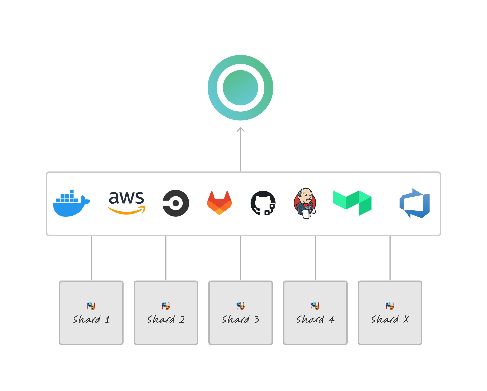
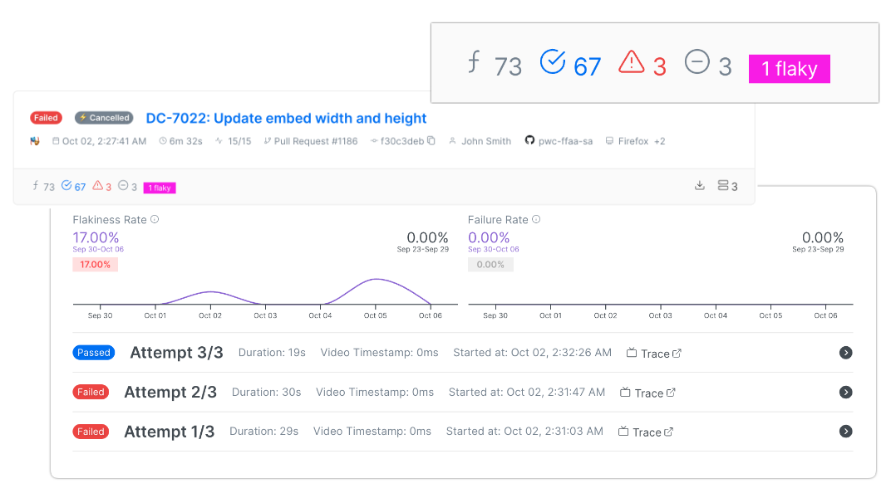

# What is Currents?

Currents is a cloud reporting service compatible with Playwright and Cypress. It helps QA and software teams with debugging, troubleshooting, and analyzing their parallel CI tests.

<figure><figcaption>
Currents Dashboard - debug, troubleshoot and analyze their parallel CI Playwright and Cypress CI tests.
</figcaption></figure>

With Currents, you can run your tests in parallel on the CI provider of your choice. Currents will collect the test results, distributed between multiple parallel machines, for further investigation and collecting analytics. Currents unlocks running and orchestrating parallel Cypress tests and also is compatible with Playwright native sharding.

<figure><figcaption>
Currents is a CI-agnostic service to collect results of parallel e2e tests
</figcaption></figure>

Currents provides convenient access to troubleshooting tools and artifacts, such as:

* Screenshots
* Videos
* Console logs
* Playwright Traces

combined with test reports that detect flakiness and provide contextual information like test execution history, duration, and top errors. This helps your engineering team better manage and fix CI failures and flaky tests with more efficiency.


Currents help to debug failed and flaky CI E2E tests


<figure><figcaption>
Currents - detecting flakiness
</figcaption></figure>

Currents helps software teams to manage their test suite beyond a single failure. It collects and aggregate test results, providing actionable and fine-tuned insights. QA Engineers, software team leads and directors can use Currents reports to drive organization-wise testing-related goals.

<figure><figcaption>
Currents - actionable analytics and insights
</figcaption></figure>

Currents is the #1 alternative to Cypress Dashboard and a Playwright Reporting tool based on the popular open-source project [Sorry Cypress](https://sorry-cypress.dev/). We help hundreds of companies of different sizes - startups and enterprises - to manage their test suite, providing high-quality support and ever-evolving solutions.

<figure><figcaption>
Currents has been helping hundreds of companies - startups and enterprises
</figcaption></figure>
