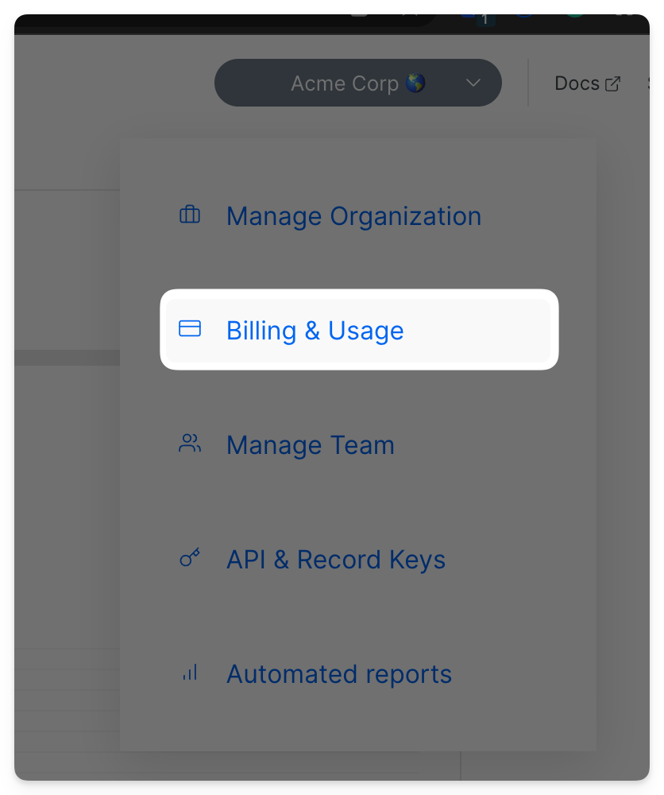
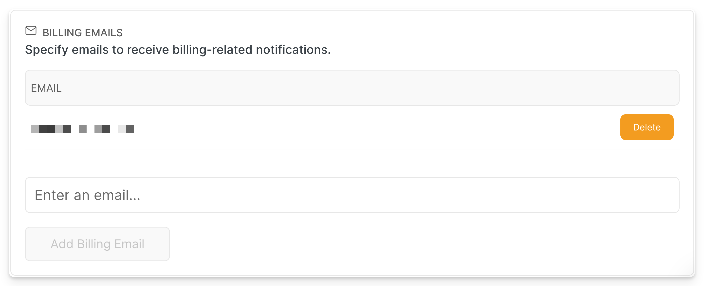
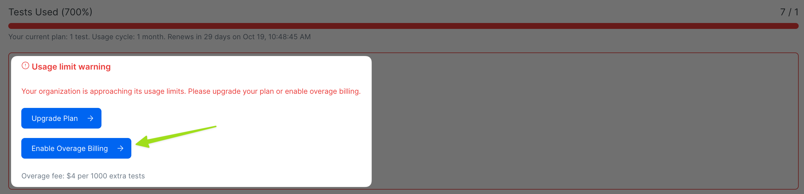

# Billing & Usage

The Billing and Usage view is accessible by accessing the org management menu - click on **Organization > Billing & Usage.** Within the Billing & Usage view, you can explore the organization's usage and plan limits, and manage the subscription and billing email recipients.

### Billing Emails

You can add recipients for billing-related notifications:

* notification about successful payments
* alerts about non-successful payments
* invoices and receipts

Please note, that billing notifications are different from operational notifications (by default operations notifications are being sent to all the members with Admin rol)

In order to add additional recipients, navigate to **Organization > Billing & Usage.** Then add a new email in the **Billing Emails** section:

<figure><figcaption>
Adding additional recipients for Billing Emails
</figcaption></figure>

### Usage Information

The Billing & Usage view displays the Usage section with a daily/monthly breakdown of the recorded tests.&#x20;

The usage includes a [<mark style="color:blue;">**Failed**</mark>](../tests/test-status.md) or [<mark style="color:orange;">**Passed**</mark> ](../tests/test-status.md)test recorded to Currents Dashboard. Retries of the same test are considered a single test result, therefore, a [<mark style="background-color:purple;">**Flaky Test**</mark>](../tests/test-status.md) counts as one record, regardless of the number of attempts.


Skipped tests `it.skip` do **not** count towards usage for billing purposes


**How to estimate your test usage**

To estimate your test volume, count all your `it` statements and multiply by your provider's average number of CI runs.

The usage is aggregated **hourly** to allow precise reporting and calculation of recorded tests.

#### Usage Information filters

You can filter usage by period and view all past billing cycles. Moreover, you can filter by **tests** or **runs**. Most customer contracts are metered by **runs**.&#x20;

<figure><figcaption>
Example - Usage history chart and filters
</figcaption></figure>

#### Usage per project

If you click **Show Usage Details**, you can see a breakdown of all recorded tests and runs per project created within your organization account.&#x20;

<figure><figcaption>
Usage per Project
</figcaption></figure>

### Extra Usage Plans

If you are still determining how many tests you need per month or if your usage is seasonal, Currents offers extra usage plans in addition to your test package. These extra usage plans offer customers more flexibility to run tests when needed.

When you reach the test limits, Currents will send you an email notification informing you of the activation of the extra usage plan. You also can see the extra recordings progress on the **Usage Information**:

<figure><figcaption>
Example - Extra usage activated
</figcaption></figure>

At the end of the monthly cycle, the billing will include the additional usage recorded. In the case of annual plans, Currents will send a separate bill with the extra tests.&#x20;

The cost for extra recordings ranges and depends on your plan. For detailed pricing information, please check our [**pricing page**](https://currents.dev/#pricing). If you have any questions or concerns, please don't hesitate to contact us via _support@currents.dev_ or our in-app support chat.

### Legacy Plans

Our legacy plans (created before April 2023) do not have extra usage enabled.

When legacy plan subscribers reach the usage limits, our system automatically increases the quota by **10%** to safeguard your usage. Then, you will get emails from our automated system with warnings, asking you to upgrade your subscription or activate an extra usage plan.&#x20;

You can activate an extra-usage or upgrade the plan in **Billing & Usage** section:

<figure><figcaption>
Enabling Extra Usage for Legacy Plans
</figcaption></figure>

If upgrading is not an option, you can contact us via _support@currents.dev_ or our in-app support chat to activate an extra usage plan to accommodate your increased usage needs.

Please remember that if you surpass your usage limits, Currents will cease recording tests on your organization dashboard. To avoid service interruption, don't hesitate to contact us to activate an extra usage plan or explore subscription upgrades. We're always here to help!
