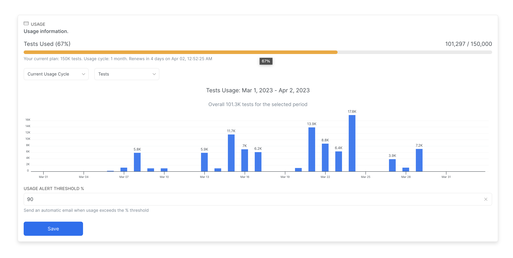

# Billing & Usage

The Billing and Usage view is accessible by accessing the org management menu - click on **Organization > Billing & Usage.** Within the Billing & Usage view, you can explore the organization's usage and plan limits, and manage the subscription and billing email recipients.

### Billing Emails

You can add recipients for billing-related notifications:

* notification about successful payments
* alerts about non-successful payments
* invoices and receipts

Please note, that billing notifications are different from operational notifications (by default operations notifications are being sent to all the members with Admin rol)

In order to add additional recipients, navigate to **Organization > Billing & Usage.** Then add a new email in the **Billing Emails** section:

<figure><figcaption>
Adding additional recipients for Billing Emails
</figcaption></figure>

### Usage Information

The Billing & Usage view displays the Usage section with a daily/monthly breakdown of the recorded tests.&#x20;

The usage includes a [<mark style="color:blue;">**Failed**</mark>](../tests/test-status.md) or [<mark style="color:orange;">**Passed**</mark> ](../tests/test-status.md)test recorded to Currents Dashboard. Retries of the same test are considered a single test result, therefore, a [<mark style="background-color:purple;">**Flaky Test**</mark>](../tests/test-status.md) counts as one record, regardless of the number of attempts.

If you want to estimate your test volume, count all your `it` statements and multiply by your provider's average number of CI runs.

<figure><figcaption>
Example usage history chart
</figcaption></figure>

