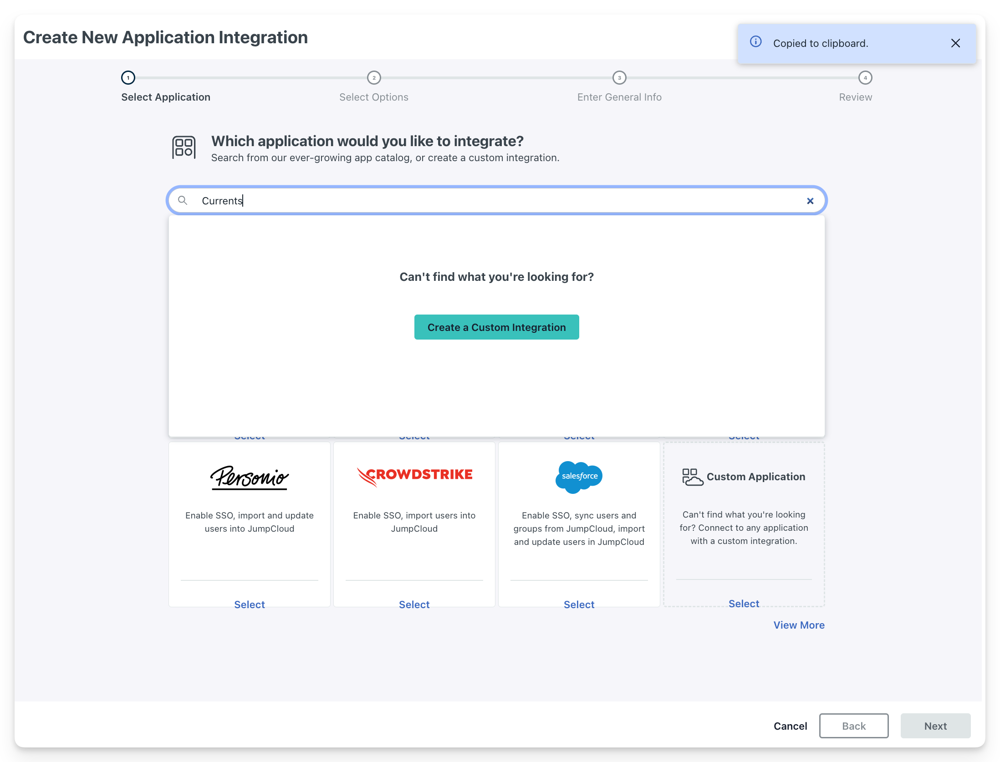

# JumpCloud


Enabling SSO will affect all users of your organization, users would not be able to sign in to Currents using a different authorization method when SSO is enabled.


### Supported Features

* SP-initiated SSO (Single Sign-On)
* Just-In-Time provisioning
* [scim-user-provisioning.md](../../dashboard/administration/sso-saml2.0/scim-user-provisioning.md "mention")

### Setup Steps



Create a new SSO Application: **User Authentication  > SSO Applications > + Add New Application.**&#x20;

Type **Currents** and then click **Create a Custom Integration > Next**

<figure><figcaption><p>Creating Custom SSO Integration</p></figcaption></figure>



Choose Integration Options

* ✅ Select **Manage SSO** + **Configure SSO with SAML**
* ✅ **Export user to this app**
* Click **Next**, set **Integration Name,** then click **Create Application**

<figure><figcaption><p>Creating Custom JumpCloud SSO Integration</p></figcaption></figure>



Configure SSO Settings

* Fill in the fields according the values defined in [saml2.0-configuration.md](../../dashboard/administration/sso-saml2.0/saml2.0-configuration.md "mention")
  * SP Entity ID
  * ACS URL
  * SAMLSubject NameID
  * SAMLSubject NameID Format
  * Signature Algorithm: RSA-SHA256
  * Login URL: you will be able to define the login URL after Currents support team activated the integration. See [idp-initiated-sessions.md](../../dashboard/administration/sso-saml2.0/idp-initiated-sessions.md "mention").
  * Attributes: `email` and `fullname`
*   Click **Export Metadata,** ensure **t**he generated metadata XML has `HTTP-POST` and `HTTP-Redirect` bindings, for example:

    ```
    <md:SingleSignOnService
        Binding="urn:oasis:names:tc:SAML:2.0:bindings:HTTP-POST"
        Location="https://sso.jumpcloud.com/saml2/currents"
    />
    <md:SingleSignOnService
        Binding="urn:oasis:names:tc:SAML:2.0:bindings:HTTP-Redirect"
        Location="https://sso.jumpcloud.com/saml2/currents"
    />
    ```



### Done

* Share the Metadata XML file together with other details appearing in [saml2.0-configuration.md](../../dashboard/administration/sso-saml2.0/saml2.0-configuration.md "mention") with Currents support team to active the SSO.
* Assign users or groups to the newly created SSO application
* Set Login URL after Currents support team activated the integration. See [idp-initiated-sessions.md](../../dashboard/administration/sso-saml2.0/idp-initiated-sessions.md "mention").


