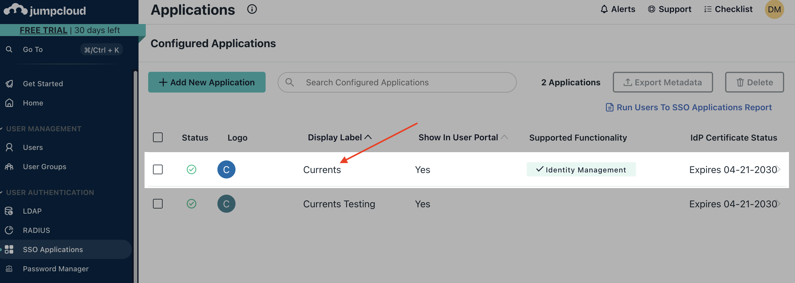
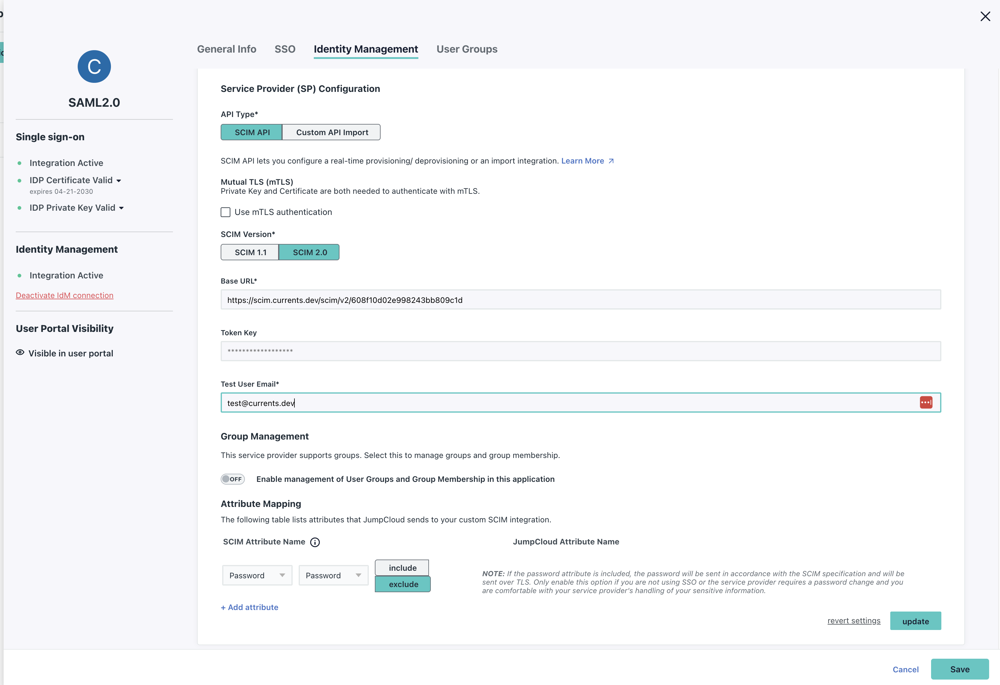
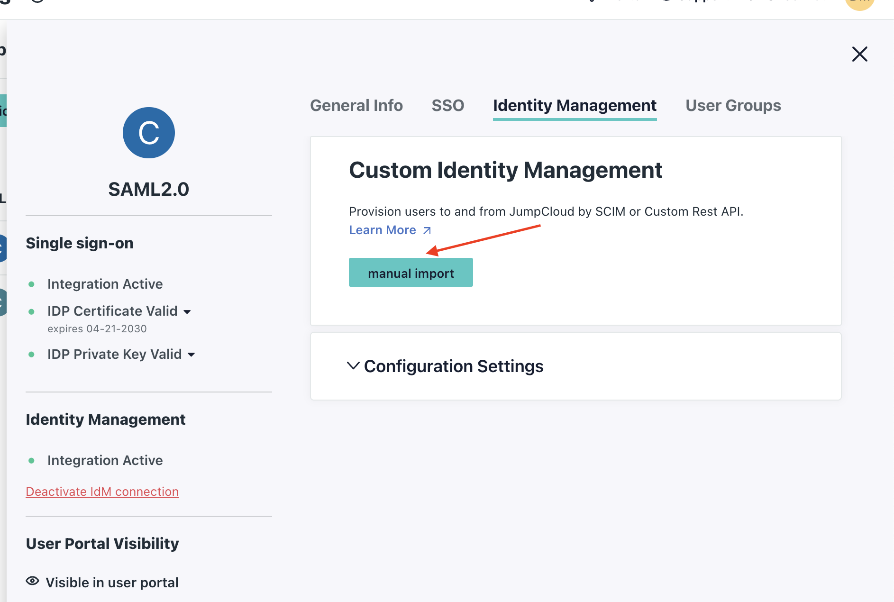

# JumpCloud User provisioning

## Supported features 

* **Create users -** JIT provisioning when they first login to Currents.
* **Update user attributes -** accept name updates for users.
* **Deactivate users - p**revents the user from logging into Currents, deactivated users are removed from the Currents team member list.
* **Import users -** Link your existing Currents users to their JumpCloud user.

For more information on the listed features, visit the [JumpCloud Support Page](https://jumpcloud.com/support/provision-and-manage-users-and-groups-in-apps-using-custom-scim-identity-management-integration).

## Requirements 

Provisioning is available for customers with an active subscription.

In order to setup provisioning you first need to:

* Setup the SAML integration with [.](./ "mention")
* Reach out to the Currents support team to have provisioning enabled for your organization.

## Configuration Steps 

#### Currents Configuration

* Login as an Admin and navigate to the **Manage Team** page.

<figure><figcaption>
Navigate to the Manage Team page
</figcaption></figure>

* Click the **Show SCIMv2 Details** button in the **DOMAIN ACCESS & SSO** section of the page.

<figure><figcaption>
Getting the SCIM details from the Manage Team page
</figcaption></figure>

* Note the **Endpoint** and **Token** details for JumpCloud Configuration

### JumpCloud Configuration

*   Navigate to the existing Currents SSO Application in JumpCloud **USER AUTHENTICATION** > **SSO Applications**. Click on the Currents SSO Application you previously setup.

    <figure><figcaption>
Navigate tot he Currents App
</figcaption></figure>
* Select the **Identity Management** tab. Then provide the **Base URL** (Endpoint) and **API Token** information from Currents. Also enter a **Test User Email** that does not already exist in Currents.
* Click **Test Connection** and verify it was successful.
* Toggle off **Group Management** and click **Activate** to verify the [default mappings](https://jumpcloud.com/support/provision-and-manage-users-and-groups-in-apps-using-custom-scim-identity-management-integration#custom-scim-user-attributes).
* If everything was succeful, click **Save**

<figure><figcaption>
Configure and Test the API Credentials
</figcaption></figure>

* Navigate to the Current SSO App again, and back into the **Identity Management Tab**
* Use the **manual import** button to find your existing Currents accounts

<figure><figcaption>
Import Users
</figcaption></figure>

* Your existing users should have been auto-matched based on email. If there are any additional Currents users that failed to be matched, you can import them from the import screen. (See [JumpCloud's Importing Users Guide](https://jumpcloud.com/support/provision-and-manage-users-and-groups-in-apps-using-custom-scim-identity-management-integration#importing-users))

## Known Issues/Troubleshooting

#### Unsupported Features

The Currents User Provisioning does not support the following JumpCloud Identity Management features:

* Group Management
* Sync password

#### Limited profile attributes updates

Currents does not accept updates to the following attributes:

* **userType** - changing a user's role is only supported from the Currents team member dashboard
* **userName** - the mapped userName must match the primary email
* **email** - the primary email cannot be changed

#### Username errors on import

JumpCloud attempts to use the first part of the email as the username when importing new users from Currents.  (eg, `andrew@currents.dev` becomes `andrew` )

If your users have a `+` character in their email, the import will fail. To workaround, first create the user in JumpCloud, then sync them with Currents. JumpCloud and Currents will sync based on the user email.

#### User Activation Error

When setting up Identify Management in JumpCloud, you must use a new user as the test email, otherwise you get errors during the test. This is referenced in [JumpCloud's SCIM Important Considerations](https://jumpcloud.com/support/provision-and-manage-users-and-groups-in-apps-using-custom-scim-identity-management-integration).
