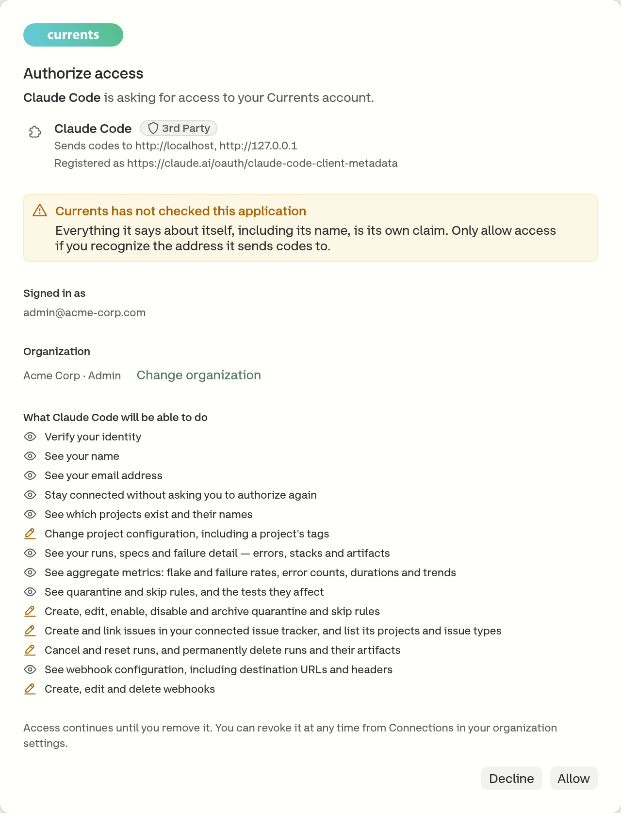
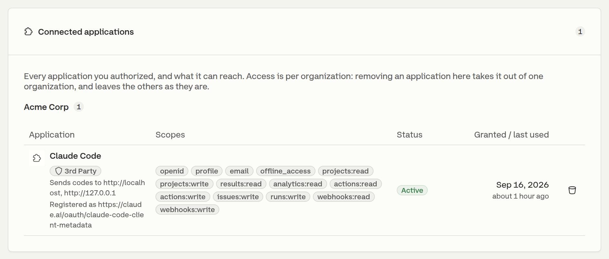
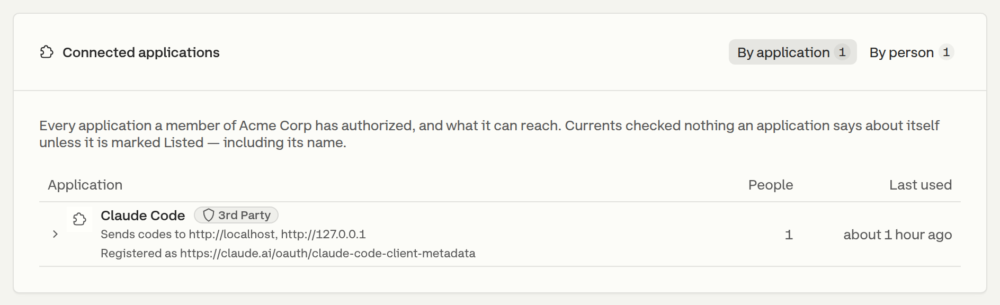

# Remote MCP Server

Currents hosts the MCP server at `https://api.currents.dev/mcp`. A client points at that URL and connects: there is no package to install, no local process to keep alive, and - in a client that supports OAuth - no key to paste into a configuration file.

It serves the same tools as the [`@currents/mcp`](mcp-server.md) package that runs locally over stdio. What differs is where the server runs and how a caller proves who it is.

|                | Remote - `api.currents.dev/mcp`                       | Local - `@currents/mcp`                     |
| -------------- | ----------------------------------------------------- | ------------------------------------------- |
| Runs           | Hosted by Currents                                    | On the developer's machine                  |
| Transport      | Streamable HTTP                                       | stdio                                       |
| Credentials    | OAuth access token, or an API key                     | API key only                                |
| Acts as        | The person who authorized it, in one organization     | The organization the key belongs to         |
| Tool list      | The tools the connection's scopes reach               | Every tool                                  |
| Stays current  | Ships with Currents                                   | Re-fetched by the client on each start      |

**OAuth is the remote endpoint only.** The published npm package authenticates with `CURRENTS_API_KEY` and nothing else, and none of the scope-based behavior below applies to it.

## Connect with OAuth

A connection made this way acts as the person who authorized it, inside the one organization they picked, and carries only the permissions they consented to. Nothing is stored in the repository, and an administrator can revoke it from the dashboard.



```bash
claude mcp add --transport http currents https://api.currents.dev/mcp
```

Then run `/mcp` and choose **Authenticate**, which opens the browser. On a headless machine, `claude mcp login currents --no-browser` prints the authorization URL instead and takes the redirect URL back.



Any client that speaks Streamable HTTP and identifies itself with a [Client ID Metadata Document](https://datatracker.ietf.org/doc/draft-parecki-oauth-client-id-metadata-document/) can complete the flow against `https://api.currents.dev/mcp`. Currents does not accept dynamic client registration, so a client that has only that way of identifying itself reports something like `does not support dynamic client registration` and has to use an API key instead.



The browser then walks through three screens.

**1. Sign in.** Only if there is no dashboard session already in that browser.

**2. Choose an organization.** An access token is bound to one organization, and every tool call the connection makes acts inside it. The screen lists the organizations the signed-in account belongs to, with the role held in each, and states the access level that role allows.

<figure><figcaption><p>A token reaches one organization - the one picked here</p></figcaption></figure>

**3. Authorize.** The consent screen names the application, the address it sends authorization codes to, and every permission it asked for, split into reads and writes.

<figure><figcaption><p>The consent screen names the client and every permission it asked for</p></figcaption></figure>

Currents verifies nothing an application claims about itself unless it is marked **Listed**, which is why the screen warns about applications it has not checked and shows the redirect address to compare against.

Allowing it returns the client to its own callback, and the connection is live. The client refreshes the token on its own; the person is not asked again unless the grant is revoked or the application starts asking for something new.

### What the role allows

Consent cannot grant more than the member's role already permits. A permission the role does not allow is dropped from the request before consent records it, and the screen says which permission was withheld and which role holds it. Raising the role and authorizing again is what adds it.

A role that changes after consent behaves differently, because the grant already holds the permission. The role is re-checked on every request rather than at consent alone, so lowering a member's role takes the permissions it covered out of the connection and the tools behind them stop being listed, and raising it again brings them back with nothing to re-authorize.

What separates the two cases is whether the grant holds the permission at all. One withheld at consent was never recorded, so a higher role only makes it grantable - the client still has to ask for it again. One recorded and later capped by a lower role is still on the grant, and comes back on its own.

## Connect with an API key

Every MCP client that can send a header can reach the endpoint with a Currents API key, including clients that cannot complete the OAuth flow. The key goes in an `Authorization` header, in place of the `your-api-key` placeholder below:

```json
{
  "mcpServers": {
    "currents": {
      "type": "http",
      "url": "https://api.currents.dev/mcp",
      "headers": {
        "Authorization": "Bearer your-api-key"
      }
    }
  }
}
```

A key is an organization credential rather than a personal one: it names no user, and it carries a single **Read Only** or **Read & Write** access level instead of the permission set OAuth grants. See [api-keys.md](../dashboard/administration/api-keys.md "mention") for creating and scoping one.

## What a connection can reach

The tool list is a property of the connection, and it is rebuilt on every request from the permissions the grant holds capped by the role the member holds at that moment. The endpoint registers only the tools whose permission survives that, so a task with no matching tool is access the connection lacks rather than something Currents cannot do - and an agent is not handed a tool it would only collect a `403` from.

| Permission       | Tools                                                                                                                                                                         |
| ---------------- | ----------------------------------------------------------------------------------------------------------------------------------------------------------------------------- |
| `projects:read`  | `currents-get-projects`, `currents-get-project`, `currents-list-project-terms`                                                                                                 |
| `results:read`   | `currents-get-runs`, `currents-get-run-details`, `currents-find-run`, `currents-get-spec-instance`, `currents-get-test-results`, `currents-get-test-evidence`, `currents-get-context`, `currents-list-pull-requests` |
| `analytics:read` | `currents-get-project-insights`, `currents-get-spec-files-performance`, `currents-get-tests-performance`, `currents-get-errors-explorer`                                       |
| `actions:read`   | `currents-list-actions`, `currents-get-action`, `currents-list-affected-tests`, `currents-get-affected-test-executions`, `currents-get-affected-executions`                     |
| `actions:write`  | `currents-create-action`, `currents-update-action`, `currents-delete-action`, `currents-enable-action`, `currents-disable-action`                                              |
| `runs:write`     | `currents-cancel-run`, `currents-reset-run`, `currents-delete-run`, `currents-cancel-run-github-ci`                                                                            |
| `webhooks:read`  | `currents-list-webhooks`, `currents-get-webhook`                                                                                                                              |
| `webhooks:write` | `currents-create-webhook`, `currents-update-webhook`, `currents-delete-webhook`                                                                                               |
| `issues:write`   | `currents-create-jira-issue`, `currents-link-jira-issue`, `currents-list-jira-projects`, `currents-list-jira-issue-types`                                                      |

`currents-get-tests-signatures` computes a test signature from values the caller already holds, so it is listed for every connection. `projects:write` reaches the REST API and no tool here.

An API key is filtered the same way, by access level rather than by permission: a **Read Only** key is handed the read tools and the two Jira lookups, and a **Read & Write** key is handed the whole catalog.


**Some write tools are irreversible.** `currents-delete-run` permanently deletes a run and everything recorded with it, and `currents-delete-webhook` and `currents-delete-action` remove a configuration outright. None of them has a confirmation step inside Currents - whether the agent asks first is up to the client. Grant `runs:write`, `webhooks:write` and `actions:write`, or a **Read & Write** key, only to an agent that needs them.


## Manage connections

Each person sees every application they authorized under **Account → Connected Applications**, with the permissions it holds in each organization. Removing it there ends that grant immediately; the client asks for authorization again the next time it connects.

<figure><figcaption><p>Account → Connected Applications, per person</p></figcaption></figure>

An organization administrator sees the same grants for the whole organization under **Manage Organization → Connected Applications**, grouped by application or by person, and can revoke any of them.

<figure><figcaption><p>Every application the organization's members have authorized</p></figcaption></figure>

Revoking a connection ends its refresh token as well, so it cannot quietly come back. An API key is not listed here - keys are managed on the API keys screen.

## Endpoint reference

| | |
| --- | --- |
| Endpoint | `https://api.currents.dev/mcp` |
| Method | `POST` only - `GET` and `DELETE` answer `405` |
| Transport | Streamable HTTP, stateless, one exchange per request |
| Headers | `Content-Type: application/json`, `Accept: application/json, text/event-stream` |
| Authorization server | `https://id.currents.dev` |
| Resource identifier | `https://api.currents.dev/mcp` |
| Metadata document | `https://api.currents.dev/.well-known/oauth-protected-resource/mcp` |
| Client registration | Client ID Metadata Documents; dynamic registration is not accepted |
| PKCE | Required, `S256` |

A token minted for the REST API is refused here, and a token minted for this endpoint is refused at `/v1` - the two are separate resource servers, so a grant for the tools is not a grant for the whole API.

## Troubleshooting

| Answer                                          | Cause                                                                                                                                 |
| ----------------------------------------------- | ------------------------------------------------------------------------------------------------------------------------------------- |
| `401` with a `WWW-Authenticate` header          | No credential, or an expired one. The header names the metadata document a client starts discovery from.                              |
| `403` `organization_not_enabled`                | The endpoint is not served to that organization. Contact [support@currents.dev](mailto:support@currents.dev).                          |
| `405` with `Allow: POST`                        | The client opened a `GET` stream. This server is stateless and answers `POST` alone.                                                   |
| `406` or `415`                                  | A missing `Accept` or `Content-Type` header.                                                                                          |
| `does not support dynamic client registration`  | The client can only register itself dynamically. Use an API key header instead.                                                        |

A tool that is refused reports the status and the body it got back, so the reason a call failed reaches the agent that made it rather than only the transport.

A missing permission is not one of those refusals. The tool for it is not listed in the first place, so an agent that asks for it by name is told the tool does not exist - which is the signal that the connection lacks that access, not that Currents lacks the feature.

## Related

* [MCP Server](mcp-server.md) - the local `@currents/mcp` package
* [Overview](overview.md) - every way to put Currents data in front of an agent
* [API Keys](../dashboard/administration/api-keys.md) - creating and scoping a key
