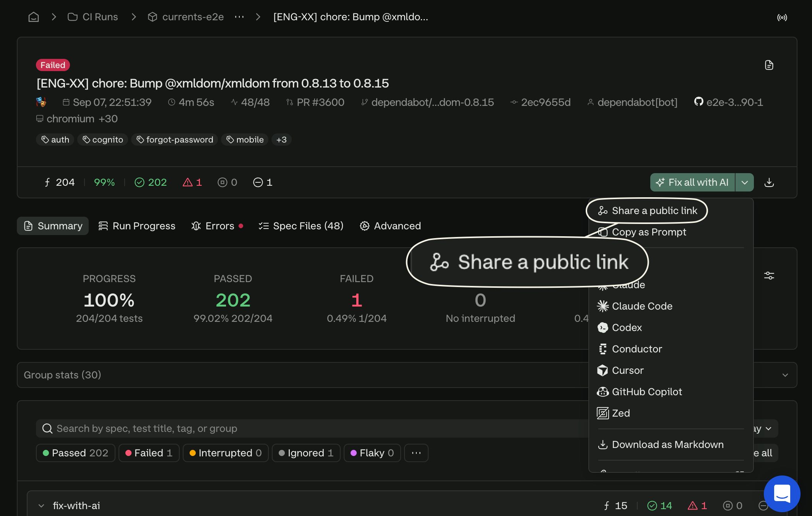
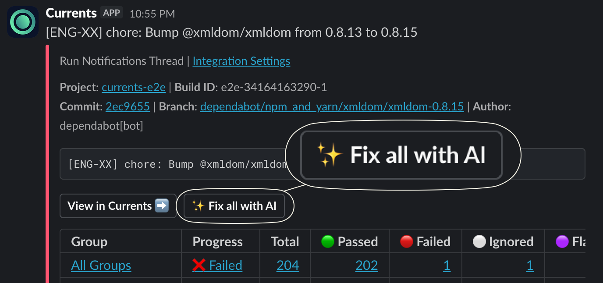
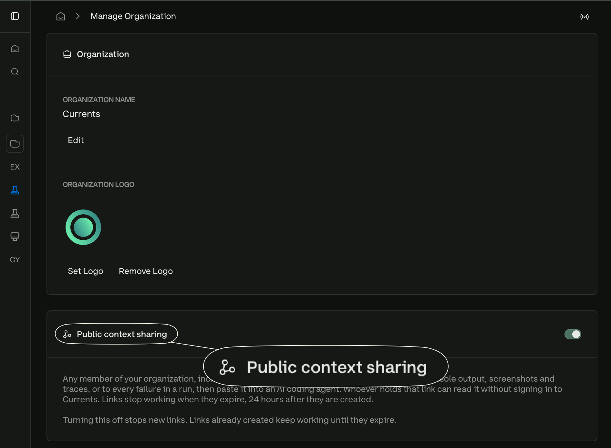

# Shareable Context

* Hand a failure to any AI agent, in your editor or in a chat window
* Give the link to an agent that fetches URLs, and it reads the context itself
* Share from the dashboard or from Slack
* No Currents credentials needed to read it - drop it in a pull request, or send it to someone outside your team

<figure><figcaption><p>The public shareable context page</p></figcaption></figure>

### How it works

1. You share a failure from the dashboard or from Slack.
2. Currents renders the failure context as Markdown, stores it, and returns a link.
3. Anyone with the link reads it - in a browser, or by fetching it as raw Markdown with no credentials.
4. The link stops working 24 hours later, and so do the asset URLs inside it.


Because the context is rendered when the link is created, it is a snapshot. It does not change as the run continues, and it does not reflect a later reset or re-run.


### Create a link

Anyone in your organization can create one, including guests. Public context sharing is on by default, and an organization admin can turn it off (see [#control-who-can-share](shareable-context.md#control-who-can-share "mention"))

Only **failures** can be shared. A passing test, or a run with no failures, has no context to hand an agent.

#### From the dashboard

The **Share a public link** action sits in every Fix with AI menu:

| Where                         | What it shares           |
| ----------------------------- | ------------------------ |
| Test sidebar → Fix with AI    | One failing test attempt |
| Run summary → Fix all with AI | Every failure in the run |
| Test list → right-click a row | That test                |

<figure><figcaption><p>Shareable context from test sidebar</p></figcaption></figure>

#### From Slack

If you use the [slack-app.md](../resources/integrations/slack/slack-app.md "mention"), the **Fix with AI** and **Fix all with AI** buttons on a failure notification create a share on click and show you the link, the raw Markdown URL and the expiry.

<figure><figcaption><p>Fix all with AI button</p></figcaption></figure>


If public context sharing is disabled for your organization, these buttons will instead provide a prompt you can copy.


### What the link contains

The context is Markdown, and what goes in depends on what you shared.



* The spec, test title, status, attempt and duration
* **Git** - repository, branch, pull request and commit, where the run reported them
* **Error** - message and stack for the selected attempt
* **Error Context (Accessibility Snapshot)** - the error-context snapshot, where the framework captured one: the page accessibility tree at the moment of failure
* **Browser Console** and **Network Requests** around the error
* **Trace Error Analysis**, where a Playwright trace was analyzed
* **All Steps** - the step list leading to the failure
* **Stdout** and **Stderr**
* **Assets** - signed links to traces, screenshots, videos and attachments
* **Environment** - OS, browser and versions
* **Other Attempts** - how the other attempts of this test ended



* The run status, and how many tests failed and flaked
* **Git** and **Environment** - where the run came from and what it ran on
* **Instances** - a table of the specs that did not pass
* Each failing test, numbered, with its error, its steps, and a count of the assets it produced


A run-level share is broader and shallower than a test-level one: it lists asset counts rather than asset links, and carries no per-test console output. Share a single test when you want everything about one failure.




Every share ends with a **Details for Currents MCP** footer carrying the MCP identifiers for what was shared - the project and run, plus the instance, test and attempt when the share is one test. An agent with the [mcp-server.md](mcp-server.md "mention") can use those identifiers to fetch anything the snapshot left out.

### Hand the context to an agent

#### From the share page

Open the link in a browser to see options for Claude, Claude Code, Codex, Conductor, Cursor, GitHub Copilot, and Zed. Each option either opens the selected tool with the context prefilled or copies the context so you can paste it manually when direct opening isn’t supported.

The page also has **Copy** and **Download as Markdown**, which provide the context with a short instruction, ready to paste into a chat.

#### Give the agent the URL

Add `.md` to the link and it serves the context as raw Markdown with no authentication, so any agent that can fetch a URL can read it directly:

```
https://s.crts.sh/x7Kp2mQ9vLbEr4Tz.md
```

That is the form to paste into an agent that fetches URLs for itself. The bare link - no `.md` - opens the public page.

#### Continue with the MCP server

A share is a snapshot, and an agent often wants more - the other attempts, a different test in the same run, the run's history. The MCP footer carries the identifiers for exactly that. Point your agent at the [mcp-server.md](mcp-server.md "mention") and it can keep going from where the share ends.

### Control who can share

Public context sharing is a single organization-wide switch, on by default.

1. Go to **Organization settings**.
2. Find **Public context sharing**.
3. Turn it off to stop new links.

<figure><figcaption><p>The public context sharing setting</p></figcaption></figure>

Turning the setting off stops **new** links. Links already created keep working until they expire.

### Permissions & Security


**The link is the credential.** Anyone holding it reads the context with no Currents account, no sign-in and no membership in your organization, until it expires.


**What a share exposes.** Everything the context contains - error messages and stacks, console and network activity, stdout and stderr, and signed URLs to screenshots, videos and traces. If your tests print secrets or capture screenshots of real customer data, that content travels with the link.

**Link lifetime.** A link works for **24 hours** from the moment it was created. Asset URLs inside it expire at the same moment as the link. Sharing the same failure again returns the **existing** link while more than an hour of it remains. Links cannot be extended or revoked.

**Read limits.** Public reads are rate limited per reader and per link, so a link circulated widely can be refused even for someone who has read little. A refused read answers `429` with a `Retry-After` header.
