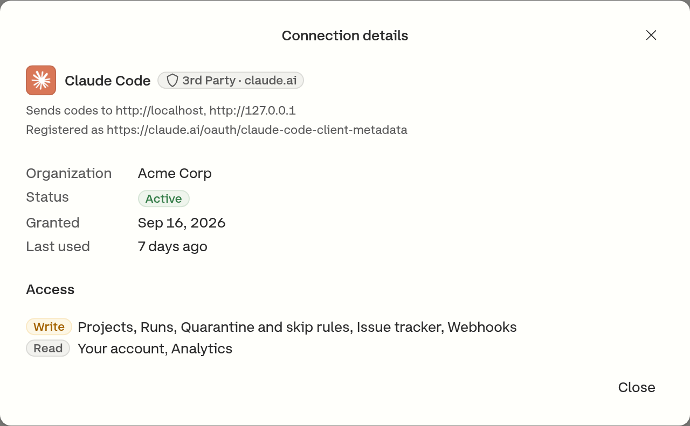

# OAuth

OAuth is how an application outside Currents gets access without anyone handing it a key. A person signs in, picks one organization, and approves a named list of permissions; the application receives an access token that acts as that person, inside that organization, limited to what was approved.

It is the alternative to an [API key](../dashboard/administration/api-keys.md), not a replacement for it. The two answer different questions:

|                       | OAuth access token                                        | API key                                     |
| --------------------- | --------------------------------------------------------- | ------------------------------------------- |
| Belongs to            | A person                                                  | An organization                             |
| Reaches               | One organization, chosen when it was authorized           | The organization it was created in          |
| Permissions           | The set consented to, capped by the member's role         | One `Read Only` or `Read & Write` level     |
| Obtained by           | Approving a screen in the browser                         | Copying a value out of the dashboard        |
| Lives                 | In the application, refreshed on its own                  | Wherever it was pasted                      |
| Ends when             | The person or an administrator revokes it                 | The key is deleted                          |
| Attributable          | Yes - actions carry the person who authorized it          | No - a key names no user                    |

A key suits a CI job, which has no person behind it. OAuth suits anything a person drives - an editor, an agent, a script run on someone's own machine - because access can be scoped below what the key would give and taken away without rotating a secret everyone shares.

## What accepts an OAuth token

Two Currents services do, and they are separate as far as a token is concerned:

| Service              | Address                        |
| -------------------- | ------------------------------ |
| The REST API         | `https://api.currents.dev`     |
| The remote MCP server | `https://api.currents.dev/mcp` |

A token is minted for one of them and named in the request that created it. A token for the REST API is refused by the MCP endpoint, and a token for the MCP endpoint is refused by the REST API - so authorizing an agent to use the tools does not hand it the whole API. An application that needs both asks for both, and holds a token per service.

See [remote-mcp.md](../ai/remote-mcp.md "mention") for connecting an agent to the MCP endpoint.

## Authorizing an application

The application opens a Currents URL in the browser. Three screens follow.

### 1. Sign in

Only when that browser has no Currents session yet. Whatever the organization uses to sign in to the dashboard - including SSO - is what applies here; OAuth adds no second way in.

### 2. Choose an organization

A token reaches one organization, and every call the application makes acts inside it. The screen lists the organizations the account belongs to with the role held in each, above everything the application asked for.

<figure><figcaption>
An application authorized here reaches this organization and no other
</figcaption></figure>

Authorizing the same application for a second organization is a separate grant, made by going through the flow again. Revoking one leaves the other alone.

### 3. Authorize

The consent screen shows:

* the application's name, icon and [badge](oauth.md#badges-and-notes)
* **Sends codes to** - the site that will receive the authorization code. For an application running on the signer's own computer, this is a local address such as `http://localhost` or `http://127.0.0.1`.
* **Registered as** - the identifier the application registered under, for every application Currents does not ship
* a note, for every badge except **Verified publisher**
* the account signing in, and - when the request needs one - the organization with the role held in it
* every permission requested, grouped by area, such as **Projects** or **Runs**. Each one is marked **Read** or **Write**, and **Granted** if an earlier authorization already approved it.

A permission the person's role does not allow is listed apart, under **Not included** - see [the role sets the ceiling](oauth.md#the-role-sets-the-ceiling).

<figure><figcaption>
Authorizing Claude Code again: every permission was approved before, so each is marked Granted
</figcaption></figure>

Approving returns the application to its own callback with the grant in place. An application that asked to stay connected - shown on the screen as **Stay connected without asking you to authorize again** - can renew its own access tokens from there, so nobody is asked again unless the grant is revoked or the application starts asking for something new. One that did not ask for it holds a single access token and sends the person back through this flow once that token expires.

### Badges and notes

The badge and note say how much Currents can vouch for the application and for where its authorization codes go. Whatever they say, read the **Sends codes to** line: a familiar name sending codes to an unfamiliar site is the sign that something is wrong.

| Badge                           | Note                                        | What it means                                                                                                                                           |
| ------------------------------- | ------------------------------------------- | ------------------------------------------------------------------------------------------------------------------------------------------------------- |
| **Verified publisher · _host_** | _(none)_                                    | Reviewed by Currents. Codes go only to its publisher's servers.                                                                                         |
| **Currents**                    | _Codes go to an app on this computer_       | Shipped with Currents, such as the IDE extension. Codes go to this computer.                                                                            |
| **3rd Party · _host_**          | _Codes go to an app on this computer_       | Reviewed by Currents. Codes go to this computer.                                                                                                        |
| **3rd Party · _host_**          | _Currents has not checked this application_ | Not reviewed. Its name is its own claim, and its icon is hidden.                                                                                        |
| **Unlisted**                    | _Currents has not checked this application_ | Neither shipped by Currents nor identified by a [metadata document](oauth.md#for-client-developers). Its name is its own claim, and its icon is hidden. |

The _host_ on a badge is the site the application's identity comes from, which is not necessarily where its codes go. The **Sends codes to** line shows that.

When codes go to the signer's own computer, any program there could be the one asking. The note asks the signer to allow access only if they just started the application themselves.

## Permissions

A grant carries a set of named permissions, and each one covers a specific area. An application receives exactly what was approved.

| Permission       | What it reaches                                                                                         |
| ---------------- | -------------------------------------------------------------------------------------------------------- |
| `projects:read`  | Which projects exist, and a project's settings, tags, branches and authors                               |
| `projects:write` | Project configuration, including a project's tags                                                        |
| `results:read`   | Runs, spec files, test results, failure evidence, and the runs on a pull request                         |
| `analytics:read` | Aggregate metrics - project insights, error counts, and spec-file and test performance                   |
| `actions:read`   | Quarantine, skip and tag rules, and the tests they affected                                              |
| `actions:write`  | Creating, editing, enabling, disabling and archiving those rules                                         |
| `runs:write`     | Cancelling and resetting runs, and deleting runs and their artifacts                                     |
| `webhooks:read`  | Webhook configuration, including destination URLs and headers                                            |
| `webhooks:write` | Creating, editing and deleting webhooks                                                                  |
| `issues:write`   | Creating and linking issues in the organization's connected issue tracker, and listing its projects and issue types |

Alongside these, an application may ask to verify the signer's identity (`openid`), read their name (`profile`) or email address (`email`), and stay connected without asking again (`offline_access`). Those say nothing about test data.

Each API endpoint names the single permission it needs, so a grant is not a blanket read or write: `runs:write` cancels a run and does not touch a webhook. A call made without the permission it needs is refused, and the refusal names what is missing.


`runs:write` includes permanently deleting a run and everything recorded with it, and `webhooks:write` and `actions:write` include deleting a configuration outright. None of these can be undone from Currents. Approve them only for an application that needs them.


### The role sets the ceiling

Consent cannot grant more than the person's organization role already permits. A permission the role does not allow is dropped from the request before the grant records it, and the screen says which permission was withheld and which role holds it.

| Permission       | Admin | Actions Admin | Member | Guest |
| ---------------- | :---: | :-----------: | :----: | :---: |
| `projects:read`  |   ✅   |       ✅       |   ✅    |   ✅   |
| `results:read`   |   ✅   |       ✅       |   ✅    |   ✅   |
| `analytics:read` |   ✅   |       ✅       |   ✅    |   ❌   |
| `actions:read`   |   ✅   |       ✅       |   ✅    |   ❌   |
| `issues:write`   |   ✅   |       ✅       |   ✅    |   ❌   |
| `runs:write`     |   ✅   |       ✅       |   ✅    |   ❌   |
| `actions:write`  |   ✅   |       ✅       |   ❌    |   ❌   |
| `projects:write` |   ✅   |       ❌       |   ❌    |   ❌   |
| `webhooks:read`  |   ✅   |       ❌       |   ❌    |   ❌   |
| `webhooks:write` |   ✅   |       ❌       |   ❌    |   ❌   |

A Guest authorizing an application that asked for every permission above leaves with `projects:read` and `results:read`, and the screen names the rest as withheld. The role caps these permissions only - the identity ones (`openid`, `profile`, `email`, `offline_access`) are the person's own to approve, so they appear on the consent screen and are granted whatever the role.

This is a ceiling on what consent may grant, not a list of what a role does in the dashboard: the two are set separately, and a permission being available to a role here means an application can be authorized for it, not that it is granted. Nothing is granted that the person did not approve on the consent screen. See [manage-team.md](../dashboard/administration/manage-team.md "mention") for what each role is for.

The role is then re-checked on every request rather than only at consent, so a role that changes later takes effect immediately: lowering someone's role suspends the permissions it covered, and raising it again restores them.

What separates the two cases is whether the grant holds the permission at all. One withheld at consent was never recorded, so a higher role only makes it grantable - the application still has to ask for it again. One recorded and later suspended by a lower role is still on the grant, and returns on its own.

This is the part an API key cannot do. A key's access level is read when a call is made, so changing it takes effect at once; a token that was not re-checked would otherwise keep whatever the role allowed when it was issued.

## Reviewing and revoking access

Each person sees every application they authorized under **Account → Connected Applications**, grouped by organization, with whether each grant can read or write, its status and when it was last used.

<figure><figcaption>
Account → Connected Applications
</figcaption></figure>

Opening a row shows more of the grant: the address the application sends codes to, when it was granted, and the areas it can write and read.

<figure><figcaption>
The permissions a grant holds, grouped by area
</figcaption></figure>

An organization administrator sees the same grants for everyone under **Manage Organization → Connected Applications**, listed by application or by person, and can revoke any of them.

<figure><figcaption>
Manage Organization → Connected Applications
</figcaption></figure>

Removing a grant takes the consent and the application's ability to renew with it, so it cannot quietly resume, and it covers every machine the application was installed on - one grant is not one computer.

<figure><figcaption>
What removing a connection does, and when it takes effect
</figcaption></figure>

**An access token already issued keeps working until it expires, up to an hour.** Each service checks a token's signature rather than asking the authorization server about it on every call, so a revoked grant cannot recall one that is already out. Revocation stops renewal at once; it stops the current token when that token runs out - including across a restart, since the application still holds the token it cached. Once that token expires there is nothing to renew it with, and the application sends the person back through the flow.

Ending a membership is the exception, and it is immediate. The organization and role behind a token are read on every request, so someone removed from an organization loses access there on the next call the application makes - there is no window.

Because a grant covers one organization, revoking it in one leaves the person's grants in other organizations alone.

### When access ends without anyone asking

Currents emails the person whose access ended when it was not them who ended it, so an application that suddenly stops working does not read as a broken tool. Four things trigger it:

* an administrator removed the grant
* their membership in that organization ended
* the same refresh token was presented twice, which is the signature of a stolen one - Currents cancels the whole family
* the application itself was disabled or deleted

Each email names the organization access was lost in and the grants the person still holds elsewhere, so a single revocation does not read as losing everything. No email carries a credential.

## For client developers

An application needs nothing arranged with Currents in advance. Pointed at the address of the service it intends to call - `https://api.currents.dev` for the REST API, `https://api.currents.dev/mcp` for the MCP server - it discovers everything else:

| It reads                                                              | It learns                                            |
| --------------------------------------------------------------------- | ---------------------------------------------------- |
| The `401` from the service it called                                   | `WWW-Authenticate`, naming the metadata document     |
| That metadata document                                                 | The service's identifier, and its authorization server |
| `https://id.currents.dev/.well-known/oauth-authorization-server`       | The authorize, token and JWKS endpoints              |

| | |
| --- | --- |
| Authorization server | `https://id.currents.dev` |
| REST API metadata | `https://api.currents.dev/.well-known/oauth-protected-resource` |
| MCP metadata | `https://api.currents.dev/.well-known/oauth-protected-resource/mcp` |
| Grant types | `authorization_code`, `refresh_token` |
| PKCE | Required, `S256` |

Two things are worth knowing before building against it:

- **The service has to be named, and it has to be the right one.** An authorization request states which service the token is for, and one that names none is refused - a token with no audience would be rejected by every service it was then spent at. Naming the wrong one fails later and less obviously: a client that read the REST API's metadata document and authorized for `https://api.currents.dev` comes back with a token the MCP endpoint refuses, and sees the same `401` it started from. Each service's document names its own identifier; use the one belonging to the address being called.
- **Client registration is not dynamic.** Currents does not accept dynamic client registration. A client identifies itself with a [Client ID Metadata Document](https://datatracker.ietf.org/doc/draft-parecki-oauth-client-id-metadata-document/) - an HTTPS URL it serves its own metadata at, which Currents fetches - or it is one of the clients Currents ships a definition for. A client with neither reports something like `does not support dynamic client registration`, and has to use an API key instead.

### Refusals

| Code                  | Meaning                                                                                                   |
| --------------------- | ---------------------------------------------------------------------------------------------------------- |
| `insufficient_scope`  | The endpoint needs a permission the grant does not hold. The refusal names it, so the application can ask for that one and retry. |
| `insufficient_role`   | The permission is on the grant, but the holder's role no longer allows it. Authorizing again changes nothing until the role is raised. |
| `api_key_required`    | The endpoint takes an API key and not a token. No permission grants access to it.                          |

A `401` always carries the pointer an application needs to authorize or re-authorize; a `403` carries the reason and, where there is one to ask for, the permission to ask for.

## Related

* [Remote MCP Server](../ai/remote-mcp.md) - connecting an agent over OAuth
* [API Keys](../dashboard/administration/api-keys.md) - the organization credential
* [Manage Team](../dashboard/administration/manage-team.md) - the roles that set the ceiling
