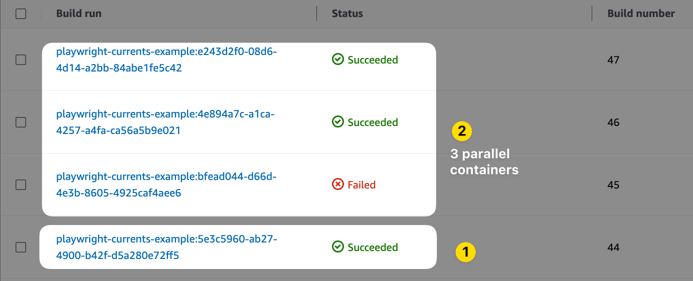
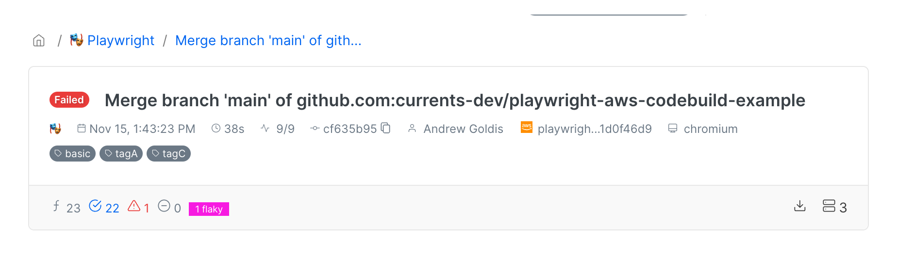

# Playwright - AWS Code Build


TL;DR Check out the example repository:

[https://github.com/currents-dev/playwright-aws-codebuild-example](https://github.com/currents-dev/playwright-aws-codebuild-example/tree/main)


Executing Playwright tests in parallel on AWS CodeBuild can significantly reduce the overall run duration. AWS CodeBuild supports [Batched Build](https://docs.aws.amazon.com/codebuild/latest/userguide/batch-build.html) in [matrix mode](https://docs.aws.amazon.com/codebuild/latest/userguide/batch-build.html#batch\_build\_matrix) for launching several workers in parallel.&#x20;

<figure><figcaption><p>Use AWS CodeBulld Matrix mode to run Playwright tests in parallel with Currents. 1 batch job (1) triggering 3 parallel build jobs (2).</p></figcaption></figure>

<figure><figcaption><p>Parallel Playwright Tests recorded to Currents dashboard from AWS CodeBulld</p></figcaption></figure>

### Prerequisites

To enable parallel runs, please make sure that you have privileged access to your AWS Account and that you can create/modify an AWS CodeBuild Project.

### Configuration

#### Obtain Currents Credentials <a href="#user-content-obtain-currents-credentials" id="user-content-obtain-currents-credentials"></a>

Create an organization, and get  [record-key.md](../../guides/record-key.md "mention") and **Project ID** at [https://app.currents.dev](https://app.currents.dev/).&#x20;

#### Create `buildspec.yml`

Create a `buildspec.yml` file in the root directory of your application's source code repository. This file defines the build and test steps for your application.&#x20;

Set the **Project ID** for `pwc` command, for example:

<pre data-overflow="wrap"><code>npx pwc --project-id <a data-footnote-ref href="#user-content-fn-1">&#x3C;project_id></a> --key $CURRENTS_RECORD_KEY --ci-build-id $CODEBUILD_INITIATOR --shard $WORKER/3
</code></pre>


The example uses `pwc` CLI command to run the tests. You can use `npx playwright test` command and configure `@currents/playwright` as a reporter. Please refer to the [documentation](https://currents.dev/readme/integration-with-playwright/currents-playwright#currents-playwright-reporter).


The `buildspec.yml` file uses [matrix mode](https://docs.aws.amazon.com/codebuild/latest/userguide/batch-build) to start 3 containers for running the test in parallel. Each container will have the environment variable `WORKER` set to `1,2,3` correspondingly, we use it to configure [Playwright Sharding](https://playwright.dev/docs/test-parallel#shard-tests-between-multiple-machines) `--shard $WORKER/3`

```yaml
## buildspec.yml
version: 0.2

batch:
  fast-fail: false
  build-matrix:
    dynamic:
      buildspec:
        - buildspec.yml
      env:
        variables:
          WORKER:
            - 1
            - 2
            - 3

phases:
  install:
    runtime-versions:
      nodejs: 18
    commands:
      # install playwright and its dependencies
      - npm ci
      - npx playwright install
      - npx playwright install-deps

  build:
    commands:
      # Optionally, set COMMIT_INFO variables to override the default values. See https://currents.dev/readme/runs/run-details#playwright-cypress-git-information
      # - export COMMIT_INFO_BRANCH="$(git rev-parse HEAD | xargs git name-rev |
      #   cut -d' ' -f2 | sed 's/remotes\/origin\///g')"
      # - export COMMIT_INFO_MESSAGE="$(git log -1 --pretty=%B)"
      # - export COMMIT_INFO_EMAIL="$(git log -1 --pretty=%ae)"
      # - export COMMIT_INFO_AUTHOR="$(git log -1 --pretty=%an)"
      # - export COMMIT_INFO_SHA="$(git log -1 --pretty=%H)"
      # - export COMMIT_INFO_REMOTE="$(git config --get remote.origin.url)"

      # update shard details according to the overall # of containers
      - npx pwc --project-id <project_id> --key $CURRENTS_RECORD_KEY --ci-build-id $CODEBUILD_INITIATOR --shard $WORKER/3
```

**Configure `CURRENTS_RECORD_KEY`**

Save the [record-key.md](../../guides/record-key.md "mention") as `CURRENTS_RECORD_KEY` [Environment variable](https://docs.aws.amazon.com/codebuild/latest/userguide/change-project-console.html#change-project-console-environment). It is strongly recommended to use your **Record Key** in a secure secrets storage. Please refer to the [detailed guide](https://www.learnaws.org/2022/11/18/aws-codebuild-secrets-manager/), here is an overview of the steps:

* Create a new entry in AWS Secrets Manager with the **Record Key**. Please note that the generated secret is a JSON document, you should note the `json_key` of the actual record key value and use it later.
* Get the secret ARN
* Update the Build Project environment variables as follows:
  * Variable name: `CURRENTS_RECORD_KEY`
  * Variable value: the ARN of previously created secret + json\_key, for example: `<secret-arn>:<json-key>`
* Update the IAM execution role to allow reading of previously created secret

#### Configure AWS Project&#x20;

Configure AWS-specific project settings like IAM execution policy, resources class and so on.  Please refer to [AWS CodeBuild documentation](https://docs.aws.amazon.com/codebuild/) for details to explore possible configuration settings.

**Configure Source Batch Mode**

* Set the **Project Setting > Edit Source**
* Configure the repository details, the events that should trigger new builds
* Configure **Primary source webhook events > Build Type** to **Batch build** to start 3 parallel workers in [matrix mode](https://docs.aws.amazon.com/codebuild/latest/userguide/batch-build)

### Example: Triggering Parallel Playwright AWS CodeBuild&#x20;

This [example repository](https://github.com/currents-dev/playwright-aws-codebuild-example) showcases running Playwright tests on AWS CodeBuild in parallel while using [Currents](https://currents.dev/) as the reporting dashboard. It has an example [AWS CodeBuilld Project configuration](https://github.com/currents-dev/playwright-aws-codebuild-example/blob/main/aws-project-config-output.json).


Example of triggering an AWS CodeBuild Playwright Tests via a commit


[^1]: replace with real project id
