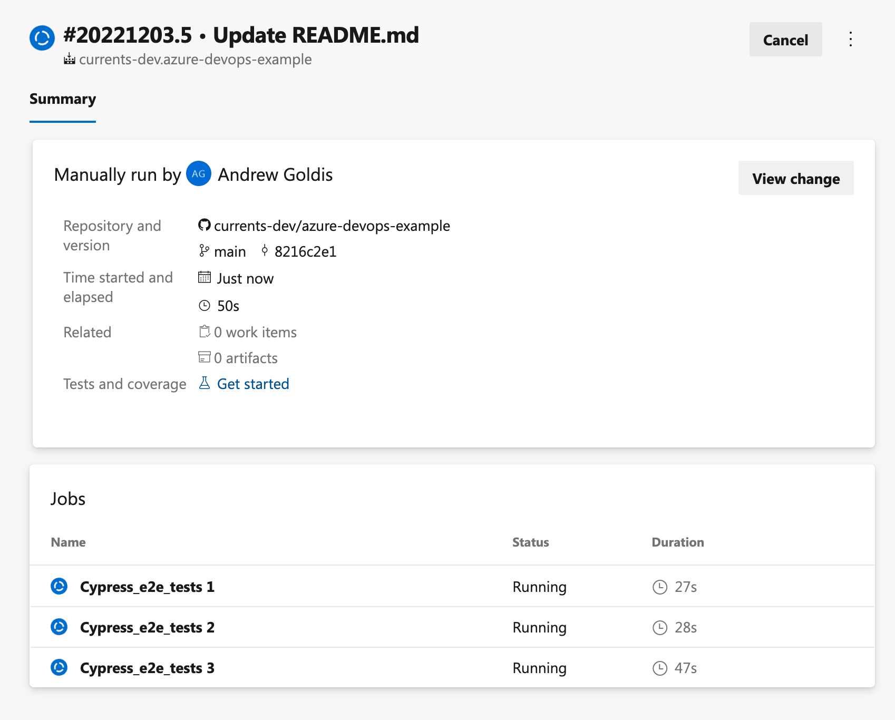
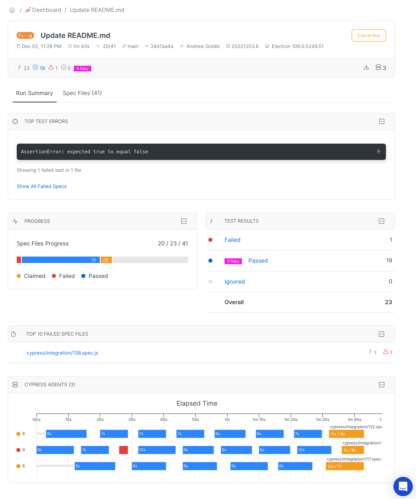

# Azure DevOps

This guide will help you to run Cypress tests in parallel using Azure DevOps and Currents Dashboard. The example showcases using 3 Azure DevOps containers for parallelizing the execution using Currents as an orchestration and reporting service.


TLDR; Check out the example Azure DevOps pipeline [configuration file](https://github.com/currents-dev/azure-devops-example/blob/main/azure-pipelines.yml)


* Connect a new/existing pipeline to a repository containing your cypress tests
* Make sure that your `cypress.config.js` file has the correct `projectId`. You can fetch the `projectId` by navigating to [https://app.currents.dev](https://app.currents.dev) and then **Project Name > Manage Project**
* Make sure that both `cypress` and [cypress-cloud](../integration-with-cypress/cypress-cloud/) are listed in your `package.json` as dependencies
* Create or modify an existing [Variable Group](https://learn.microsoft.com/en-us/azure/devops/pipelines/library/variable-groups?view=azure-devops\&tabs=yaml), and add a new secret variable called `CURRENTS_SECRET`. You can grab the secret key at **Currents Dashboard > Org Name (Header Menu) > Record Keys**
* Modify your `azure-pipelines.yml` file and use [this file](https://github.com/currents-dev/azure-devops-example/blob/main/azure-pipelines.yml) as a reference.&#x20;

```yaml
jobs:
  - job: Cypress_e2e_tests
    pool:
      vmImage: "ubuntu-latest"
    # Use 3 containers for parallel execution, use 
    strategy:
      parallel: 3
    # Fetch the secrets from Variable Group names "Currents"
    variables:
      - group: Currents
    steps:
      # Use Node@16 container
      - task: NodeTool@0
        inputs:
          versionSpec: "16.x"
          displayName: "Install Node.js"

      # Speed up the execution by caching the dependencies
      - task: CacheBeta@1
        inputs:
          key: npm | $(Agent.OS) | package-lock.json
          path: /home/vsts/.npm
          restoreKeys: npm | $(Agent.OS) | package-lock.json
        displayName: Cache NPM packages

      # cache cypress binary, which is installed at a different location
      - task: CacheBeta@1
        inputs:
          key: cypress | $(Agent.OS) | package-lock.json
          path: /home/vsts/.cache/Cypress
          restoreKeys: cypress | $(Agent.OS) | package-lock.json
        displayName: Cache Cypress binary

      # Install Node dependencies
      - script: npm ci
        displayName: "Install NPM dependencies"

      # The next command runs Cypress tests
      # using Currents as a remote orchestration service.
      #
      # Read more about CI Build ID:
      # https://currents.dev/readme/guides/cypress-ci-build-id

      # Note the use of `currents` command
      - script: |
          npx cypress-cloud run --record --parallel --key $CURRENTS_RECORD_KEY --ci-build-id $BUILD_BUILDNUMBER
        displayName: "Run Currents tests"
        env:
          CURRENTS_RECORD_KEY: $(CURRENTS_SECRET)
```


Pipeline executions will be orchestrated via the Currents Dashboard, and execution results and artifacts will be automatically uploaded as well.

<figure><figcaption><p>Running Cypress Tests in Azure DevOps Pipeline</p></figcaption></figure>

<figure><figcaption><p>Running Cypress Tests in Azure DevOps Pipeline</p></figcaption></figure>


<figure><figcaption><p>Currents Dashboard executing tests from Azure DevOps Pipeline</p></figcaption></figure>
