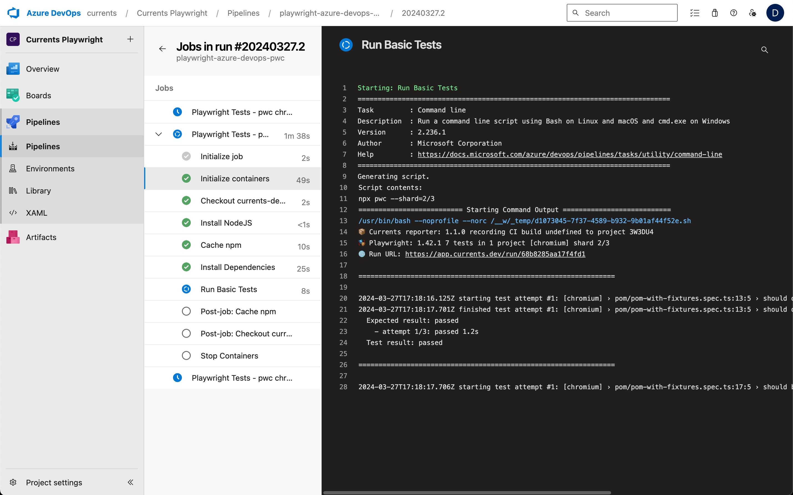
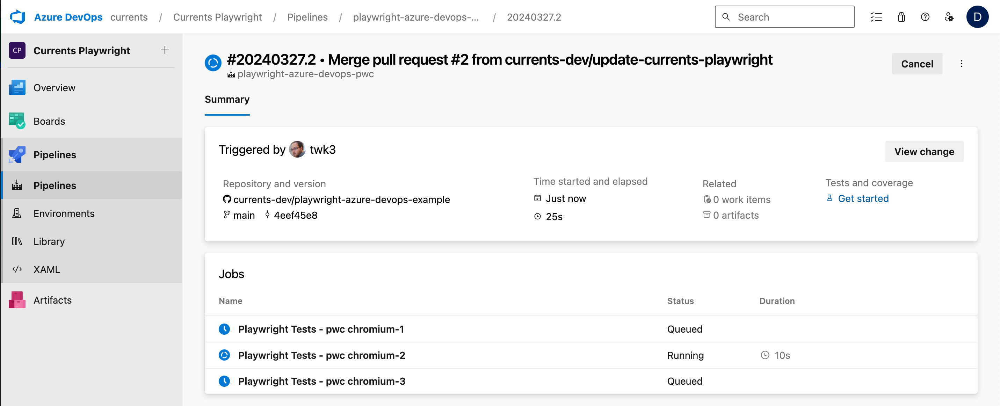

# Playwright - Azure DevOps


TL;DR Check out the example repository:

[https://github.com/currents-dev/playwright-azure-devops-example](https://github.com/currents-dev/playwright-azure-devops-example)


Currents can use the native [Playwright Sharding](https://playwright.dev/docs/test-sharding) to split the tests between multiple containers. The results from distributed runs will be collected together with the generated artifacts to provide insights into test suite performance.&#x20;

The [example repository](https://github.com/currents-dev/playwright-azure-devops-example)  `https://github.com/currents-dev/playwright-azure-devops-example`showcases using 3 Azure DevOps containers to allow parallel execution of the test using Currents as a reporting service.

* Connect a new/existing Azure Pipeline to a repository containing your Playwright tests.
* Create an organization, get your **Record Key** and **Project Id** at [https://app.currents.dev](https://app.currents.dev/)
* Create or modify an existing [Variable Group](https://learn.microsoft.com/en-us/azure/devops/pipelines/library/variable-groups?view=azure-devops\&tabs=yaml), and add a new secret variable called `CURRENTS_RECORD_KEY` with your **Record Key**.
* Include your **Project Id** in an env variable called `CURRENTS_PROJECT_ID` in your pipeline configuration.
* Ensure the [@current/playwright](../../integration-with-playwright/currents-playwright.md) package has been integrated into your tests.
* Modify your `azure-pipelines.yml` file to run the tests and use one of the [example pipeline files](https://github.com/currents-dev/playwright-azure-devops-example/blob/main/azure-pipelines.yml) as a reference.

Here's an example pipeline file:

```yaml
trigger:
- main

jobs:
- job: pwcTests
  displayName: Playwright Tests - pwc
  strategy:
    matrix:
      chromium-1:
        project: chromium
        shard: 1/3
      chromium-2:
        project: chromium
        shard: 2/3
      chromium-3:
        project: chromium
        shard: 3/3
  pool:
    vmImage: ubuntu-latest

  # If you choose to not use the playwright container, you will also need to npx install playwright in your steps
  container: mcr.microsoft.com/playwright:v1.42.1-jammy
  variables:
  - name: npm_config_cache
    value: $(Pipeline.Workspace)/.npm

  # You can use a variable group to store the CURRENTS_RECORD_KEY secret
  - group: currents-settings
  steps:
  - task: NodeTool@0
    displayName: 'Install NodeJS'
    inputs:
      versionSpec: '18'

  # Speed up the execution by caching the dependencies
  # https://docs.microsoft.com/en-us/azure/devops/pipelines/caching/?view=azure-devops
  - task: Cache@2
    inputs:
      key: 'npm | "$(Agent.OS)" | package-lock.json'
      restoreKeys: |
         npm | "$(Agent.OS)"
      path: $(npm_config_cache)
    displayName: Cache npm

  # Install Node dependencies
  - script: npm ci
    displayName: 'Install Dependencies'

  # Use pwc as the currents wrapper for playwright test
  # Replace the CURRENTS_PROJECT_ID value with your own from https://app.currents.dev
  - script: npx pwc --shard=$(shard)
    workingDirectory: '$(build.sourcesdirectory)/basic'
    displayName: 'Run Basic Tests'
    env:
      CI: 'true'
      CURRENTS_PROJECT_ID: '3W3DU4'
      CURRENTS_RECORD_KEY: $(CURRENTS_RECORD_KEY)
```

Pipeline executions will be recorded and available in the Currents Dashboard, and test results and artifacts will be automatically uploaded.

<figure><figcaption><p>Running Playwright Tests in Azure DevOps Pipeline</p></figcaption></figure>

<figure><figcaption><p>Running Playwright Tests in Azure DevOps Pipeline</p></figcaption></figure>

Here's an example of how the demo workflow appears in the Currents dashboard

<figure><figcaption><p>Running Playwright Tests with multiple runners - Currents dashboard</p></figcaption></figure>
