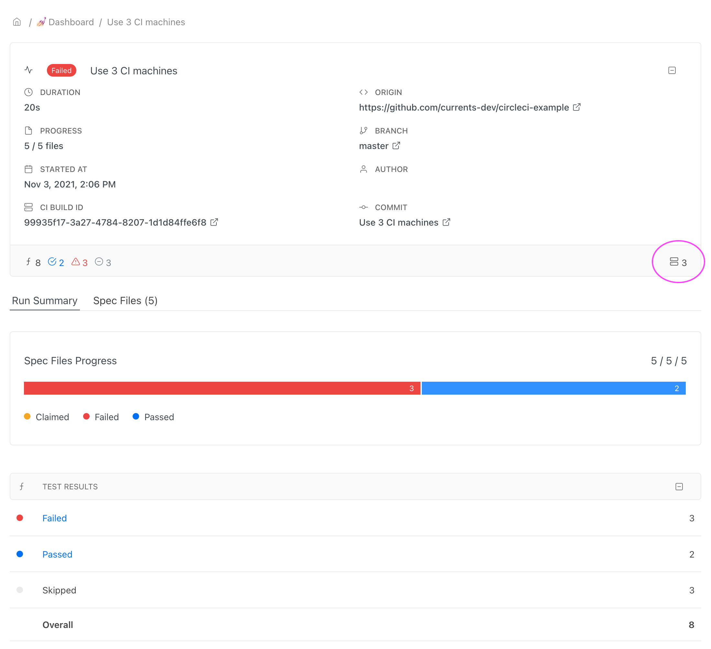

# Cypress - CircleCI


TL;DR Check out the example repository:

[https://github.com/currents-dev/circleci-example](https://github.com/currents-dev/circleci-example)


This is an example repository that showcases using [CircleCI](https://circleci.com/) with [Currents.dev](https://currents.dev/).

We are hosting independent versions of the Cypress App and [docker images](https://hub.docker.com/r/currentsdev/cypress-included) with pre-installed binaries. Please refer to the [documentation](https://currents.dev/readme/integration-with-cypress/alternative-cypress-binaries) for the list of supported binaries and versions.

The example [config file](https://github.com/currents-dev/circleci-example/blob/master/.circleci/config.yml) installs the custom Cypress App and runs 3 containers with Cypress tests in parallel using various setup scenarios.

### Prerequisites

* Create an account at https:/app.currents.dev.
* Obtain **ProjectId** and **Record Key**.
* Set `CURRENTS_RECORD_KEY`:
  * create [CircleCI context](https://circleci.com/docs/contexts/) and set `CURRENTS_RECORD_KEY`.
  * alternatively, set [Environment variable](https://circleci.com/docs/2.0/env-vars/) `CURRENTS_RECORD_KEY`
* Follow the setup instructions at [https://currents.dev/readme/integration-with-cypress/cypress-cloud](https://currents.dev/readme/integration-with-cypress/cypress-cloud) to create `currents.config.js` set your `projectId`

### Bare CircleCI configuration

Please refer to the setup scenario that fits your needs.

#### Use Docker image with pre-installed Cypress

CircleCI configuration that uses Docker image with pre-installed cypress app. Refer to the [documentation](https://currents.dev/readme/integration-with-cypress/alternative-cypress-binaries) for the list of supported binaries and versions.

```
version: 2.1

jobs:
  # Use pre-built image with alternative Cypress binary
  noorbs currents-image:
    parallelism: 3
    docker:
      - image: currentsdev/cypress-included:12.17.4
    steps:
      - checkout
      - run:
          name: Install Dependencies
          command: npm ci
      - run:
          name: Run tests
          command: npx cypress-cloud run --parallel --record --key $CURRENTS_RECORD_KEY

workflows:
  noorbs:
    jobs:
      - noorbs currents-image:
          context: currents
```

#### Explicitly downloading alternative Cypress binary

CircleCI configuration that explicitly downloads alternative Cypress binary. Refer to the [documentation](https://currents.dev/readme/integration-with-cypress/alternative-cypress-binaries) for the list of supported binaries and versions.

```
version: 2.1

jobs:
  # Explicitly download Cypress binary
  noorbs explicit-download:
    parallelism: 3
    docker:
      - image: cypress/base:18.16.1
    steps:
      - checkout
      - run:
          name: Install dependencies
          command: npm ci
      - run:
          name: Download Alternative Cypress Binaries
          command: CYPRESS_DOWNLOAD_MIRROR=https://cy-cdn.currents.dev npx cypress install --force
      - run:
          name: Run tests
          command: npx cypress-cloud run --parallel --record --key $CURRENTS_RECORD_KEY

workflows:
  noorbs:
    jobs:
      - noorbs explicit-download:
          context: currents
```

### Using Cypress Orb with default executor

[Cypress Orb](https://circleci.com/developer/orbs/orb/cypress-io/cypress) has pre-defined commands that facilitate creating CircleCI configuration. The examples below show how to integrate Cypress tests with Currents using Cypress Orb and various setup scenarios.

The examples below use [Custom Test Command](https://github.com/currents-dev/circleci-example/blob/master/.circleci/config.yml#L9) to run `cypress-cloud` for recording test results and parallelization with [Currents.dev](https://currents.dev/)

#### Using `cypress/default` executor example

The configuration below uses the default `cypress/default` [CircleCI executor](https://circleci.com/docs/executor-intro/) and installs custom Cypress binary during `cypress/install` step:

```
version: 2.1

orbs:
  cypress: cypress-io/cypress@3

jobs:
  # Use cypress/default executor example
  default-executor cypress-install:
    executor: cypress/default
    steps:
      - cypress/install:
          post-install: CYPRESS_DOWNLOAD_MIRROR=https://cy-cdn.currents.dev npx cypress install --force
      - persist_to_workspace:
          root: ~/
          paths:
            - .cache/Cypress
            - project

  default-executor cypress-run:
    executor: cypress/default
    parallelism: 3
    steps:
      - attach_workspace:
          at: ~/
      - cypress/run-tests:
          cypress-command: npx cypress-cloud run --parallel --record --key $CURRENTS_RECORD_KEY

workflows:
  with-orbs default-executor:
    jobs:
      - default-executor cypress-install
      - default-executor cypress-run:
          context: currents
          requires:
            - default-executor cypress-install
```

#### Using custom executor with pre-installed Cypress App

The configuration below uses the [custom executor](https://circleci.com/docs/executor-intro/) with pre-installed Cypress App.

```
version: 2.1

orbs:
  cypress: cypress-io/cypress@3

executors:
  # define custom executors
  currents-executor:
    docker:
      - image: currentsdev/cypress-included:12.17.4

jobs:
  # Use currentsdev executor with pre-installed Cypress binary
  custom-executor cypress-install:
    executor: currents-executor
    steps:
      - cypress/install
      - persist_to_workspace:
          root: ~/
          paths:
            - project

  custom-executor cypress-run:
    executor: currents-executor
    parallelism: 3
    steps:
      - attach_workspace:
          at: ~/
      - cypress/run-tests:
          cypress-command: npx cypress-cloud run --parallel --record --key $CURRENTS_RECORD_KEY

workflows:
  with-orbs custom-executor:
    jobs:
      - custom-executor cypress-run:
          context: currents
```

#### Use Docker image with pre-installed Cypress

CircleCI configuration that uses Docker image with pre-installed cypress app. Refer to the [documentation](https://currents.dev/readme/integration-with-cypress/alternative-cypress-binaries) for the list of supported binaries and versions.

***

Here's an example of the demo run in Currents.dev dashboard, note that 3 cypress agents were used as part of this run:


