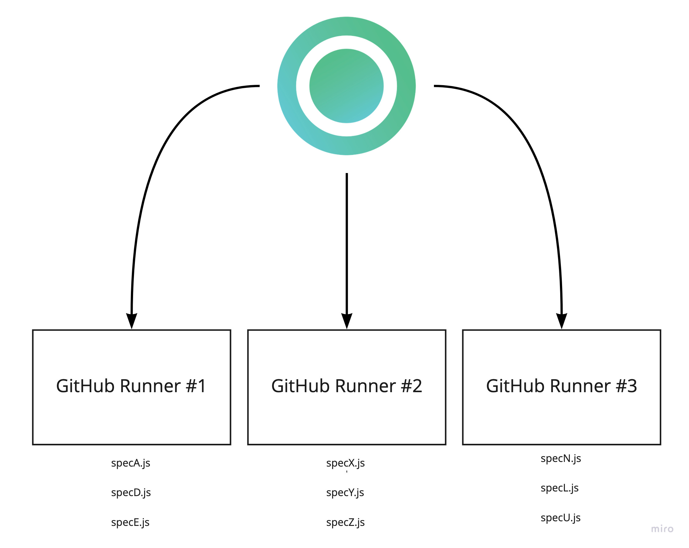

# GitHub Actions

Currents dashboard allows running Playwright and Cypress tests in parallel using multiple containers within your GitHub Actions workflow.

By using [GitHub Actions matrix execution strategy](https://docs.github.com/en/actions/using-workflows/workflow-syntax-for-github-actions#jobsjob\_idstrategymatrix), you can create multiple containers that will run your Playwright and Cypress tests in parallel.

Each container will receive a unique set of tests to run so that your tests will run faster and you can receive faster feedback from your browser test suite.

#### **Cypress**

Currents orchestrates the tests between multiple containers, applying intelligent optimizations to reduce the overall runtime of your workflow, and records screenshots and videos for later troubleshooting.

#### **Playwright**

Currents uses the native [Playwright Sharding](https://playwright.dev/docs/test-sharding) to split the tests between multiple containers and collects the results from distributed runs.
