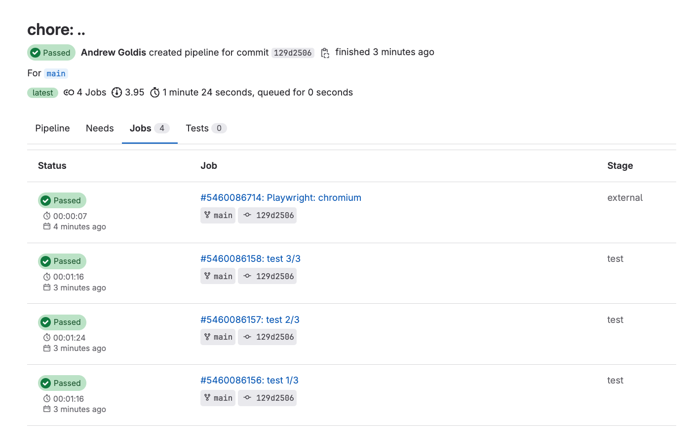
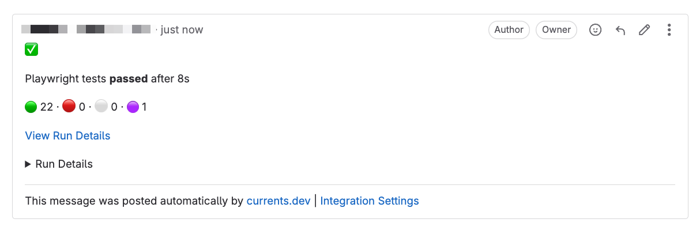

# Playwright - GitLab CI/CD


TL;DR take a look at the example repository:

[https://gitlab.com/currents.dev/gitlab-playwright-currents](https://gitlab.com/currents.dev/gitlab-playwright-currents)


The example [`.gitlab-ci.yml`](https://gitlab.com/currents.dev/gitlab-playwright-currents/-/blob/main/.gitlab-ci.yml) file creates a GitLab CI pipeline with 3 workers using 3 [Playwright Shards](https://playwright.dev/docs/test-sharding):


```yaml
# .gitlab-ci.yml
default:
  image: mcr.microsoft.com/playwright:latest

stages:
  - test

test:
  image: mcr.microsoft.com/playwright:latest
  stage: test
  parallel: 3

  script:
    - npm ci
    - npx playwright install
    - cd ./basic
    - npx pwc --key $CURRENTS_RECORD_KEY --project-id bnsqNa --shard=$CI_NODE_INDEX/$CI_NODE_TOTAL

```


<figure><figcaption><p>Running 3 parallel jobs Playwright jobs in GitLab CI</p></figcaption></figure>

### Setup <a href="#user-content-setup" id="user-content-setup"></a>

* Create an account at [https://app.currents.dev](https://app.currents.dev) and grab the **Project ID** and **Record Key**.
* Add `CURRENTS_RECORD_KEY` as [GitLab CI/CD Secrets](https://docs.gitlab.com/ee/ci/variables/) (make sure it's not protected)

Additional resources:

* Playwright Features on Currents: [https://currents.dev/playwright](https://currents.dev/playwright)
* Integration Documentation: [https://currents.dev/readme/integration-with-playwright/currents-playwright](https://currents.dev/readme/integration-with-playwright/currents-playwright)
* CI Build ID Guide: [https://currents.dev/readme/guides/cypress-ci-build-id](https://currents.dev/readme/guides/cypress-ci-build-id)

### GitLab CI Playwright Results <a href="#user-content-gitlab-ci-playwright-results" id="user-content-gitlab-ci-playwright-results"></a>

The results are being reported to Currents for more efficient troubleshooting, and monitoring test suite flakiness and performance.

Currents will collect the following information:

* console output
* screenshots
* videos
* trace files
* timing
* outcomes
* flaky tests
* error details
* tags for more convenient management of the tests

#### GitLab Merge Request Notes <a href="#user-content-gitlab-merge-request-notes" id="user-content-gitlab-merge-request-notes"></a>

Take a look at the example merge request: [https://gitlab.com/currents.dev/gitlab-playwright-currents/-/merge\_requests/3](https://gitlab.com/currents.dev/gitlab-playwright-currents/-/merge\_requests/3)

When [GitLab integration](https://currents.dev/readme/integrations/gitlab) is enabled, Currents will post a Merge Commit note with run results:

<figure><figcaption><p>Currents Merge Request Notes</p></figcaption></figure>

In addition, Currents will post an [External Status check](https://docs.gitlab.com/ee/user/project/merge\_requests/status\_checks.html) for every Playwright project configured. For example:

<figure><figcaption><p>Example of GitLab CI External Status Check </p></figcaption></figure>
