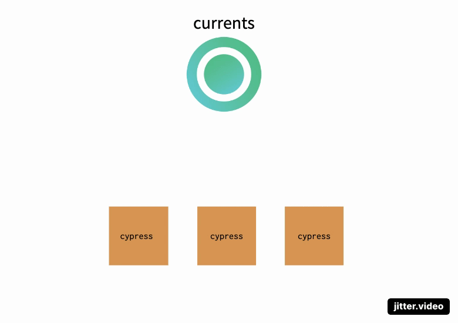

# Cypress Parallelization

### Why parallelize cypress tests?

As your Cypress Tests suite grows, it becomes crucial to optimize the overall duration in order to get a faster feedback. Once your cypress tests suite volume passed 10 spec files, you'd start looking for solutions to run the tests in parallel.

Parallelization is the most popular technique for reducing the runtime duration of your cypress tests. One of the most convenient and easy solutions is to use cloud service like Currents or Cypress Dashboard.&#x20;

Those services integrate with your CI provider and use intelligent techniques to parallelize the tests, reduce overall runtime, as well as providing features like storing video and screenshot recording, tests outputs, providing analytics and integration with 3rd party tools.

 (1).png>)

### How does cypress parallelization work?

Running cypress tests in parallel on CI environment involves creating multiple containers. Depending on the size of your browser test suite, it can be dozens or hundreds of containers.

Containers use Currents cloud service to get instructions about tests (technically, spec files) to run - every test runs in a different container. Currents uses intelligent orchestration heuristics to optimally distribute the tests between containers and reduce overall runtime.

The simplistic animation below demonstrates parallelization of 6 spec files using 3 containers.

* Each container runs an identical `cypress` or [`currents`](currents-cli.md) command with `--parallel` flag
* Each container connects to Currents dashboard to get instructions about the next spec file to run
* Currents dashboard assigns each container a spec file to run
* Each container runs its spec file
* Each container sends the results back to Currents and get the next spec file to run
* When no more spec files left, containers finish their execution



### Do I need my own machines to run cypress tests in parallel?

Yes. You still need CI machines that will run the actual tests. Currents Dashboard (and other orchestration services) will load-balance the tests between the machines, will record test results to allow troubleshooting your cypress tests.

### Can I run multiple cypress tests in parallel on the same machine?

Yes! You don't have to have different machines / containers for running cypress tests in parallel.&#x20;

You can run multiple [`currents`](currents-cli.md) / `cypress` instances on the same machine. Keep in mind that cypress tests are quite resource-demanding - running to many instances of test runner can actually slow down the overall execution or even crash the machine.

### How to run cypress tests in parallel locally?

Running cypress tests in parallel on localhost requires running two or more cypress runners at the same time. Open two separate terminals and run identical [`currents`](currents-cli.md) or [`cy2`](https://www.npmjs.com/package/cy2) command with `--parallel` flag  `--ci-build-id` flag with identical value:

```
npx currents run --parallel --record --key <currents_key> --ci-build-id build-001
```

You will see that two runners are executing different spec files and are running in parallel.

### How to split cypress spec files for running them in parallel?

You don't need to split files manually when using Cypress / Currents or Sorry Cypress dashboard service - the service does that for you automatically and distributes the spec files between cypress runners.

Moreover, Currents dashboard uses historical data to optimally sort the spec files in order to reduce overall build / run duration.

### What CI providers can run cypress tests in parallel?

Any CI provider or tool that allows creating multiple containers / jobs can be integrated with Currents for running cypress tests in parallel. See [Broken link](broken-reference "mention") section for details.

Here are a few popular CI providers that can run cypress tests in parallel:

* [GitHub Actions](../ci-setup/github-actions.md)
* [Jenkins](../ci-setup/jenkins.md)
* [GitLab](../ci-setup/gitlab.md)
* [CircleCI](../ci-setup/circleci.md)

### How to run cypress tests in parallel?

To run cypress tests in parallel and use Currents as orchestration service, run this command:

```bash
npx currents run --parallel --record --key <currents_key> --ci-build-id build-001Follow our  guide for details.
```

Read more about the importance of [CI Build ID](cypress-ci-build-id.md). You can generate `currents_key` by creating an organization and a project on [Currents Dashboard](https://app.currents.dev).

### How to distinguish one parallelized build / run from another?

Currents uses `--ci-build-id` flag to uniquely identify one parallelized build from another.&#x20;

.png>)

This value of this flag is calculated automatically for popular CI tools, but you can provide it explicitly to control your. See [cypress-ci-build-id.md](cypress-ci-build-id.md "mention") for details.
