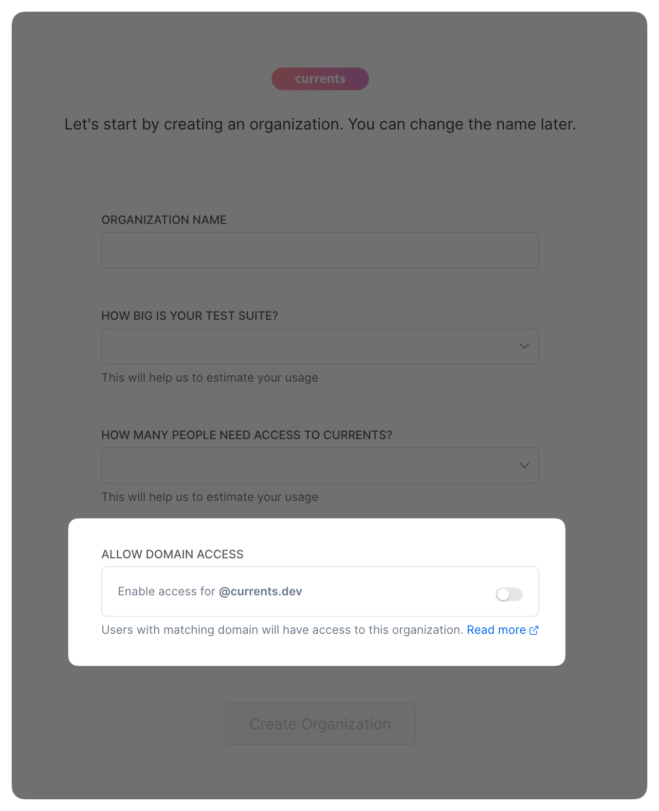

# Email Domain Based Access

Domain binding allows users to automatically join your Currents organization based on their email domains. When signing up to Currents platform, they will automatically become team members if their email domain matches.

You can allow users with your company email domain to connect to your Currents organization by activating this option in the onboarding screen.

<figure><figcaption>
Enabling Domain Access via Currents onboarding form
</figcaption></figure>

You can also request to activate this feature by entering the members' administration panel in Currents dashboard. You can have multiple domains enabled for the organization.\

<figure><figcaption>
Enabling Domain Access via Currents Team Management view
</figcaption></figure>

