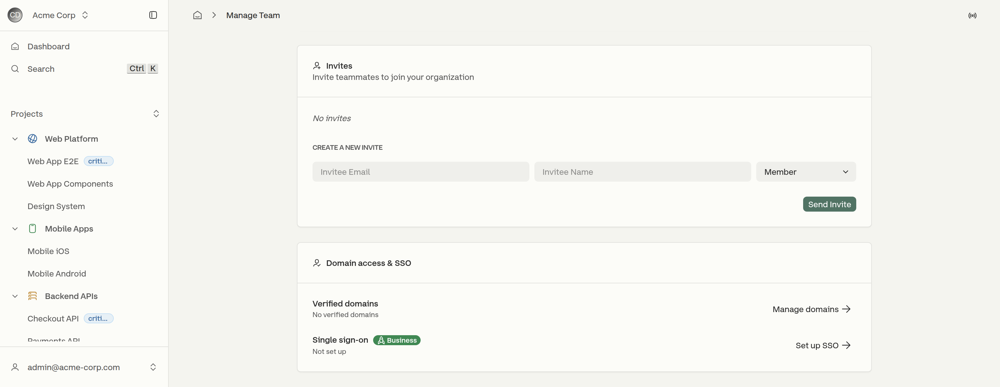
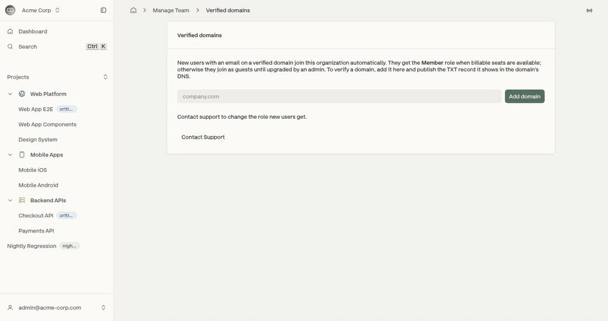
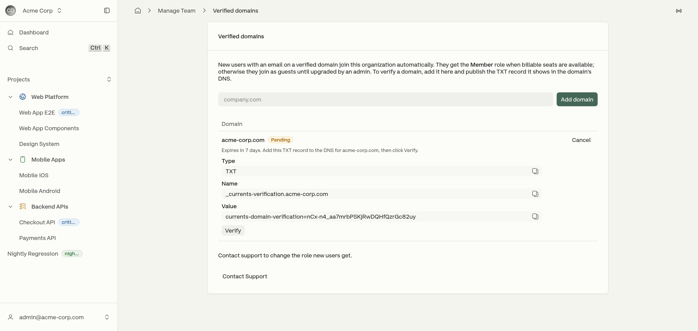

# Verified Domains

A verified domain lets new users join an organization on their own. When someone signs up to Currents with an email address on a domain the organization has verified, they become part of that organization instead of landing in one of their own.

Verifying a domain proves the organization controls it. An administrator adds the domain, publishes a TXT record Currents generates in that domain's DNS, and Currents checks for the record.

## Where it lives

Domain verification sits on the **Manage Team** page, in the **Domain access & SSO** section, alongside [sso-saml2.0](sso-saml2.0/ "mention").

<figure><figcaption>
Manage Team → Domain access &#x26; SSO
</figcaption></figure>

**Manage domains** opens the list of verified and pending domains. An organization can verify more than one.

## Verifying a domain

1. Enter the domain — the bare name, such as `company.com` — and select **Add domain**. The request appears as **Pending**.
2. Copy the TXT record Currents shows and publish it in that domain's DNS.
3. Select **Verify**.

<figure><figcaption>
Adding a domain returns the TXT record that proves control of it
</figcaption></figure>

The record has three parts, each with a copy control next to it:

| Field    | Value                                          |
| -------- | ---------------------------------------------- |
| **Type** | `TXT`                                          |
| **Name** | `_currents-verification.<domain>`              |
| **Value**| `currents-domain-verification=<token>`         |

<figure><figcaption>
A pending domain and the record that verifies it
</figcaption></figure>

The token is generated per request and belongs to that request alone. **Verify** fails while the record is still propagating; the check can be repeated until it succeeds.

A pending request **expires after 7 days**. Once it has, the domain has to be added again, which issues a new token. **Cancel** withdraws a pending request without waiting for it to expire.

## What a verified domain does

New users who sign up with an address on the domain join the organization automatically. They are **not** sent an invite and no administrator has to approve them.

The role they receive depends on seats:

* **Member**, when the organization has a billable seat free.
* **Guest**, when it does not — until an administrator upgrades them. Guests do not occupy a seat, so the upgrade is what takes one.

To change which role new users receive, contact Currents support from the link on the page.


Verifying a domain does not change how anyone signs in. It decides which organization a new account joins. To make an identity provider the way an organization signs in, see [sso-saml2.0](sso-saml2.0/ "mention") — SSO carries its own domain list.


Verification applies to new accounts. Someone who already has a Currents account on that domain is brought in the usual way, from [manage-team.md](manage-team.md "mention").
