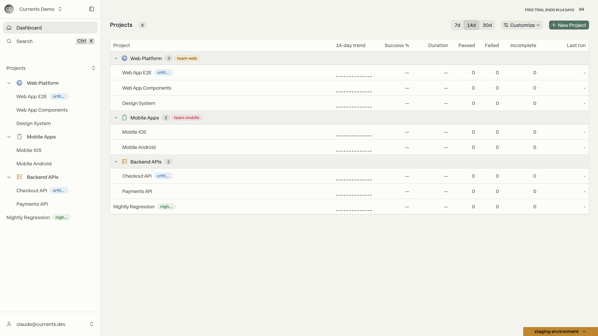

# Manage Projects

**Manage Projects** is the organization-wide editor that controls how your projects are presented across the dashboard — on the Projects page, in the sidebar and in the project switcher. Use it to group projects into folders, order them, give them icons and accent colors, maintain a shared set of project labels, and decide which run states count towards the project preview cards.

The layout is **organization-wide**: once published, every member of the organization sees the same folders, order, labels and appearance.


Only **Admins** can edit the project structure. Other roles that open the Manage Projects page see the regular, read-only Projects list. See [Roles and Permissions](manage-team.md#roles-and-permissions).


## Opening Manage Projects

There are two entry points:

* The organization menu → **Manage Projects**.
* The Projects page → **Customize** → **Organize & Settings**.

<figure><figcaption>
Opening the editor from the Projects page
</figcaption></figure>

Both open `/organizations/<orgId>/manage-projects`, which is split into three tabs:

<table><thead><tr><th width="200">Tab</th><th>What it controls</th></tr></thead><tbody><tr><td><strong>Project Structure</strong></td><td>Folders, ordering, moving projects between folders, per-project and per-folder appearance</td></tr><tr><td><strong>Project Labels</strong></td><td>The organization's label registry — create, rename, re-color and delete labels</td></tr><tr><td><strong>Project Preview</strong></td><td>Which run states count as "incomplete" on the project preview cards</td></tr></tbody></table>

Every tab shows who last saved the configuration and when — or **Not yet published for your organization** if no layout has been saved yet. Select **Done** in the header to leave the editor and go back to the Projects page.

## Project Structure

The **Project Structure** tab renders your projects as a file tree: folders with the projects they contain, alongside the projects that are not in any folder. Folders and top-level projects share one ordering, so a top-level project can sit above, between or below the folders.

<figure><figcaption>
The Project Structure tab, with the resulting folders mirrored in the sidebar
</figcaption></figure>

### Creating a folder

Type a name into the **New folder name** field in the header and select **Add folder** (or press `Enter`). The folder is created at the top level with the default folder icon and no color — both can be changed afterwards from the folder's action menu.

Folders are flat: a folder contains projects, not other folders.

### Ordering and moving projects

Hover a row to reveal its drag handle (the grip on the left), then drag and drop to change the structure:

* Drag a project or a folder up and down to change its order.
* Drop a project **onto a folder** to move it into that folder.
* Drag a project out of a folder and onto the top level to ungroup it.

Each folder header shows a count of the projects it holds, and a chevron to collapse or expand it.

### Folder actions

Hover a folder header and open its **⋯** menu to:

* **Rename** the folder.
* Pick an **icon** and a color for it (the **Icons** tab).
* Attach **labels** to the folder itself (the **Labels** tab).
* **Delete folder** — the folder's projects are not deleted, they move back to the top level.

<figure><figcaption>
Renaming a folder and choosing its icon and color
</figcaption></figure>

### Project appearance and labels

Hover a project row and open its **⋯** menu to:

* Choose an **icon** and an **accent** color, shown wherever the project appears — the sidebar, the project switcher and the project lists.
* Toggle the project's **labels**.
* Jump to **Manage project** (the project's settings page).
* **Archive** or **Unarchive** the project.

<figure><figcaption>
Attaching labels to a project — up to three per project
</figcaption></figure>

A project or folder can carry up to **3** labels.


The same icon, accent and labels can also be set per project from **Project Settings → Appearance**. Changes made there are saved immediately, whereas edits in Manage Projects are held as a draft until you publish them.


### Archived projects

Archived projects are hidden by default. Use **Show archived** in the header to bring them into the tree so they can be re-ordered or placed into folders; archived projects are marked with an `ARCHIVED` badge. See [Archive and Unarchive Projects](../projects/archive-and-unarchive-projects.md).

## Project Labels

Labels are a shared vocabulary for your projects — for example `team-web`, `nightly` or `critical`. They are defined once per organization on the **Project Labels** tab and can then be attached to both projects and folders from the **Project Structure** tab.

* **Create** — type a name into **New label name** and select **Add label**. A distinct color is assigned automatically by cycling the palette. Names can be up to 32 characters.
* **Rename** — edit the label's name inline. `Enter` commits the change, `Esc` reverts it.
* **Re-color** — pick another color from the row's color picker.
* **Delete** — select the trash button on the row. The label is removed from every project and folder that used it.

<figure><figcaption>
The organization's label registry
</figcaption></figure>

## Project Preview

The Projects page shows a preview card per project with its run (or test) totals and success rate. The **Project Preview** tab decides which run states are treated as *incomplete* and therefore whether they are counted at all:

<table><thead><tr><th width="180">State</th><th>Runs it covers</th></tr></thead><tbody><tr><td><strong>Cancelled</strong></td><td>Runs cancelled before they finished reporting</td></tr><tr><td><strong>Timed out</strong></td><td>Runs that hit the inactivity timeout</td></tr><tr><td><strong>In progress</strong></td><td>Runs still reporting — not all specs are in yet</td></tr></tbody></table>

All three states are counted by default. Turning one off excludes those runs **entirely** from the preview's totals and success rate — useful when, for example, cancelled runs are dragging your success rate down.

<figure><figcaption>
Choosing which run states count towards the project preview cards
</figcaption></figure>

This setting is organization-wide and is saved independently from the folders and labels.

## Saving changes

Edits in Manage Projects are held as a local draft — nothing changes for the rest of your organization until you publish it.

* **Save for everyone** publishes the draft. Because it replaces the org-wide layout for every member, the action asks for a confirmation first.
* **Discard changes** reverts the draft back to the currently published layout.
* The **Project Structure** and **Project Labels** tabs edit the same draft, so saving from either publishes both. **Project Preview** has its own draft and its own save.

<figure><figcaption>
Publishing a draft layout to the whole organization
</figcaption></figure>


If another admin publishes a layout while you have unsaved edits, your save is rejected to avoid overwriting their work. Reload the page to pick up the latest layout, then re-apply your changes.


## Where the layout shows up

Once published, the folders, ordering, icons and labels are used on the Projects page and in the sidebar. On the Projects page each folder becomes a collapsible group; projects that are not in a folder are listed after the folders.

<figure><figcaption>
The published layout on the Projects page
</figcaption></figure>

## What stays personal

The structure, labels and appearance are shared, but a few view preferences remain per user and are never published:

* **Favorites** — starring a project pins it to a **Favorites** group at the top of the Projects page. It is additive: the project still appears in its folder as well.
* **Collapsed folders** — collapsing a folder only affects your own view. The Manage Projects editor also tracks its collapsed folders separately from the sidebar's.
* **Customize** menu preferences — **Cards** or **List** view, and whether preview metrics are based on **Runs** or **Tests**.

## Placing a new project into a folder

The **New Project** form has a **Directory** field for placing the project straight into an existing folder, so it doesn't have to be moved afterwards. Like every other structure change, the placement applies to the whole organization. Folders themselves can only be created, renamed, re-ordered and deleted in Manage Projects.

To move a project that already exists, drag it in the **Project Structure** tab.
