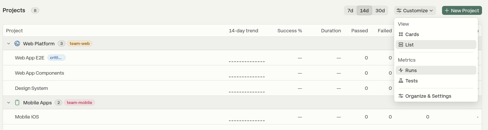
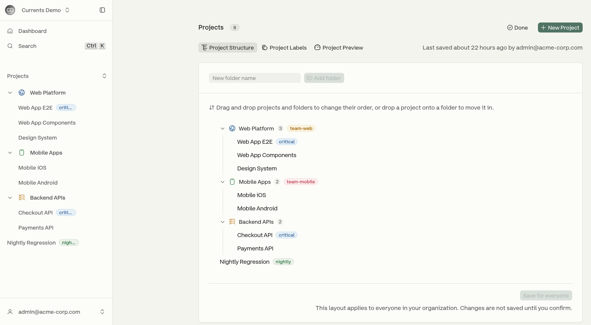
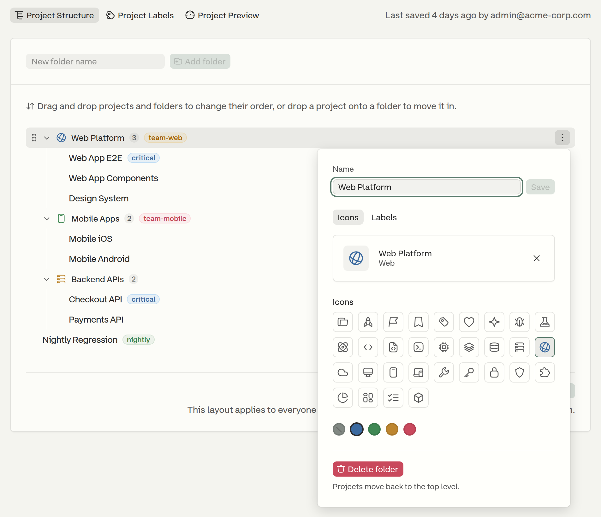
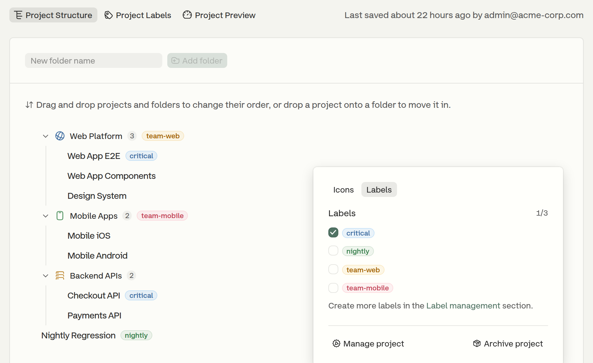
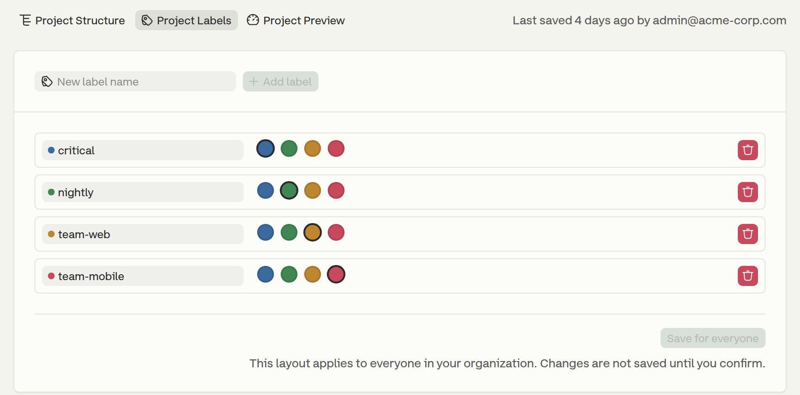
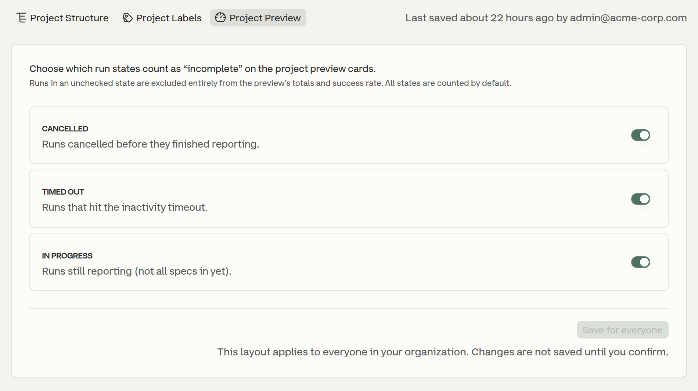
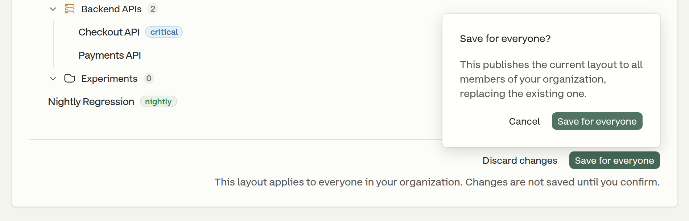

# Manage Projects

**Manage Projects** is the editor that controls how projects appear across the dashboard — on the Projects page, in the sidebar and in the project switcher. It also sets which runs count towards the project preview cards.

The folders, ordering, appearance and labels it controls make up the organization's project **layout**. The layout is organization-wide: once published, every member sees the same one.

Nothing in the editor is live until it is published, and an unpublished draft does not survive a page reload.


Only **Admins** can make changes here. Other roles that open the Manage Projects page see the regular, read-only Projects list. See [Roles and Permissions](manage-team.md#roles-and-permissions).


## Opening Manage Projects

There are two ways to open it:

* Open the organization menu — the organization name at the top of the sidebar — and click **Manage Projects**.
* On the Projects page, click **Customize → Organize & Settings**.

<figure><figcaption>
Opening the editor from the Projects page
</figcaption></figure>

The editor is also labelled **Organize & Settings** in the Customize menu, and [the project settings page](../projects/project-settings.md) links to it as **Organize Projects**. It is split into three tabs:

<table><thead><tr><th width="200">Tab</th><th>What it controls</th></tr></thead><tbody><tr><td><strong>Project Structure</strong></td><td>Folders, ordering, moving projects between them, per-project and per-folder appearance</td></tr><tr><td><strong>Project Labels</strong></td><td>The organization's labels — create, rename, re-color and delete</td></tr><tr><td><strong>Project Preview</strong></td><td>Which runs count towards the project preview cards</td></tr></tbody></table>

Every tab shows who last saved a change and when, or **Not yet published for your organization** if nothing has been saved yet. **Done**, in the page header beside **New Project**, leaves the editor and returns to the Projects page.

## Project Structure

The **Project Structure** tab shows the organization's projects as a tree: folders with the projects they contain, alongside the projects that are not in any folder. In the editor, folders and ungrouped projects are ordered together, so an ungrouped project can sit above, between or below the folders. The Projects page presents the same layout differently — see [Where the Layout Shows Up](manage-projects.md#where-the-layout-shows-up).

<figure><figcaption>
The Project Structure tab, with the resulting folders mirrored in the sidebar
</figcaption></figure>

### Creating a Folder

Type a name into the **New folder name** field above the tree and click **Add folder** (or press `Enter`). The folder is created at the top level with the default folder icon and no color; both can be set afterwards — see [Folder Actions](manage-projects.md#folder-actions).

Folders are flat: a folder contains projects, not other folders.

### Ordering and Moving Projects

Hover a row to reveal its drag handle (the grip on the left). Dragging rearranges the layout:

* Drag a project or a folder up and down to change its order.
* Drop a project **onto a folder** to move it into that folder.
* Drag a project out of a folder and onto the top level to ungroup it.

### Folder Actions

A folder header shows a count of the projects visible in it and a chevron to collapse or expand it. Its **⋮** menu, revealed on hover, offers:

* **Rename** the folder.
* Pick the folder's **icon** and color, on the **Icons** tab.
* Attach **labels** to the folder itself, on the **Labels** tab.
* **Delete folder** — the folder's projects are not deleted; they move back to the top level.

<figure><figcaption>
Renaming a folder and choosing its icon and color
</figcaption></figure>

### Project Appearance and Labels

The **⋮** menu on a project row, also revealed on hover, offers:

* Pick an **icon** and an accent color, shown wherever the project appears — the sidebar, the project switcher and the project lists.
* Toggle the project's **labels**.
* **Manage project** — opens the project's settings page.
* **Archive project** — or **Unarchive project**, when it is archived.

<figure><figcaption>
Attaching labels to a project
</figcaption></figure>

Each project and each folder can carry up to three labels.


The same icon, accent color and labels can also be set per project from **Project Settings → Appearance**. Changes made there are saved immediately, rather than held as a draft.


### Archived Projects

Archived projects are hidden by default. When the organization has any, a **Show archived** button appears above the tree, opposite **Add folder**, showing how many. Click it to bring them into the tree, where they can be re-ordered or placed into folders; each is marked with an **Archived** badge. See [Archive and Unarchive Projects](../projects/archive-and-unarchive-projects.md).

## Project Labels

Labels such as `team-web`, `nightly` or `critical` are defined once for the organization on the **Project Labels** tab, then attached to projects and folders from the **Project Structure** tab.

* **Create** — type a name into **New label name** and click **Add label**. A distinct color is assigned automatically by cycling the palette. Names can be up to 32 characters.
* **Rename** — edit the label's name inline. `Enter` commits the change, `Esc` reverts it.
* **Re-color** — pick another color from the row's color picker.
* **Delete** — click the delete button at the end of the row. The label is removed from every project and folder that used it.

<figure><figcaption>
The organization's project labels
</figcaption></figure>

## Project Preview

The Projects page shows a preview card per project with its run (or test) totals and success rate. The **Project Preview** tab decides which runs feed those numbers. It lists the three run states the dashboard treats as incomplete, and each one can be counted or left out:

<table><thead><tr><th width="180">State</th><th>Runs in this state</th></tr></thead><tbody><tr><td><strong>Cancelled</strong></td><td>Runs cancelled before they finished reporting</td></tr><tr><td><strong>Timed out</strong></td><td>Runs that hit the inactivity timeout</td></tr><tr><td><strong>In progress</strong></td><td>Runs still reporting — not all specs are in yet</td></tr></tbody></table>

All three states are counted by default. Turning one off excludes those runs entirely from the preview's totals and success rate — useful when, for example, cancelled runs are dragging the success rate down.

<figure><figcaption>
Choosing which runs count towards the project preview cards
</figcaption></figure>

These settings are organization-wide and are saved independently of the layout.

## Saving Changes

Edits in Manage Projects are held as a draft, so nothing changes for the rest of the organization until the draft is published. The draft lives only while the page is open: reloading or leaving the editor discards unsaved edits.

* **Save for everyone** publishes the draft. Because that replaces the layout for every member, the button asks for confirmation first.
* **Discard changes** reverts the draft to the currently published layout.
* The **Project Structure** and **Project Labels** tabs edit the same draft, so saving from either publishes both. **Project Preview** has its own draft and its own save, and the "last saved" line on every tab reflects whichever draft was saved most recently.

<figure><figcaption>
Publishing a draft layout to the whole organization
</figcaption></figure>


Publishing is refused if a newer save already exists, rather than overwriting it. A newer save can come from another admin publishing, from one of the other tabs, or from a change in **Project Settings → Appearance**. Reload the page to pick up that save, then re-apply the edits.


## Where the Layout Shows Up

Once published, the layout is used on the Projects page and in the sidebar. On the Projects page, each folder becomes a collapsible group; a folder with no visible projects is left out. The projects that are not in any folder follow the folders as a single group labelled **Ungrouped**, regardless of where they sit in the editor's order.

## What Stays Personal

The layout is shared, but a few view preferences remain per user and are never published:

* **Favorites** — starring a project pins it to a group at the top of the Projects page. The project still appears in its folder as well.
* **Collapsed folders** — collapsing a folder affects only the current user's view, and the Manage Projects editor keeps its collapsed folders separate from the sidebar's.
* **Customize** menu preferences — **Cards** or **List** view, and whether the preview cards show **Runs** or **Tests**.

## Placing a New Project Into a Folder

The **New Project** form has a **Directory** field for placing the project straight into an existing folder, so it does not have to be moved afterwards. Directory is this form's name for a folder. Like every other layout change, the placement applies to the whole organization. If someone else saves between opening the form and submitting it, the project is still created but stays at the top level, and a message says so.

Folders themselves can only be created, renamed, re-ordered and deleted in Manage Projects. To move an existing project, drag it in the **Project Structure** tab.
