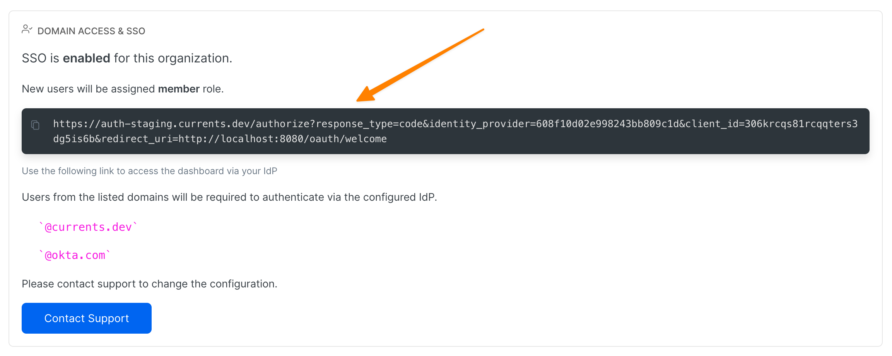

# IdP-initiated Sessions

Currents requires sign-in sessions to originate from https://app.currents.dev.  IdP-initiated auth requests are not supported because of potential risks associated with spoofing and cross-site request forgery.

To simplify access to Currents from your IdP provider, you can generate a dedicated bookmark, following the instructions in **Manage Team** section at https://app.currents.dev.&#x20;

<figure><figcaption>
Using a dedicated link to initiate an authentication with your IdP skipping the Currents dashboard login page
</figcaption></figure>
