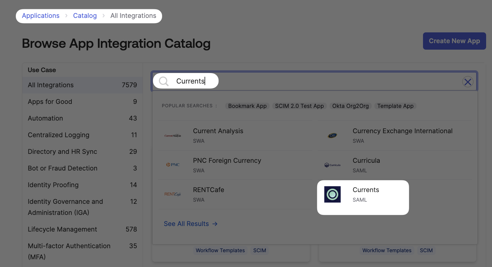
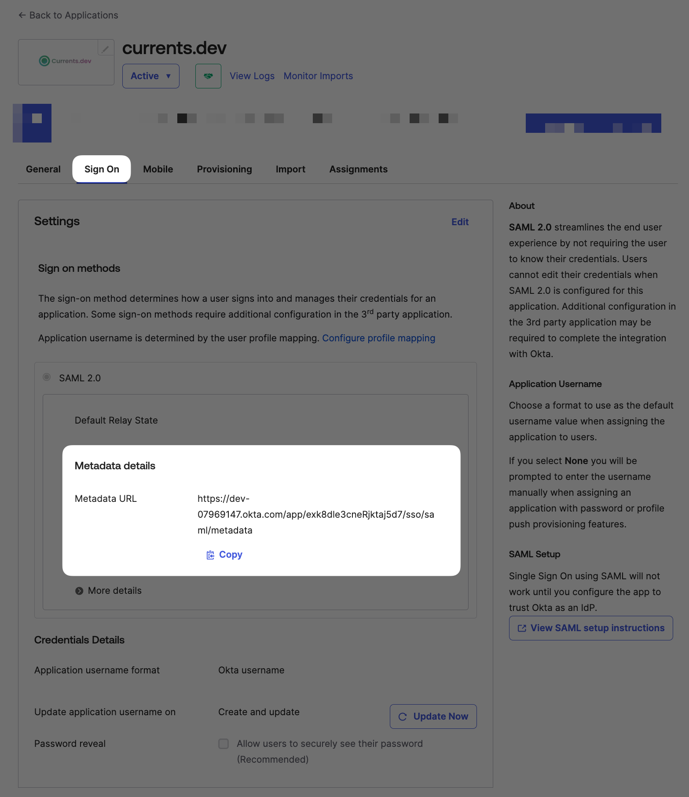

# Okta

### Prerequisites

SAML as the SSO mode with provisioning is available for customers with an active subscription. Please follow the guide below to enable the integration and provide the necessary details to Currents support team.


**Please note**

Enabling SSO will affect all users of your organization who access Currents, users would not be able to sign in to Currents using a different authorization method when SSO is enabled for your organization.


### Supported Features

* SP-initiated SSO (Single Sign-On)
* Just-In-Time provisioning
* SCIM provisioning

For more information on the listed features, visit the [Okta Glossary](https://help.okta.com/okta\_help.htm?type=oie\&id=ext\_glossary).

### Non Supported Features

* Custom Roles for team members are not supported at the moment - the roles need to be manually configured for each user via the dashboard; new accounts will be created with "member" role
* Enabling SSO will mandate the auth method for all the team members
* IdP-initiated SSO (through [Third-party Initiated Login](https://openid.net/specs/openid-connect-core-1\_0.html#ThirdPartyInitiatedLogin))

### Configuration Steps

* Install **Currents** application from Okta Integration Network (OIN) application catalogue: **Applications > Applications > Browse App Catalogue.** Type "**Currents**", select the application from the list, then click **Add Integration** and follow on-screen instructions

<figure><figcaption>
Installing Currents from Okta ION
</figcaption></figure>

* After installing the app, select the **Sign On** tab for the newly installed **Currents app**

<figure><figcaption>
Getting Metadata URL from Currents SAML ION application
</figcaption></figure>

* Copy the Metadata URL from the Okta Admin Console, SAML 2.0 Sign on methods section.
* Contact the **Currents** support team (support@currents.dev) and request that they enable SAML 2.0 for your account. Include the "Metadata URL" value from the previous step.

Your SAML configuration for **Currents** is complete. You can start assigning people to the application.

### SP-initiated SSO

The sign-in process is initiated from https://app.currents.dev

1. From your browser, navigate to https://app.currents.dev/login
2. Enter your email, then Continue
3. Enter your Okta credentials (your email and password) and click "Sign in with Okta". If your credentials are valid, you are redirected to the Currents dashboard.

### Misc

The following SAML attributes are supported:

| Name                                                                                                                                     | Value      |
| ---------------------------------------------------------------------------------------------------------------------------------------- | ---------- |
| [http://schemas.xmlsoap.org/ws/2005/05/identity/claims/emailaddress](http://schemas.xmlsoap.org/ws/2005/05/identity/claims/emailaddress) | user.email |

