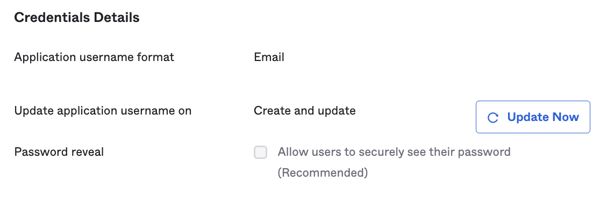

# Okta User provisioning

### Supported features

* **Create users:**
  * Creates new users in Currents when assigned to the Okta app.&#x20;
  * Users won't appear in the Currents team member list until they login.
* **Update user attributes:**&#x20;
  * Currents accepts name updates for users.
* **Deactivate users:**&#x20;
  * Prevent the user from logging into Currents
  * Deactivated users are removed from the Currents team member list.
* **Import users:**&#x20;
  * Link your existing Currents users to their Okta profile.

For more information on the listed features, visit the [Okta Glossary](https://help.okta.com/okta\_help.htm?type=oie\&id=ext\_glossary).

### Requirements

Provisioning is available for customers with an active subscription.&#x20;

In order to setup provisioning you first need to:

* Setup the the  [Okta integration for SAML](./).&#x20;
* Reach out to the Current support team to have provisioning enabled for your organization.

&#x20;Please follow the guide below to enable the provisioning integration.

### Configuration Steps

#### In Currents

* Login as an Admin and navigate to the **Manage Team** page.

<figure><figcaption>
Navigate to Manage Team page
</figcaption></figure>

* Click the **Show SCIMv2 Details**  button in the **DOMAIN ACCESS & SSO** section of the page.

<figure><figcaption>
Getting the SCIM details from the Manage Team page
</figcaption></figure>

* The **Endpoint** and **Token** details will be needed to configure Okta.

#### In Okta

* Navigate to the existing Currents SAML app in Okta: **Applications > Applications.** Click on the **Currents** SAML app**.**

<figure><figcaption>
Navigating to the Currents Okta App
</figcaption></figure>

* Select the **Provisioning** tab and click **Configure API Integration**.
* Check the **Enable API Integration** box. Then provide the **Endpoint** and **Token** information from Currents.
* Click **Test API Credentials** and verify everything is working. Click **Save.**
* Still on the **Provisioning** tab, click **To App** in the left Settings panel and then **Edit** in the top right**.**
* Enable all the supported actions and Click save.
* Ensure that the **Application username format** is set to **Email**. This is found in the **Sign On** tab, under **Credentials Details**.&#x20;

<figure><figcaption>
Application username format set to Email
</figcaption></figure>

* Navigate to the **Import** tab and click the **Import Now** button to find your existing Currents accounts
* Review the matched assignments. Use the checkboxes on the right to select all those that look correct, and click the **Confirm Assignments** button to confirm those imported users.
* You can now update user assignments from the **Assignments** tab to manage who has access to Currents.

### Known Issues/Troubleshooting

#### Unsupported Features

The Currents Okta app does not support the following Okta features:

* Import groups
* Group push
* Sync password
* Profile sourcing

#### Limited profile attributes updates

Currents does not accept updates to the following attributes:

* **userType** - changing a user's role is only supported from the Currents team member dashboard
* **userName** - the mapped userName must match the primary email
* **email** - the primary email cannot be changed
