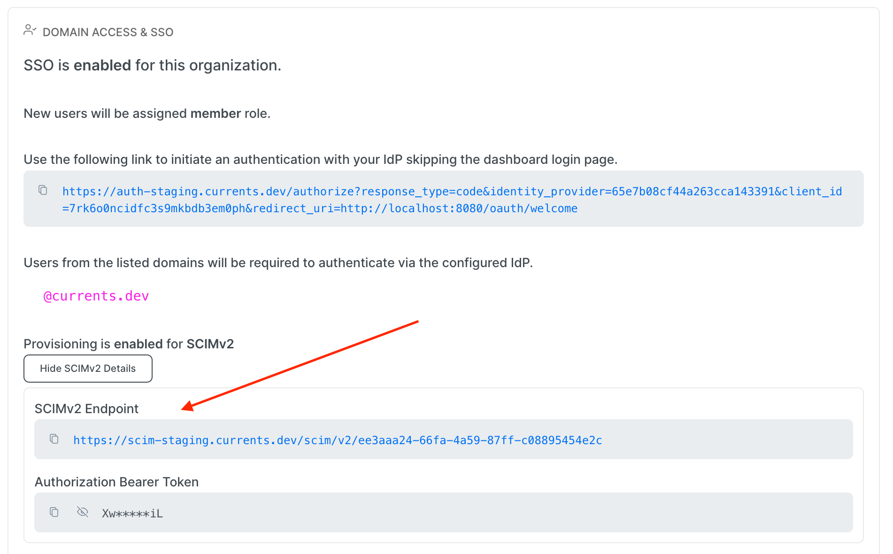

# SCIM User Provisioning

Currents supports [SCIM v2 ](https://datatracker.ietf.org/doc/html/rfc7644) to automatically provision and de-provision users.

First, enable  [saml2.0-configuration.md](saml2.0-configuration.md "mention"). Once ready, contact support via in-app chat or email to request SCIM to be enabled for your organization.

Once enabled by Currents team, organization admins will be able to find the **SCIMv2 Endpoint** and **Authorization Bearer Token** on the **Manage Team** section at https://app.currents.dev.

<figure><figcaption>
SCIM details can be fetched in the Currents app by Org Admins
</figcaption></figure>

### Supported features

Currents supports User resource provisioning using SCIM. **Group resources are not supported**. Only users with an email address that matches the domains configures in the [SSO setup](./) are supported.

When a user is deactivated, Currents removes the user from the team member list. When a user is activated, they are not added to the team member list in Currents until after they login.

The following provisioning endpoints are supported:

* GET Users&#x20;
  * List all users belonging to your organization in our system
  * Search for a specific user using SCIM filtering
* GET User
  * Get a specific user based on id
* POST User
  * Create a new user
* PUT User
  * Update an existing user's active status or display name.
* DELETE User
  * Deactivates the user

### Managed Provisioning

We are maintaining a Managed SCIM provisioning settings for popular providers:

* [Okta Provisioning](okta/okta-user-provisioning.md)
* [JumpCloud Provisioning](../../../administration/sso-saml2.0/jumpcloud/jumpcloud-user-provisioning.md)

### Manual SCIM Configuration

Use the settings below to manually configure your SCIMv2 client.

| Name                         | Value                                                                            |
| ---------------------------- | -------------------------------------------------------------------------------- |
| SCIMv2 Base Url              | Different for each org. It is available in the **Manage Team** dashboard section |
| Auth Method                  | Authorization Header                                                             |
| Auth Type                    | Bearer Token                                                                     |
| `userName` mapping           | email                                                                            |
| Mandatory mapped fields      | `name.givenName`, `name.familyName`, `emails`, `active`                          |
| Optional non-writable fields | `name.formatted`, `displayName`                                                  |

In case of an error, please collect the error detials and contactour support for assistance.
