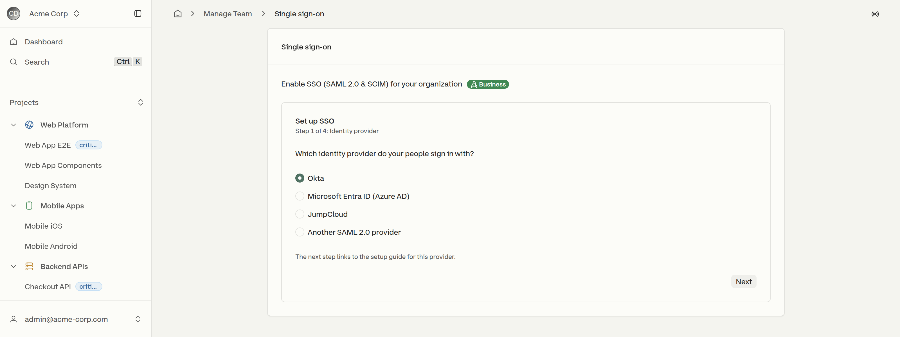
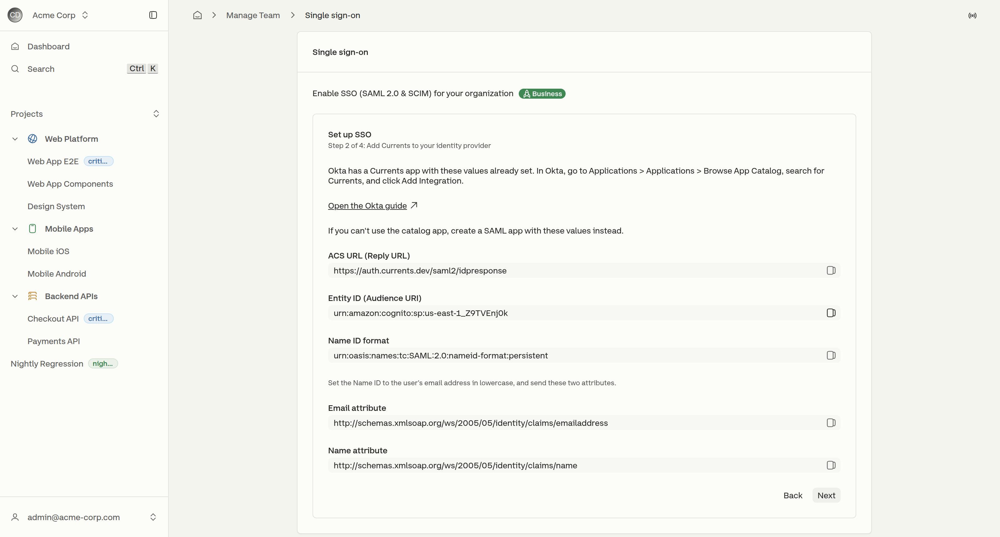
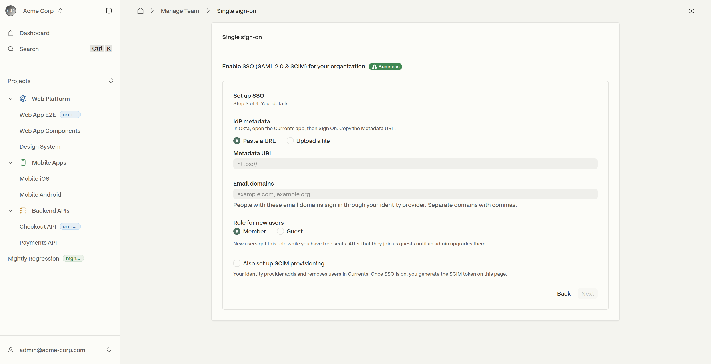
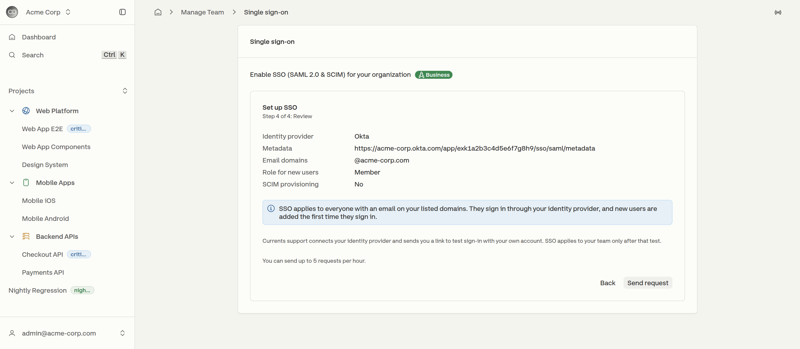

# Setting Up SSO

SSO setup starts in the dashboard rather than in a support conversation. A four-step wizard on **Manage Team → Domain access & SSO → Set up SSO** collects everything Currents needs — the identity provider, its metadata, the email domains it covers and the role new users land with — and submits it as one request.


SSO is part of the Business and Enterprise plans.


The wizard gathers details; it does not switch SSO on by itself. See [what happens after the request](setting-up-sso.md#after-the-request).

## Step 1 — Identity provider

<figure><figcaption>
The provider chosen here decides which guide the next step links to
</figcaption></figure>

Four choices: **Okta**, **Microsoft Entra ID (Azure AD)**, **JumpCloud**, and **Another SAML 2.0 provider**. The pick is not only a label — it decides which instructions and which setup guide the next step shows.

## Step 2 — Add Currents to the identity provider

<figure><figcaption>
The values a manually created SAML app needs, each with a copy control
</figcaption></figure>

For a provider with a Currents app in its catalog — Okta is the case called out — the step names the catalog path and links to the full guide. The catalog app arrives with these values already set.

Where there is no catalog app, the step lists the values a SAML application needs, each with a copy control next to it: the **ACS URL (Reply URL)**, the **Entity ID (Audience URI)**, the **Name ID format**, and the **email** and **name** attribute names. They match [saml2.0-configuration.md](saml2.0-configuration.md "mention"), which also covers the requirements the wizard summarizes in one line — chiefly that the Name ID must be the user's email address in lowercase, and that the `identifier` claim must carry that same value.

## Step 3 — Details

<figure><figcaption>
Everything Currents needs to connect the identity provider
</figcaption></figure>

| Field                  | What it takes                                                                                              |
| ---------------------- | ---------------------------------------------------------------------------------------------------------- |
| **IdP metadata**       | Either a metadata URL or an uploaded metadata file. The step names where to find it in the chosen provider. |
| **Email domains**      | The domains whose users sign in through the identity provider, separated by commas.                        |
| **Role for new users** | **Member** or **Guest**. New users receive this role while seats are free; after that they join as guests until an administrator upgrades them. |
| **SCIM provisioning**  | An optional checkbox. Selecting it includes [scim-user-provisioning.md](scim-user-provisioning.md "mention") in the same request. Once SSO is on, the **SCIMv2 Endpoint** and **Authorization Bearer Token** appear under **Manage Team**. |

The domains listed here are what SSO applies to, and they are separate from the domains under [email-domain-based-access.md](../email-domain-based-access.md "mention") — that list decides which organization a new account joins, this one decides how people sign in.

## Step 4 — Review

<figure><figcaption>
Everything the request carries, before it is sent
</figcaption></figure>

The last step restates every answer and sends the request with **Send request**. Up to **5 requests per hour** can be sent, so a correction after a mistyped metadata URL costs nothing.

## After the request

Currents support connects the identity provider and sends back a link to test sign-in. **SSO applies to the rest of the organization only after that test succeeds** — nobody is locked out while the configuration is being checked.

Once it is on, everyone with an email on the listed domains signs in through the identity provider and can no longer use a password or a social sign-in for Currents. Users are created the first time they sign in, unless SCIM is provisioning them.

If sign-in fails at that point, see [troubleshooting-sso.md](troubleshooting-sso.md "mention").
