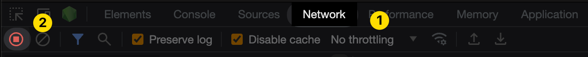
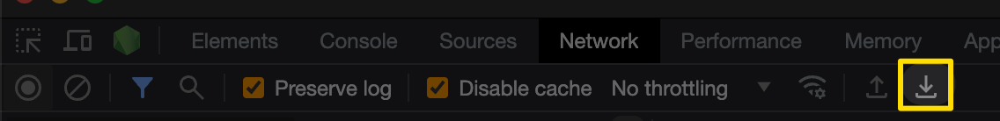

# Troubleshooting SSO

Please follow the steps below to help collect information when you have issues with using SSO connection:

* Open the latest Chrome browser
* Navigate to [https://app.currents.dev/login](https://app.currents.dev/login)
* Open Chrome Developer Tools **(View > Developer > Developer Tools)**
* Switch to Network Tab (1) and make sure that Network Recording is active (the recording button is red) (2)

<figure><figcaption><p>Activating Network Recording in Chrome Develper Tools</p></figcaption></figure>

* Enter your email into the Email field, then click **"Continue"** - you will be forwarded to your organization's Identity Service Provider login screen
* Enter your credentials, you will be forwarded to currents.dev domain
* Upon seeing an error message, please capture the screenshot
* Save the recorded network requests log (HAR) by clicking the **"Export HAR..."** button in Chrome Developer Tools

<figure><figcaption><p>Exporting HAR from Chrome Developer Tools</p></figcaption></figure>

Share the screenshot and the generated HAR file with our Support team


### Case-sensitive NameID Errors

Various IdP use case-sensitive format for email and domain. If `NameID` contains uppercase characters, users that already have an Currents account  can see an error message&#x20;

```
Invalid SAML response received: Invalid ProviderName/Username combination.
```

To resolve the issue you need to ensure the `NameID` is lowercased in your IdP settings.&#x20;

For example:

* Use [Microsoft Enterprise Apps transformation](https://learn.microsoft.com/en-us/entra/identity-platform/saml-claims-customization#special-claims-transformations) to transfor `NameID`  to lowercase format
