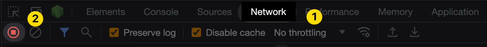
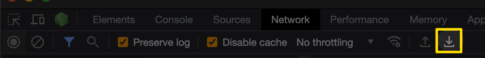

# Troubleshooting SSO

Please follow the steps below to help collect information when you have issues with using SSO connection:

* Open the latest Chrome browser
* Navigate to [https://app.currents.dev/login](https://app.currents.dev/login)
* Open Chrome Developer Tools **(View > Developer > Developer Tools)**
* Switch to Network Tab (1) and make sure that Network Recording is active (the recording button is red) (2)

<figure><figcaption><p>Activating Network Recording in Chrome Develper Tools</p></figcaption></figure>

* Enter your email into the Email field, then click **"Continue"** - you will be forwarded to your organization's Identity Service Provider login screen
* Enter your credentials, you will be forwarded to currents.dev domain
* Upon seeing an error message, please capture the screenshot
* Save the recorded network requests log (HAR) by clicking the **"Export HAR..."** button in Chrome Developer Tools

<figure><figcaption><p>Exporting HAR from Chrome Developer Tools</p></figcaption></figure>

Share the screenshot and the generated HAR file with our Support team


### Invalid ProviderName/Username Combination

This error occurs when Currents cannot match the SAML response to a valid user account:

```
Invalid SAML response received: Invalid ProviderName/Username combination.
```

#### Common Causes

1. **NameID uses an opaque identifier instead of email**
   
   Some IdPs (notably Azure AD / Entra ID) default to sending an opaque persistent identifier (e.g., Object ID) as the `NameID` value. Currents requires the `NameID` to be the user's **email address**, not an opaque ID.

2. **NameID and identifier claim mismatch**
   
   The `identifier` SAML attribute must contain the exact same value as `NameID`. If `NameID` is set to one value (e.g., an opaque ID) while `identifier` contains the email, authentication will fail.

3. **Case-sensitive email values**
   
   If `NameID` or `identifier` contains uppercase characters (e.g., `User@Example.com`), it may not match existing Currents accounts which use lowercase emails.

#### Resolution

Ensure your IdP is configured to:

* Set `NameID` to the user's email address (not an opaque identifier)
* Apply a lowercase transformation to `NameID`
* Set the `identifier` claim to the same lowercase email value

**For Azure AD / Entra ID:**

See [azure-ad](azure-ad/ "mention") for detailed configuration steps, including how to apply the `ToLowercase()` transformation to claims.

**For other IdPs:**

* Use [Microsoft Enterprise Apps transformation](https://learn.microsoft.com/en-us/entra/identity-platform/saml-claims-customization#special-claims-transformations) for Entra ID
* Consult your IdP's documentation for claim transformation options

***

### Encrypted Assertion Errors

If your IdP is configured to encrypt SAML assertions, you may encounter errors during authentication. Currents supports encrypted assertions, but the encryption must be properly configured.

#### Symptoms

* Authentication fails silently after IdP login
* Error messages referencing encryption or decryption failures
* SAML response appears valid in IdP logs but Currents rejects it

#### Resolution

1. Verify your IdP is using a supported encryption algorithm
2. Ensure the encryption certificate matches what Currents expects
3. Contact Currents support with your metadata XML to verify encryption configuration

If you continue to experience issues, you can temporarily disable assertion encryption in your IdP to isolate the problem.
