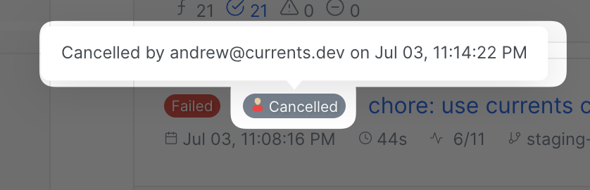
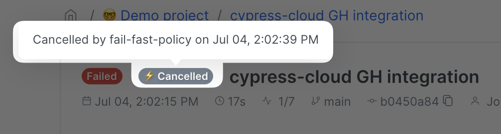
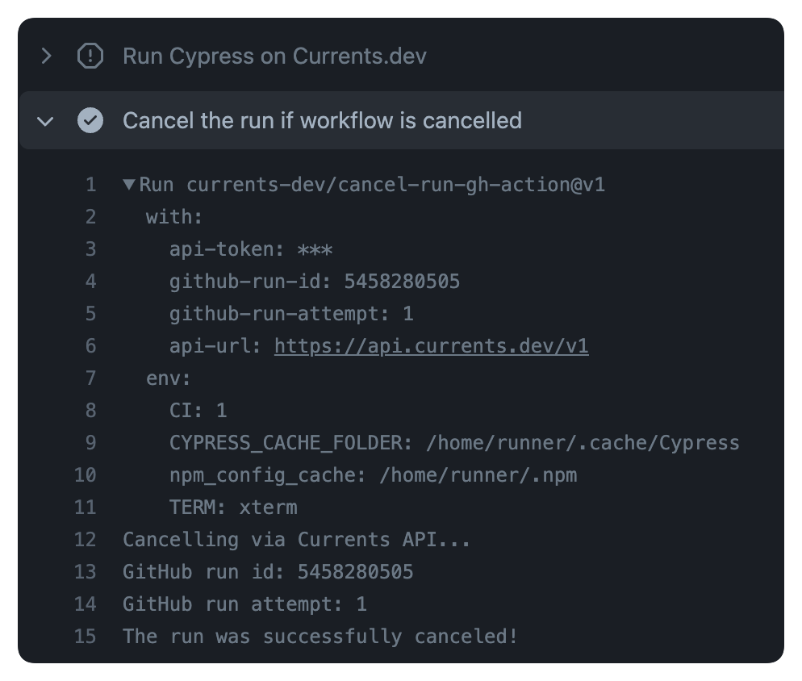
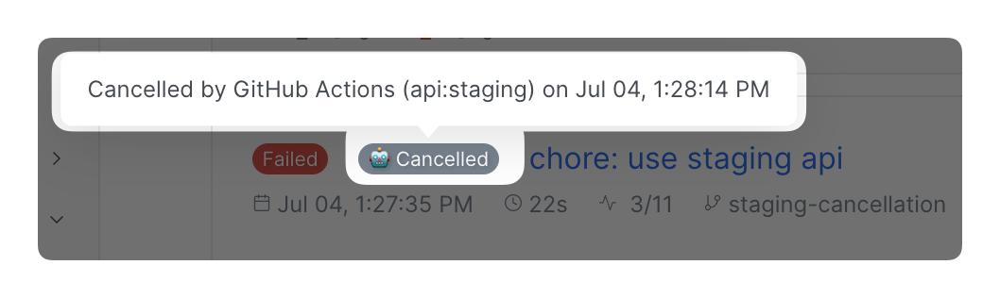

# Canceling Runs

Runs that are currently in progress can be cancelled using the dashboard controls or via an API call.

Cancelling a run can be useful for:

* preventing a run from timing out
* optimizing usage of your CI provider resources
* reducing the number of recorded tests


**Please note:** Cancelling a run cannot be undone


### Cancelling Playwright or Cypress CI runs from the Currents dashboard

In-progress runs can be cancelled by clicking the "Cancel Run" button in the Runs Feed view.


You can also cancel a run when from the Run Details view.


<figure><figcaption><p>Example of a run cancelled by a dashboard user</p></figcaption></figure>

### Cancelling Playwright or Cypress CI runs via an API call

You can programmatically cancel a run via the `PUT runs/:runId/cancel` HTTP API call. For example, here is an example of `curl` command that cancels a particular run

```bash
curl --location --request PUT 'https://api.currents.dev/v1/runs/:runId/cancel' \
--header 'Authorization: Bearer <currents API token>'
```

By using the API call you can extend the - for example:

* cancel a run after CI pipeline is stopped/cancelled
* cancel a run when a particular condition is met, e.g.:
  * activate [http-webhooks.md](../../resources/integrations/http-webhooks.md "mention") and parse the results
  * based on the results (e.g. encountering a particular error message), send the cancellation request
* cancel a run when a certain number of failed tests are detected (it is natively supported via [fail-fast-strategy.md](../../guides/parallelization-guide/fail-fast-strategy.md "mention"))

### Runs cancelled by fail-fast strategy

If you have [fail-fast-strategy.md](../../guides/parallelization-guide/fail-fast-strategy.md "mention") activated for a project, runs cancelled because of fail-fast strategy will be marked with a special badge:

<figure><figcaption><p>Example of a run cancelled by fail-fast strategy</p></figcaption></figure>

### GitHub Actions workflow cancellation

You can automatically cancel Currents runs (cypress and playwright) when cancelling GitHub Actions workflow using [cancel-run-gh-action](https://github.com/currents-dev/cancel-run-gh-action).

Check out the [example workflow configuration](https://github.com/currents-dev/gh-actions-example/blob/main/.github/workflows/currents.yml#L38):

```yaml
      # Run all Currents tests
      - name: Run Cypress on Currents.dev
        uses: cypress-io/github-action@v4
        with:
          command: npx cypress-cloud run --record --parallel --browser chrome --key ${{ secrets.CURRENTS_RECORD_KEY }} --ci-build-id ${{ github.repository }}-${{ github.run_id }}-${{ github.run_attempt}}

      - name: Cancel the run if the workflow is cancelled
        if: ${{ cancelled() }}
        uses: currents-dev/cancel-run-gh-action@v1
        with:
          api-token: ${{ secrets.CURRENTS_API_KEY }}
          github-run-id: ${{ github.run_id }}
          github-run-attempt: ${{ github.run_attempt }}
```

The example above uses a [GitHub Actions repository secret](https://docs.github.com/en/actions/security-guides/encrypted-secrets#creating-encrypted-secrets-for-a-repository) named `CURRENTS_API_KEY.` For creating a new API secret please refer to [api-keys.md](../../resources/api/api-keys.md "mention").

After the step is enabled, cancelling a GitHub Actions workflow will trigger cancellation:

<figure><figcaption><p>Example of a cancellation step</p></figcaption></figure>

The associated Currents run will be cancelled with the corresponding notes:

<figure><figcaption></figcaption></figure>

### What happens when a run is cancelled?

Cancelling a run affects in-progress and pending tests, as well as integrations and run analytics.

* the run will be marked as "Cancelled", depending on the test's status, it can also become "Failed" or "Passed". See [run-status.md](run-status.md "mention").
* in-progress tests will run to completion, the dashboard will accept their result
* attempts to start a new test for a cancelled run would fail with the error message `Run is cancelled`

### Cancelling runs and analytics

* Cancelled runs are excluded from Runs Duration Insights
* Cancelled runs are excluded from Test / Spec Size Insights
* Tests recorded as part of a cancelled run are still included in Tests Insights charts

### How does cancelling a run affect test records plan usage?

* Only fully recorded tests consume your organization's test records limit.&#x20;
* Cancelled runs do consume your organization's runs limit (for organizations on deprecated runs-based plans)

### How does cancelling a run affect integrations (GitHub, Slack, etc.)?

#### GitHub / BitBucket Commit Status Check

* Commit status checks will display `Cancelled by <username>` message
* Commit status check outcome will be set according to the last known run status, for example
  * if no failed tests were recorded before the cancellation, the status check outcome will be a `success`
  * otherwise, the status check outcome will be a `failure`


#### GitHub PR Comment

* Currents will post a new PR comment with `Cancelled by <username>` message
* PR comment details will be set according to the last known run status


#### Slack / MS Teams

* Currents will post a cancellation notification with the last known run results


#### HTTP Webhook Integration

* A new HTTP POST request will be emitted with the last known run results. and event type `RUN_CANCELED`  See [http-webhooks.md](../../resources/integrations/http-webhooks.md "mention") for details.

