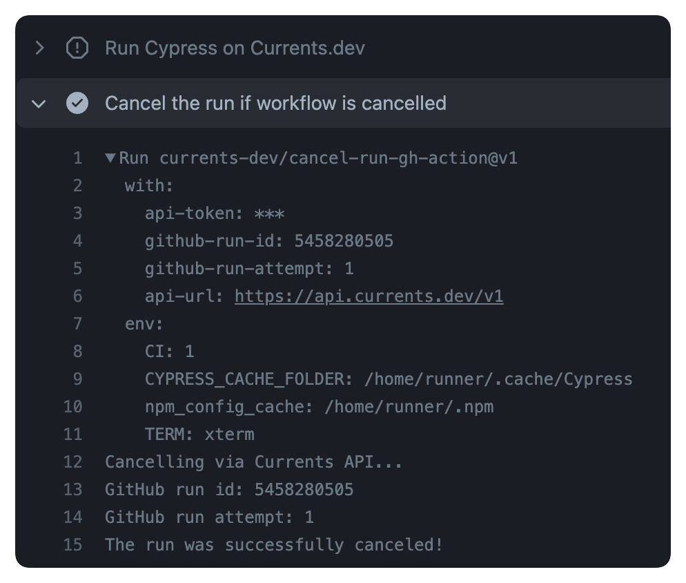
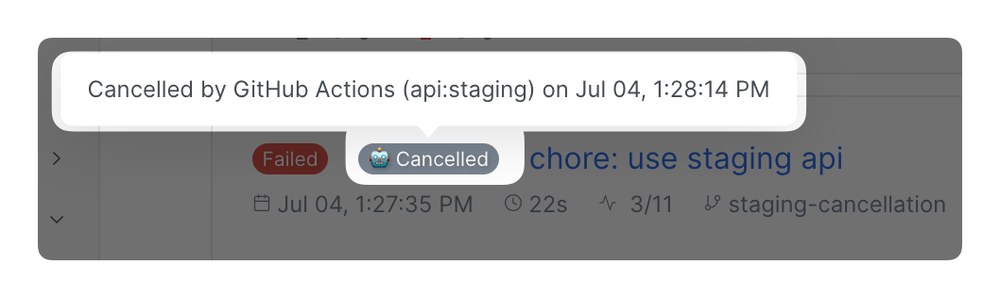

# Cancelling Runs

Runs that are currently in progress can be cancelled using the dashboard controls or via an API call.

Cancelling a run can be useful for:

* preventing a run from timing out
* optimizing usage of your CI provider resources
* reducing the number of recorded tests


**Please note:** Cancelling a run cannot be undone


## Cancelling Runs via Dashboard

In-progress runs can be cancelled by clicking the "Cancel Run" button in the Runs Feed view. You can also cancel a run when from the Run Details view.

<figure><figcaption><p>Cancelling a Run via Dashboard</p></figcaption></figure>

The canceled run will be tagged accordingly, and the dashboard will display the user, date, and time of cancellation.

<figure><figcaption><p>Example of a run cancelled by a dashboard user</p></figcaption></figure>

## Cancelling Runs from CI

When a CI job is cancelled — manually, or because a newer commit superseded it — it stops reporting mid-run, and the run stays in progress until it hits the project's [run-timeouts.md](run-timeouts.md "mention"). Add a step that cancels the run when the job is cancelled:

```yaml
- name: Cancel the run if the workflow is cancelled
  if: ${{ cancelled() }}
  run: npx currents cancel
```

[`currents cancel`](../../resources/reporters/currents-cmd/currents-cancel.md) authenticates with the [record-key.md](../../guides/record-key.md "mention") the job already uses to report results, so it needs no additional secret, and it identifies the run by its [ci-build-id.md](../../guides/parallelization-guide/ci-build-id.md "mention") or its run ID — which makes it work on any CI provider. See [currents-cancel.md](../../resources/reporters/currents-cmd/currents-cancel.md "mention") for the available options.

On GitHub Actions the same thing is available as an action — see [cancel-runs.md](../../getting-started/ci-setup/github-actions/cancel-runs.md "mention").

## Cancelling Runs via API

You can programmatically cancel a run via the `PUT runs/:runId/cancel` HTTP API call. For example, here is an example of `curl` command that cancels a particular run

```bash
curl --location --request PUT 'https://api.currents.dev/v1/runs/:runId/cancel' \
--header 'Authorization: Bearer <currents API token>'
```

By using the API call you can extend the - for example:

* cancel a run after CI pipeline is stopped/cancelled
* cancel a run when a particular condition is met, e.g.:
  * activate [http-webhooks.md](../../resources/integrations/http-webhooks.md "mention") and parse the results
  * based on the results (e.g. encountering a particular error message), send the cancellation request
* cancel a run when a certain number of failed tests are detected (it is natively supported via [fail-fast-strategy.md](../../guides/ci-optimization/fail-fast-strategy.md "mention"))

### Cancellation by Fail-Fast

If you have [fail-fast-strategy.md](../../guides/ci-optimization/fail-fast-strategy.md "mention") activated for a project, runs cancelled because of fail-fast strategy will be marked with a special badge:

<figure><figcaption><p>Example of a run cancelled by fail-fast strategy</p></figcaption></figure>

## GitHub Actions Workflow Cancellation

On GitHub Actions the same cancellation is also available as an action, [cancel-run-gh-action](https://github.com/currents-dev/cancel-run-gh-action). See [cancel-runs.md](../../getting-started/ci-setup/github-actions/cancel-runs.md "mention") for a complete workflow.

```yaml
      - name: Run tests
        env:
          CURRENTS_RECORD_KEY: ${{ secrets.CURRENTS_RECORD_KEY }}
          CURRENTS_PROJECT_ID: my-project-id
          CURRENTS_CI_BUILD_ID: ${{ github.repository }}-${{ github.run_id }}-${{ github.run_attempt }}
        run: npx playwright test

      - name: Cancel the run if the workflow is cancelled
        if: ${{ cancelled() }}
        uses: currents-dev/cancel-run-gh-action@v1
        with:
          record-key: ${{ secrets.CURRENTS_RECORD_KEY }}
          project-id: my-project-id
          ci-build-id: ${{ github.repository }}-${{ github.run_id }}-${{ github.run_attempt }}
```

All three inputs default to `CURRENTS_RECORD_KEY`, `CURRENTS_PROJECT_ID` and `CURRENTS_CI_BUILD_ID`, so a job that already exports them for the reporting step can use the action with no inputs at all.

Pass `run-id` instead of `ci-build-id` to cancel a run you already have the id of. It defaults to `CURRENTS_RUN_ID` and takes precedence when both are set.

After the step is enabled, cancelling a GitHub Actions workflow will trigger cancellation:

<figure><figcaption><p>Example of a cancellation step</p></figcaption></figure>

The associated Currents run will be cancelled with the corresponding notes:

<figure><figcaption></figcaption></figure>

#### Cancelling with an API key

The action also accepts an [api-keys.md](../administration/api-keys.md "mention") instead of a record key. It then identifies the run by the GitHub run id and attempt recorded on it, so no other input is needed:

```yaml
  - name: Cancel the run if the workflow is cancelled
    if: ${{ cancelled() }}
    uses: currents-dev/cancel-run-gh-action@v1
    with:
      api-token: ${{ secrets.CURRENTS_API_KEY }}
```

Pass `project-id` and `ci-build-id` as well to identify the run by its [ci-build-id.md](../../guides/parallelization-guide/ci-build-id.md "mention") instead — which is what you need when the workflow records under a CI build ID of its own:

```yaml
  - name: Run tests
    env:
      CURRENTS_CI_BUILD_ID: "a-custom-ci-build-id"
      CURRENTS_PROJECT_ID: "my-project-id"
    run: npx pwc --key ${{ secrets.CURRENTS_RECORD_KEY }}

  - name: Cancel the run if the workflow is cancelled
    if: ${{ cancelled() }}
    uses: currents-dev/cancel-run-gh-action@v1
    with:
      api-token: ${{ secrets.CURRENTS_API_KEY }}
      project-id: ${{ env.CURRENTS_PROJECT_ID }}
      ci-build-id: ${{ env.CURRENTS_CI_BUILD_ID }}
```

## FAQ

### What happens when a run is cancelled?

Cancelling a run affects in-progress and pending tests, as well as integrations and run analytics.

* the run will be marked as "Cancelled", depending on the test's status, it can also become "Failed" or "Passed". See [test-status.md](../tests/test-status.md "mention").
* in-progress tests will run to completion, the dashboard will accept their result
* attempts to start a new test for a cancelled run would fail with the error message `Run is cancelled`

### Cancelling runs and analytics

* Cancelled runs are excluded from Runs Duration Insights
* Cancelled runs are excluded from Test / Spec Size Insights
* Tests recorded as part of a cancelled run are still included in Tests Insights charts

### How does cancelling a run affect test records plan usage?

* Only fully recorded tests consume your organization's test records limit.&#x20;
* Cancelled runs do consume your organization's runs limit (for organizations on deprecated runs-based plans)

### How does cancelling a run affect integrations (GitHub, Slack, etc.)?

#### GitHub / BitBucket Commit Status Check

* Commit status checks will display `Cancelled by <username>` message
* Commit status check outcome will be set according to the last known run status, for example
  * if no failed tests were recorded before the cancellation, the status check outcome will be a `success`
  * otherwise, the status check outcome will be a `failure`


#### GitHub PR Comment

* Currents will post a new PR comment with `Cancelled by <username>` message
* PR comment details will be set according to the last known run status


#### Slack / MS Teams

* Currents will post a cancellation notification with the last known run results


#### HTTP Webhooks&#x20;

A new HTTP `POST` request will be emitted with the last known run results and event type `RUN_CANCELED`  See [http-webhooks.md](../../resources/integrations/http-webhooks.md "mention") for details.

