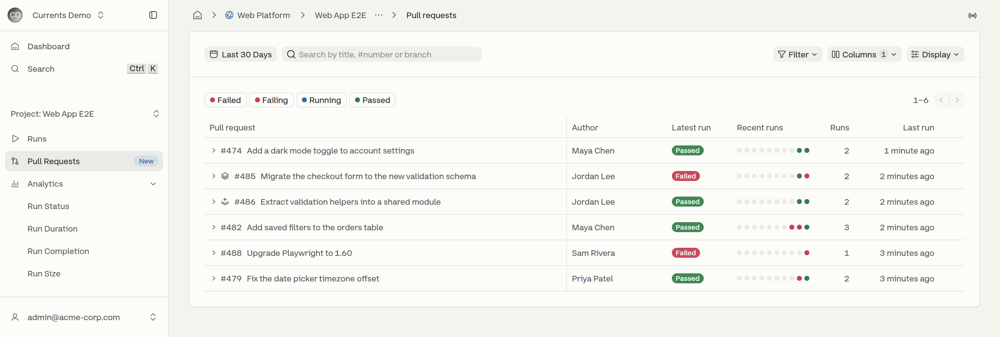
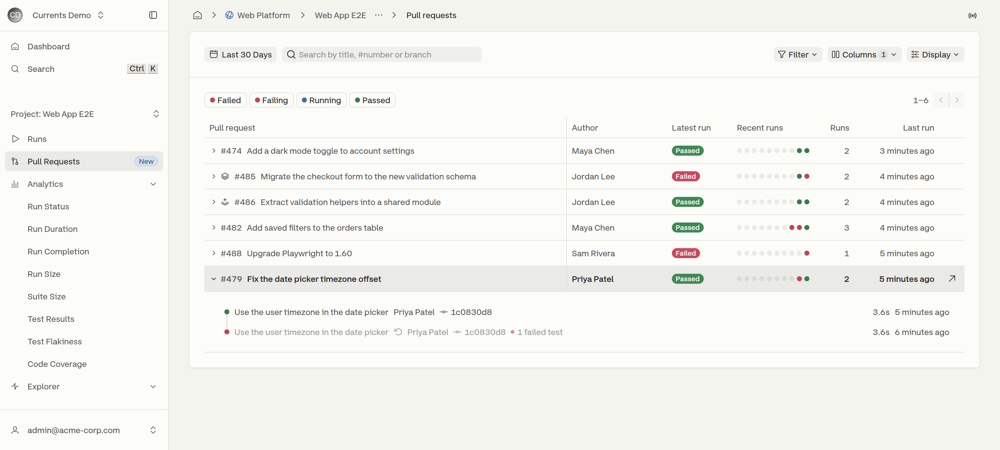
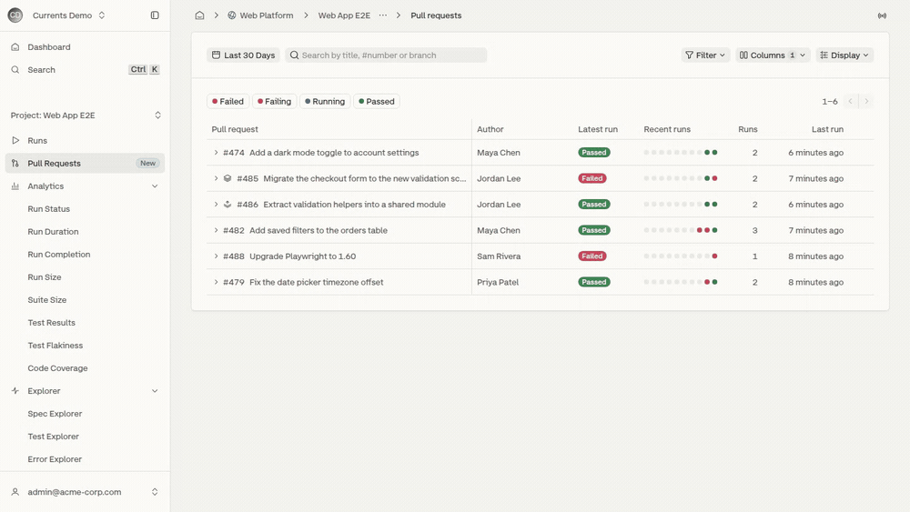
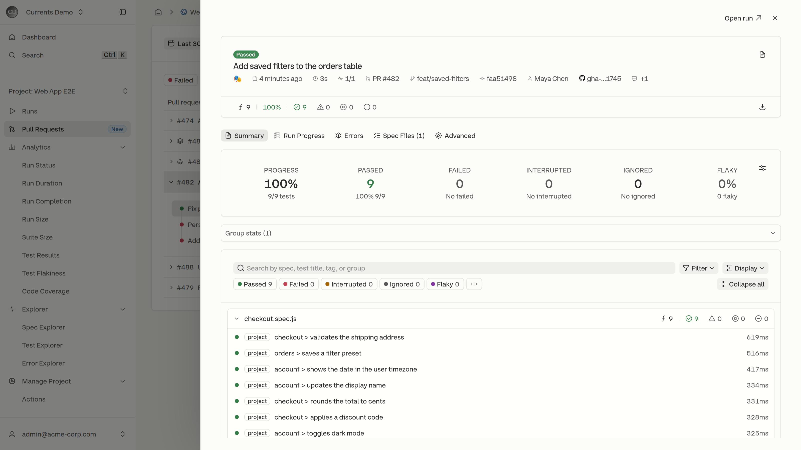
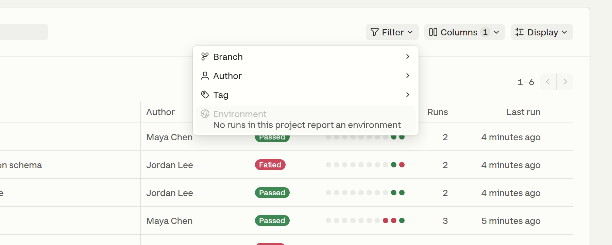
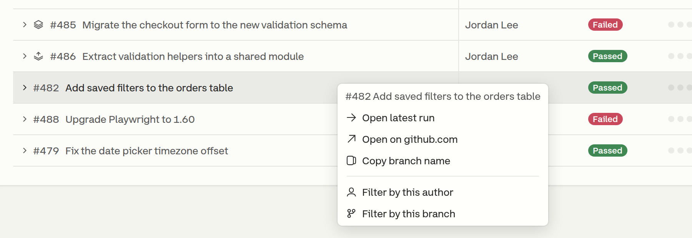
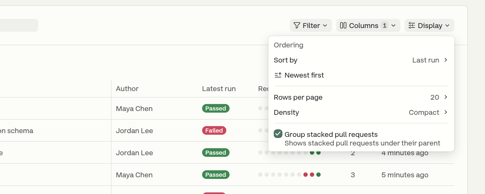

# Pull Requests

The **Pull Requests** page lists the pull requests that CI reported runs for within the selected date range (the last 30 days by default), one row per pull request, with the status of its latest run and a strip of its recent runs. It answers "which open pull requests are failing, and since when?" without scanning the flat run feed.

To open it, select a project and click **Pull Requests** in the sidebar.

<figure><figcaption>
Pull requests of a project, most recently run first
</figcaption></figure>


A run appears on this page only when CI reports it with pull request information, for example a GitHub Actions `pull_request` workflow or a GitLab merge request pipeline. Runs from branch pushes stay on the Runs page only. A row's title is the pull request title that CI reports, or the latest run's commit message when CI sends no title. It does not follow the project's Run Title Source setting. Authors and commit messages come from the run's git data; see [commit-information.md](commit-information.md "mention").


## Columns

| Column        | Description                                                                              |
| ------------- | ---------------------------------------------------------------------------------------- |
| Pull request  | Number and title. When the page mixes repositories, rows outside the most common one show their repository name before the number. |
| Author        | Commit author of the latest run                                                          |
| Latest run    | Status of the most recent run                                                            |
| Recent runs   | One dot per recent run, oldest to newest, colored by status                              |
| Runs          | Total number of runs for the pull request                                                |
| Last run      | When the most recent run was created                                                     |

The **Columns** menu turns the optional columns on and off: **Author**, **Branch**, **Tags**, **Environment** and **First run**. Author is on by default. Environment turns on by itself when a row on the page reports an environment. First run is shown only when the list is sorted by first run.

## Expanding a Pull Request

Clicking anywhere on a row, or pressing <kbd>Enter</kbd> on a focused row, expands it into a timeline of the pull request's recent runs, newest first. Each run shows its commit message, the commit author and short SHA, the number of failed tests, its duration and when it was created.

<figure><figcaption>
The earlier run of commit 1c0830d8 is muted because the same commit ran again after it
</figcaption></figure>

When the same commit runs more than once, for example after a retry in CI, the earlier runs are muted and marked **This commit ran again after this run**, so the result that stands is the latest one.

When a pull request has more runs than the timeline shows, a **View all N runs** link opens the Runs page filtered to that pull request, keeping the current search and date range.

## Previewing a Run

Clicking a run in the expanded row, or a dot in the **Recent runs** column, opens the run in a drawer over the list. The drawer has the full run page, including its tabs, filters and test details, and the list keeps its scroll position, filters and expanded rows underneath.

<figure><figcaption>
Expanding a pull request and previewing one of its runs
</figcaption></figure>

* **Open run** in the drawer header opens the full run page.
* Opening a test inside the drawer shows it over the run, with **Back to run** to return.
* <kbd>Esc</kbd> closes an open test first, then the drawer.
* <kbd>Ctrl</kbd>/<kbd>Cmd</kbd>-click on a run opens the run page in a new tab instead of the drawer.

<figure><figcaption>
A run of pull request #482 in the preview drawer
</figcaption></figure>

## Searching and Filtering

* **Date range** - pull requests with runs in the selected range. The default is the last 30 days. When the range is empty, **Use last 90 days** widens it.
* **Search** - matches a pull request's title, number (`#482` or `482`) or branch.
* **Status chips** - **Failed**, **Failing**, **Running** and **Passed** filter by the status of each pull request's latest run. More than one chip can be selected.
* **Filter** - narrows the list by **Branch**, **Author**, **Tag** or **Environment**. Each active filter appears as a removable pill under the toolbar.

<figure><figcaption>
The Filter menu
</figcaption></figure>

Status and search are checked against each pull request's latest run. When nothing matches, **Clear filters** resets the search, chips and filters.

## Row Actions

Right-clicking a row opens its actions:

* **Open latest run**
* **Open on** the Git host, for example `github.com`
* **Copy branch name**
* **Filter by this author**
* **Filter by this branch**

<figure><figcaption>
Actions for a pull request
</figcaption></figure>

## Display Options

The **Display** menu controls how the list is ordered and laid out.

<figure><figcaption>
The Display menu
</figcaption></figure>

| Option                      | Values                                                                                                   |
| --------------------------- | -------------------------------------------------------------------------------------------------------- |
| Sort by                     | **Last run** (default), **First run** or **Number of runs**                                              |
| Direction                   | **Newest first** / **Oldest first**, or **Most runs first** / **Fewest runs first** when sorting by runs |
| Rows per page               | **20** (default) or **50**                                                                               |
| Density                     | **Compact** (default) or **Comfortable**, which adds the source and destination branches under the title |
| Group stacked pull requests | On by default. See [Stacked Pull Requests](#stacked-pull-requests).                                      |

Density, rows per page, column choices and stacked grouping are saved per project in the browser. A shared link that sets the page size keeps it for everyone who opens it.

## Stacked Pull Requests

A pull request is stacked when its destination branch is the source branch of another pull request in the same repository, for example `feat/validation-helpers` into `feat/checkout-validation`.

With **Group stacked pull requests** on, a stacked pull request is placed directly under the pull request it is stacked on, and a stack icon marks each member of the group. In the screenshot at the top of this page, #486 is stacked on #485. A stacked pull request whose parent is not directly above it, such as a parent on another page, shows a **Stacked on #N** badge instead.

## New Runs

The list refreshes every minute, and more often while a latest run is still in progress. When new runs change the first page while a later page is open, a **New runs · Back to newest** button returns to the top of the list.

## Missing Commit Information

When most pull requests on the page have runs without a commit message or author, a warning explains that CI sends only the commit SHA. Runs affected are marked with a warning icon. The warning offers **Fix with AI**, which hands an AI assistant a prompt for fixing the CI configuration, and a **Setup guide** link to [commit-information.md](commit-information.md "mention"). Dismissing the warning hides it for that project.
