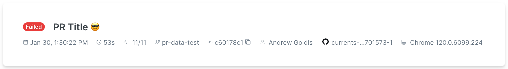

# Run Details

When creating a new run, playwright and cypress collect various information about the environment - this information is shown as Run Details in Currents Dashboard.

<figure><figcaption>
Run details example
</figcaption></figure>

| Field             | Description                                             |
| ----------------- | ------------------------------------------------------- |
| Duration          | Run's duration                                          |
| Progress          | Completed / overall spec files progress                 |
| Started at        | Run start timestamp                                     |
| Branch            | Git branch name (or HEAD for Pull Requests)             |
| Commit            | Git commit message (or Pull Request title)              |
| Browser / Project | Cypress tests browser or Playwright Project             |
| Author            | Git commit author                                       |
| CI Build ID       | [ci-build-id.md](../../guides/ci-build-id.md "mention") |
