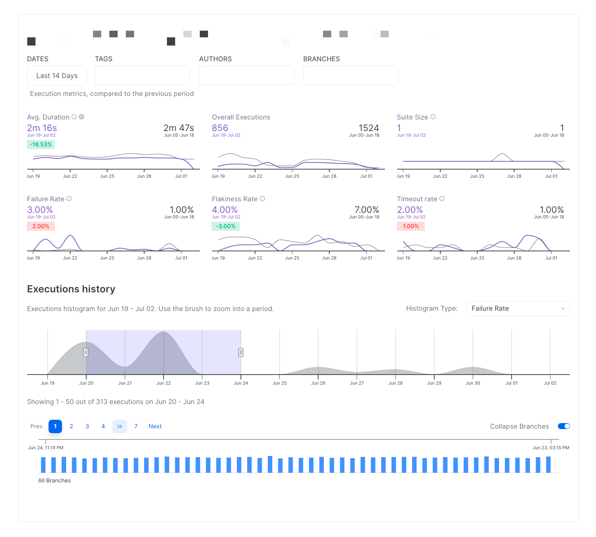
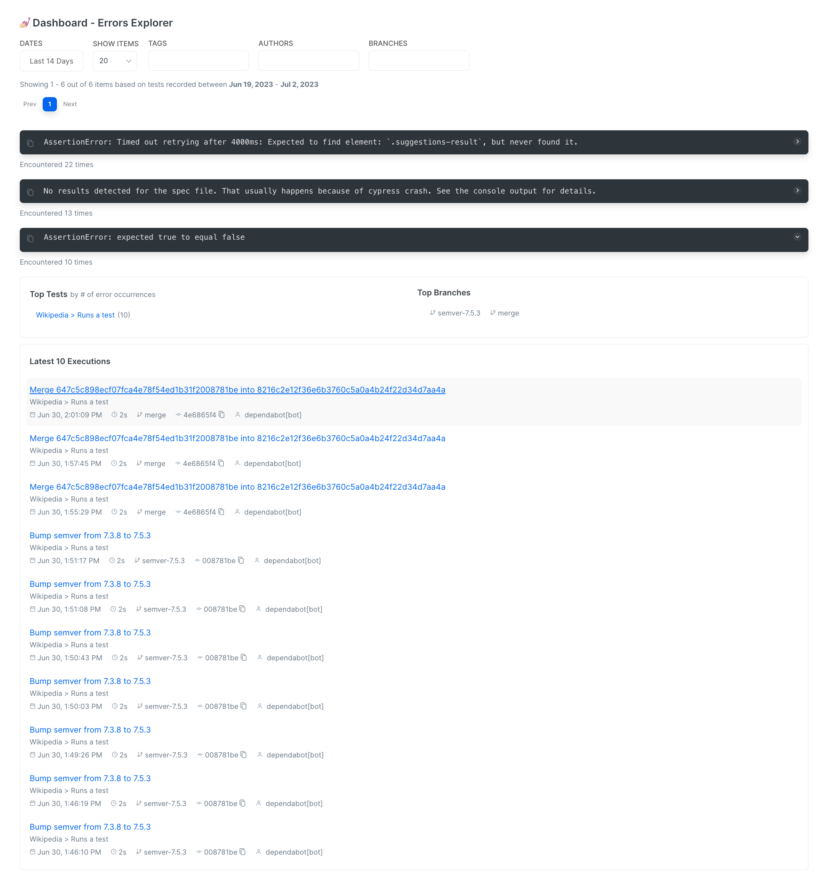

# Test Explorer

Test Suite Explorer track and troubleshoot the performance of individual tests or spec files.

<figure><figcaption>
Test Suite Performance Explorer
</figcaption></figure>

Together with [automated-reports.md](../automated-reports.md "mention"), the Test Explorer allows teams to proactively detect changes in tests flakiness, failure rate or duration and to effectively discover the root cause of regressions in performance.

In addition, an aggregated view of cross-run top errors helps identify high-impact errors that are affecting your test executions.

<figure><figcaption>
Top Errors Preview
</figcaption></figure>
