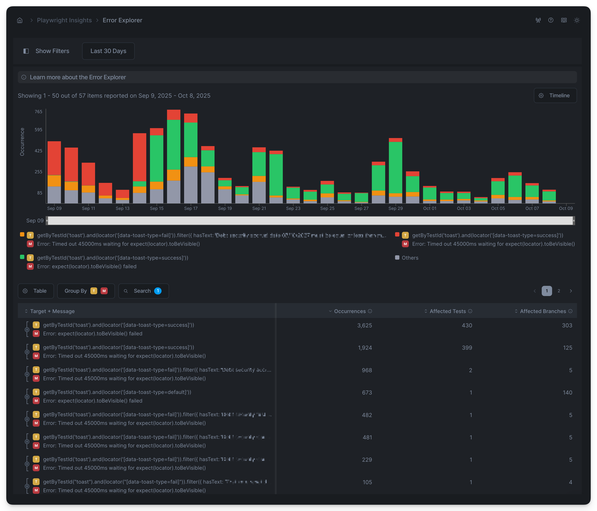
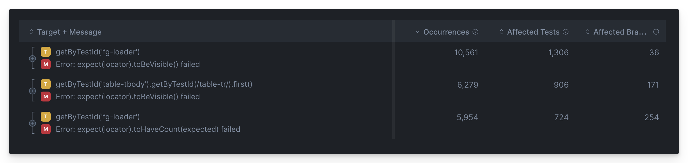

# Error Explorer

Currents goes beyond just collecting error messages by analyzing each failure and extracting additional fields:

* **Target** (e.g. CSS selector, URL)
* **Action** (e.g. `click`, `toBeVisible`)
* **Category** (e.g. Assertion, Timeout)

By combining these fields, you can discover failure patterns across CI runs — linking **what happened** (Action), **where it happened** (Target), and **why it failed** (Category).

Currents evaluates the impact of test failures across your CI pipeline by measuring

* number of failure occurrences
* number of affected tests
* number of affected branches

<figure><figcaption></figcaption></figure>

This allows you to distinguish between flaky UI selectors, network instability, and true logic errors; identify components or endpoints that frequently break; and visualize how different error types evolve over time.

## Error Classification Fields

When a test fails, the raw error message and stack trace are parsed by Currents’ Error Classification Engine. It enriches every captured test error with structured fields that turn unstructured log text into searchable, comparable data.

<figure><figcaption></figcaption></figure>

### How to use Error Classification Fields?

Finding the most unstable components across multiple tests and runs is a key to improving testing suite stability. However, Playwright error messages are either too generic or too detailed. For example consider this message:

```
Error: expect(locator).toBeVisible() failed
```

This message is too generic — it can be associated with different CSS. That’s why additional context is needed to reason about the error, not just the message itself.&#x20;

By combining **Target + Message** we uncover what CSS selectors are generating this error.

<figure><figcaption></figcaption></figure>

Think of it as an SQL `GROUP BY` statement - by changing the fields and their order, you gain different perspective on your test suite top failures.&#x20;

Let's take a look at the available fields.

### **Category**

A high-level classification bucket that represents the _type or nature_ of the failure.\
Categories are mutually exclusive and describe _why_ the test failed, not the specific details.

<table data-full-width="false"><thead><tr><th width="229.6513671875">Category</th><th>Meaning</th><th>Example</th><th>Interpretation</th></tr></thead><tbody><tr><td><strong>Assertion</strong></td><td>A condition asserted in the test did not match the expected result.</td><td><code>expect(received).toBe(expected)</code></td><td>Test logic failed — wrong value or state.</td></tr><tr><td><strong>Async Assertion</strong></td><td>A retried assertion timed out before the expected condition was met.</td><td><code>Timed out 15000ms waiting for expect(locator).toBeVisible()</code></td><td>Dynamic UI did not reach the expected state.</td></tr><tr><td><strong>Action</strong></td><td>A Playwright operation (click, navigation, wait) failed to complete.</td><td><code>locator.waitFor: Timeout 30000ms exceeded</code></td><td>Page element not ready or interaction blocked.</td></tr><tr><td><strong>Timeout</strong></td><td>The overall test, hook, or step exceeded its maximum allowed duration.</td><td><code>Test timeout of 30000ms exceeded</code></td><td>Infrastructure or setup delay; test never finished.</td></tr><tr><td><strong>Infra / Misc</strong></td><td>Unrelated to test logic — caused by environment or runtime errors.</td><td><code>Error: browserType.launch: Executable doesn't exist at ...</code></td><td>Environment misconfiguration or dependency issue.</td></tr></tbody></table>

**Usage examples:**

* `Group by Category`  →  Compare the distribution of Assertion vs Action vs Timeout errors.
* `Filter by Category = Action`  → See all failed interactions with UI elements or APIs.

### **Action**

The **specific operation or command** being executed at the time of failure. It describes _what the test was trying to do_ when the error occurred. Actions are derived from Playwright’s APIs and assertion functions.

<table data-full-width="false"><thead><tr><th width="229.8525390625">Action Example</th><th>Example Error Message</th><th>Interpretation</th></tr></thead><tbody><tr><td><code>toBeVisible</code></td><td><code>Timed out waiting for expect(locator).toBeVisible()</code></td><td>Element did not become visible within timeout.</td></tr><tr><td><code>toEqual</code></td><td><code>expect(received).toEqual(expected)</code></td><td>Expected and received values differ.</td></tr><tr><td><code>click</code></td><td><code>locator.click: Target closed</code></td><td>Element disappeared before click executed.</td></tr><tr><td><code>waitForURL</code></td><td><code>page.waitForURL: Timeout exceeded</code></td><td>Navigation did not reach the expected URL.</td></tr><tr><td><code>waitForResponse</code></td><td><code>page.waitForResponse: Timeout 60000ms exceeded</code></td><td>Network request never returned a response.</td></tr></tbody></table>

**Usage examples:**

* `Group by Action` → Identify which operations most often fail (e.g., `toBeVisible` or `click`).
* `Search for Action = waitForResponse` → Filter network-related issues.

### **Target**

The **object of the action or assertion** — typically a **UI element**, **locator**, or **network endpoint** affected by the failure. Targets give context to _where_ the failure happened.

<table data-full-width="false"><thead><tr><th width="230.0966796875">Target Type</th><th>Example</th><th>Meaning</th></tr></thead><tbody><tr><td><strong>Locator / Selector</strong></td><td><code>getByTestId('order-confirmation-v2-header')</code></td><td>Element in the DOM being tested or interacted with.</td></tr><tr><td><strong>CSS Selector</strong></td><td><code>locator('[data-q^="activity-log-item"]')</code></td><td>Selector path identifying a UI element.</td></tr><tr><td><strong>Text / Role Target</strong></td><td><code>getByText('Thank you for your order')</code></td><td>Element targeted by text content.</td></tr><tr><td><strong>Network Endpoint</strong></td><td><code>https://api.labs.livechatinc.com/v3.5/configuration/action/list_bots</code></td><td>Remote resource or API request tied to a failure.</td></tr><tr><td><strong>Navigation URL</strong></td><td><code>/#/dashboard</code></td><td>Page or route expected during a navigation action.</td></tr></tbody></table>

**Usage examples:**

* `Group by Target` → Identify which selectors or endpoints produce the most errors.
* `Group by Action + Target` → Correlate failing operations with their affected element or endpoint.
* `Search by Target = getByTestId('checkoutButton')` → Isolate all failures tied to a single component.

### How It Works

Currents has been trained on hundreds of thousands of CI errors to identify patterns and assign structured fields (tokens) to each one.

1. Extract raw data - Currents captures the error’s message, stack, and location from the test run.
2. Apply pattern recognition - the message is scanned for known Playwright error formats — such as `expect(locator).toBeVisible()` or `page.waitForURL()`.&#x20;
3. Aggregate - Currents calculates errors impact by measuring frequency and spread (affected tests and branches).


A `null` value indicates that Currents could not classify the corresponding field


### Combining Error Fields

By combining **Error Message**, **Category**, **Action**, and **Target** fields, you can explore how often errors occur, and also which parts of your UI contribute most to test suite instability.

For example:

* grouping by **Action + Target** expose selector causing failures across multiple tests
* grouping by **Category + Branch** highlights whether timeouts or assertions dominate your failures.

Filtering by **Target** (such as a specific API endpoint or DOM element) helps quantify how many unique tests, branches, or runs are affected by that component — a direct measure of its impact on CI reliability.



#### Filtering by an Error Field

Use the search popup to filter items based in the selected fields values. For example:

* `Target: "toast"` → show all items that include "toast" value&#x20;
* `Action: "waitForURL"` → isolates navigation issues.



## Error Explorer Timeline

The Errors Explorer displays a timeline chart showing the daily distribution of error messages over the selected period. You can switch the metric and adjust how many top errors to display. Top errors are ranked by their total value for the selected metric across the period.

<figure><figcaption><p>Daily Error Distribution - Timeline Chart</p></figcaption></figure>

## Error Explorer Metrics

Currents shows the following metrics to help estimate an impact of an error item.

### Occurrences

Shows how often an error has caused a failure or a flaky behavior during the selected period, based on the active filters. This metric counts all occurrences — including repeated ones from the same test.

For example, if the error message `TimeoutError: Navigation timeout of 30000 ms exceeded` occurred 5 times in `test A` and 10 more times across other tests, the total count will be 15.

### Affected Tests

Shows how many unique tests were impacted by this error during the selected period. Each test is counted once, even if the error occurred multiple times in it.

\
For example, if the same error appears 5 times in one test and 3 times in another, the **Affected Tests** count will be 2.

### Affected Branches <a href="#duration-volume" id="duration-volume"></a>

Shows how many unique branches encountered this error during the selected period. Each branch is counted once, even if the error occurred multiple times on it.

For example, if the error shows up 10 times on main and 3 times on feature/login, the Affected Branches count will be 2.

## Individual Error Details

Clicking an error item reveals more details about that specific error.

<figure><figcaption><p>Expanding Error Details in Error Explorer</p></figcaption></figure>

* **Affected Tests** – A list of tests impacted by the error, sorted by occurrence. These are tests that failed or flaked due to the error. Click a test title to view its details in the [tests-explorer.md](tests-explorer.md "mention").
* **Recent Executions** – A chronologically sorted list of the most recent test runs affected by this error. Clicking on a test title reveal its details in the [tests-explorer.md](tests-explorer.md "mention"), clicking on the commit message opens the specific execution details.
* **Affected Branches** – A list of branches where this error occurred, sorted by occurrence count.


## Customization

Use filters to fine-tune the data that used to calculate the metrics for the Error View:

* **Date Range** - include items recorded within the specified period
* **Tag** - include items with the matching[playwright-tags.md](../../guides/playwright-tags.md "mention")
* **Author** - include items with the matching Git Author (see[commit-information.md](../runs/commit-information.md "mention"))
* **Branch** - include items with the matching Git Branch (see[commit-information.md](../runs/commit-information.md "mention"))
* **Group** - include items recorded for particular group (e.g. `Firefox` or `Chromium`)
* **Search by error message** - narrow down the results by Error Message

Additionally, use the Timeline Chart to focus in the time period of interest:

<figure><figcaption><p>Using Timeline Chart controls to refine Error Explorer view</p></figcaption></figure>
