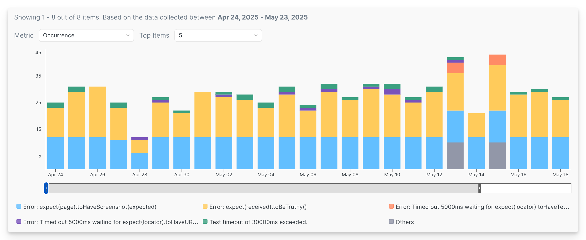
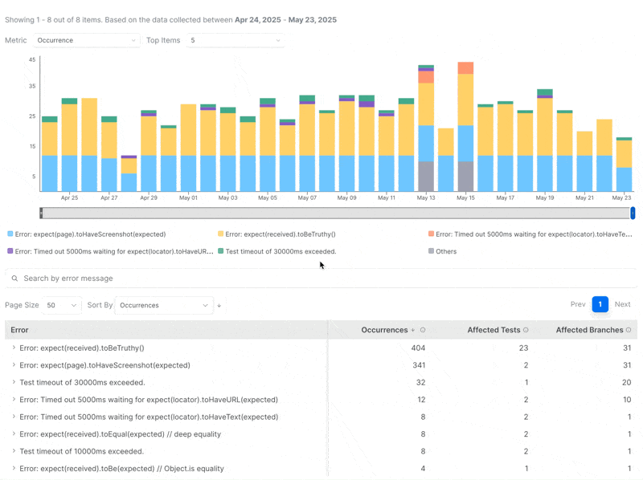

# Error Explorer

**Error Explorer** highlights the errors impacting your CI executions, making it easier to identify patterns and root causes.&#x20;

Currents calculates the metrics by aggregating the results based on the date range and the filters. You can fine-tune the aggregations by applying various filters, for example:

* What is the most frequent error during the 30-day period affecting `main` branch?
* What is the errors affecting most tests tagged `onboarding` ?

<figure><figcaption></figcaption></figure>

## Error Explorer Chart

The Errors Explorer displays a timeline chart showing the daily distribution of error messages over the selected period. You can switch the metric and adjust how many top errors to display. Top errors are ranked by their total value for the selected metric across the period.

<figure><figcaption>
Daily Error Distribution - Timeline Chart
</figcaption></figure>

## Error Explorer Metrics

### Occurrences

Shows how often an error has caused a failure or a flaky behavior during the selected period, based on the active filters. This metric counts all occurrences — including repeated ones from the same test.

For example, if the error message `TimeoutError: Navigation timeout of 30000 ms exceeded` occurred 5 times in `test A` and 10 more times across other tests, the total count will be 15.

### Affected Tests

Shows how many unique tests were impacted by this error during the selected period. Each test is counted once, even if the error occurred multiple times in it.

\
For example, if the same error appears 5 times in one test and 3 times in another, the **Affected Tests** count will be 2.

### Affected Branches 

Shows how many unique branches encountered this error during the selected period. Each branch is counted once, even if the error occurred multiple times on it.

For example, if the error shows up 10 times on main and 3 times on feature/login, the Affected Branches count will be 2.

## Customization

Use filters to fine-tune which test recordings are included in the Error Explorer metrics.

* **Date Range** - include items recorded within the specified period
* **Tag** - include items with the matching[playwright-tags.md](../../guides/playwright-tags.md "mention")
* **Author** - include items with the matching Git Author (see[commit-information.md](../runs/commit-information.md "mention"))
* **Branch** - include items with the matching Git Branch (see[commit-information.md](../runs/commit-information.md "mention"))
* **Group** - include items recorded for particular group (e.g. `Firefox` or `Chromium`)
* **Search by error message** - narrow down the results by **Error Message**

## Individual Error Details

Clicking an error item reveals more details about that specific error:

* **Affected Tests** – A list of tests impacted by the error, sorted by how often it occurred. These are tests that failed or flaked due to this error. Click a test title to view its details in the [tests-explorer.md](tests-explorer.md "mention").
* **Recent Executions** – A chronological list of the most recent test runs affected by this error. Clicking on a test title reveal its details in the [tests-explorer.md](tests-explorer.md "mention"), clicking on the commit message opens the specific execution details.
* **Affected Branches** – A list of branches where this error occurred, sorted by occurrence count.

## Customization

Use filters to fine-tune the data that used to calculate the metrics for the Error View:

* **Date Range** - include items recorded within the specified period
* **Tag** - include items with the matching[playwright-tags.md](../../guides/playwright-tags.md "mention")
* **Author** - include items with the matching Git Author (see[commit-information.md](../runs/commit-information.md "mention"))
* **Branch** - include items with the matching Git Branch (see[commit-information.md](../runs/commit-information.md "mention"))
* **Group** - include items recorded for particular group (e.g. `Firefox` or `Chromium`)
* **Search by error message** - narrow down the results by Error Message

Additionally, use the Timeline Chart to focus in the time period of your interest:

<figure><figcaption>
Using Timeline Chart controls to refine Error Explorer view
</figcaption></figure>
