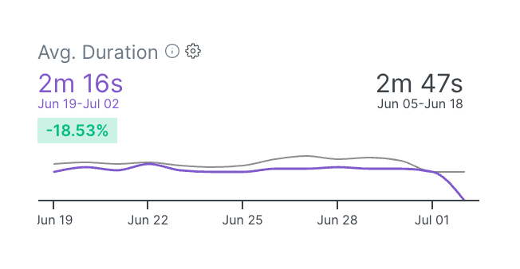
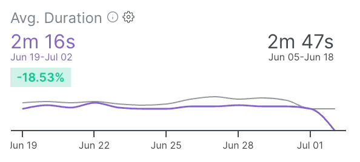

# Reference

## Performance Charts

Upon selecting the dates period, the charts show two lines:

* The primary <mark style="color:purple;">purple</mark> line shows the metric values for the selected period.
* The secondary \[gray] line shows the metric value for the period preceding the selected period.

For example, selecting a 14-day period reveals this type of chart:

<figure><figcaption>
Average Duration Chart
</figcaption></figure>

* The purple line shows the metric value for the selected date range (last 14 days).
* The purple amounts are the average value for the selected period - i.e. the average duration based on the last 14-day recordings was 2m 16s.
* The gray line shows the metric value for the previous date range (28 days ago to 14 days ago).
* The gray amounts are the average value for the preceding period - i.e. the average duration based on the recordings from 28 days ago rill 14 days ago was 2m 47s.
* The trend change value of <mark style="color:green;">**-18.53%**</mark> indicates that the metric value improved during the recent period compared to the preceding period.

Hovering over a particular day would reveal the metric values and the difference between the selected day and the matching day in the preceding period:

<figure><figcaption>
Comparing performance for specific date
</figcaption></figure>

Another example is the spec file analyzed in the image below. During the analysis, the peak of the **average duration** for this spec file occurred on the same day as the highest **failure rate** within the selected period.&#x20;

<figure><figcaption></figcaption></figure>

It suggests a potential correlation between the duration of the spec file's executions and its failure rate. The fact that the highest average duration aligns with the highest failure rate indicates that longer execution times may be associated with an increased likelihood of failures for this particular spec file.&#x20;

By identifying patterns or trends where these metrics coincide, users can find potential performance bottlenecks that could be causing longer execution times and leading to failures.

A similar analysis can be done on any other metric—the charts provide a visual indication of improvements or regressions in performance and, together with History, allow pinpointing the root cause of change in the performance metrics.

## History

The History shows the recordings matching the selected filters on a timeline - each bar is an execution, its colour is determined by the spec file or test outcome  (<mark style="color:red;">**Failed**</mark>, <mark style="color:blue;">**Passed**</mark>**,** and <mark style="color:purple;">**Flaky**</mark>), and the height is the relative duration of the recording. Each execution entry provides users with essential information such as the date, time, duration, branch, commit message, and author. Additionally, for failed tests, the feature presents an error preview.

<figure><figcaption></figcaption></figure>

Users can use a brush tool to engage with these histograms, enabling them to zoom in and concentrate on executions in a particular period of interest.

### Merge Branches

Users can also arrange executions based on branches using the "Merge branches" flag. This functionality enables a more structured and organized view of the data, grouping the executions according to their respective branches.

<figure><figcaption>
Collapse Branch - Explorer
</figcaption></figure>
