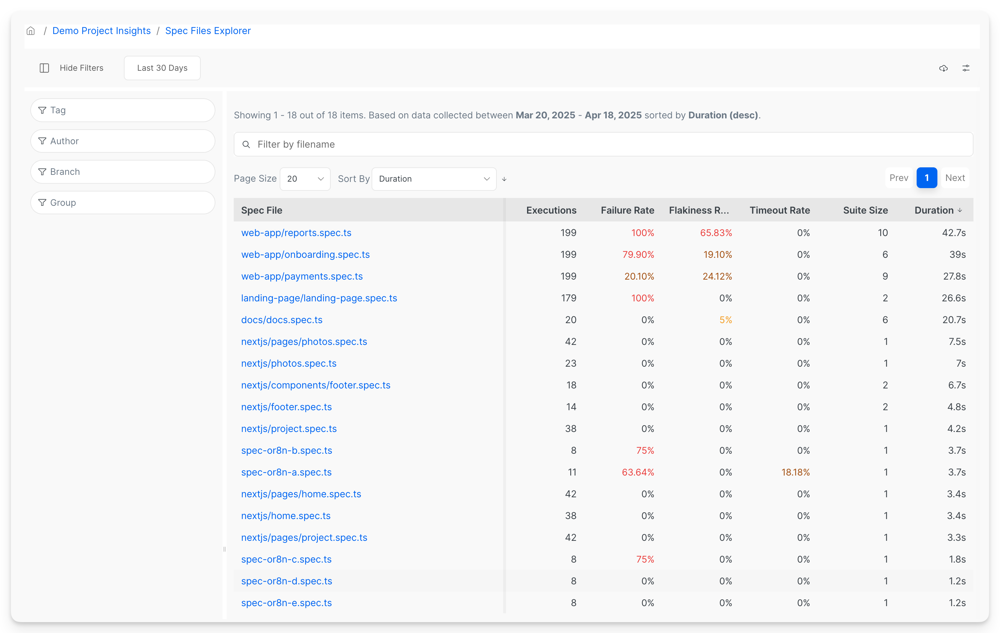
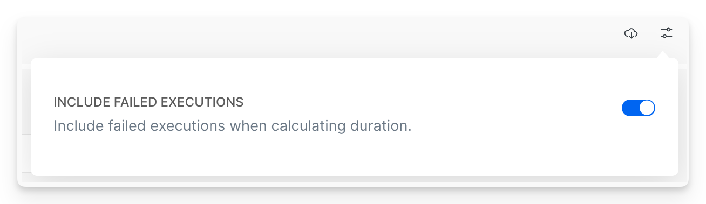

# Spec Files Explorer

The Spec Files Explorer allows users to track and analyze spec files performance using various metrics such as:

* Duration
* Failure Rate
* Flakiness Rate
* Timeout Rate
* Suite Size

<figure><figcaption>
Spec Files Explorer health and performance dashboard - flakiness, failure rate, duration, suite size.
</figcaption></figure>

Currents calculates the metrics based on the executions recorded during the provided date range and filters. A typical use case is to monitor the performance of the spec files that cause the degraded performance of the overall test suite - e.g. spec files with the highest flakiness rate, longest duration, etc.&#x20;

## Spec Files Explorer Metrics

### **Average Duration**

The average duration of [fully completed spec files](#user-content-fn-1)[^1], excluding timed-out or cancelled spec files.  You can exclude or include failed executions for calculating the average duration in Settings (see below).

### Overall Executions

How many executions were included during in the selected period and match the filters.

### **Failure Rate**

The failure rate is the percentage of spec file executions that failed. A spec file is failed if it had 1 or more failed tests. See [spec-files-status.md](../spec-file-status/spec-files-status.md "mention").

### **Timeout Rate**

The percentage of spec file executions that timed out.  A spec file is marked as timed out if we didn't report its test results  before exceeding its run's timeout. See [run-timeouts.md](../runs/run-timeouts.md "mention").

### **Flakiness Rate**

The percentage of spec file executions that had 1 or more flaky tests. See [flaky-tests.md](../tests/flaky-tests.md "mention").

### **Suite Size**

The number of tests in a spec file (including skipped tests).


Only fully completed executions of a spec file are considered for counting the suite size


## Customization

Only test recordings matching the filters will be included for metric calculation.

* **Date Range** - include items recorded within the specified period
* **Tag** - include items with the matching[playwright-tags.md](../../guides/playwright-tags.md "mention")
* **Author** - include items with the matching Git Author (see[commit-information.md](../runs/commit-information.md "mention"))
* **Branch** - include items with the matching Git Branch (see[commit-information.md](../runs/commit-information.md "mention"))
* **Group** - include items recorded for particular group (e.g. `Firefox` or `Chromium`)
* **Search by spec name** - narrow down the results by spec name

## Controls & Settings 

* Click on a column header to sort the tests by the corresponding column, click again to change the sorting order.
* Click on the **Export**   icon to download the data in JSON format
* Click in the **Settings**  icon to customize the view:
  * **Include Failed Executions** - include or exclude the failed execution in calculating the avg. duration

<figure><figcaption>
Spec Explorer Settings
</figcaption></figure>

## Use Cases

* The flakiest Spec Files from the selected period for a specific branch.
* The Failure Rate trends for specific branches for the past month.
* The most long-running Spec Files and how they changed their duration over time.
* The Spec Files that experienced the most timeouts in the past weeks.

## **Individual Spec File Analysis**&#x20;

Clicking on an individual spec file will reveal a dedicated view of its performance, including detailed execution **History** and performance **Metrics.**

<figure><figcaption>
History - Spec Files Explorer
</figcaption></figure>

<figure><figcaption>
Spec File Performance
</figcaption></figure>

## Next Steps

View [reference.md](reference.md "mention") for detailed information on test **History and** **Performance Charts.**

[^1]: A spec file is considered fully completed if if a test runner reported the results for **all of its tests**
