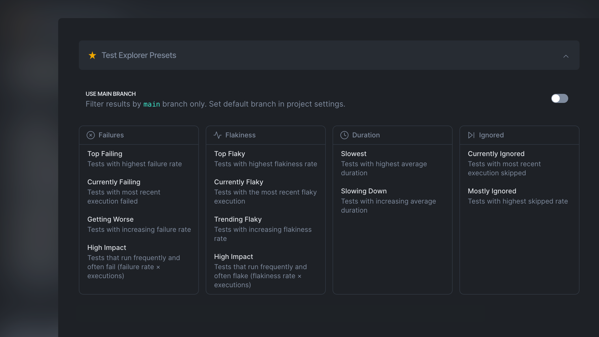
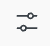

# Test Explorer

Test Explorer displays performance and health metrics for each individual test case. The metrics are:

* Failure Rate
* Failure Volume
* Flakiness Rate
* Flakiness Volume
* Duration
* Duration Volume

Additionally, it tracks the **change** of the metrics values:

* Failure Rate Change
* Flakiness Rate Change
* Duration Change

Use Test Explorer to identify flaky, failing or long-running tests, explore the trends and changes in test behavior.


You can fetch the Test Explorer data programmatically. See [API](https://app.gitbook.com/o/-MT4mUcrnbXWgd1xvl_x/s/lcxad7NaXT7D2V6owvHN/ "mention").


<figure><figcaption>
Test Explorer displays test performance and health data
</figcaption></figure>

Currents calculates the metrics by aggregating the test results. You can fine-tune the aggregations by applying various filters, for example:

* What are the 30-day flakiest tests from the `main` branch?
* What are the 14-fay most failing tests tagged `onboarding` ?
* What are the longest tests for  `mobile`  viewport?
* What test cases started to flake recently?
* What test case started to run slower during the last 2 months?

## Test Explorer Presets

The Test Explorer provides preset filters to help you quickly identify bottlenecks in your test suite. You can spot failing, flaky, slow, or frequently ignored tests, as well as track trends over time. Results can be filtered to show only the main branch. You can set the default branch in the [project-settings.md](../projects/project-settings.md "mention").

<figure><figcaption>
Test Explorer Presets
</figcaption></figure>

Let's examine in detail the available metrics.

## Test Explorer Metrics

These Test Explorer metrics help evaluate the health and performance of your testing suite.


Use **Explorer Settings** to exclude or include certain samples from the metric calculations.



You can choose the visible columns and sorting by tweaking **Table Settings.**


### Value Metrics vs Volume Metrics

Metrics like **Duration Volume**, **Flakiness Volume** and **Failure Volume** measure the impact of the associated test on overall suite performance. The scores are calculated by multiplying the corresponding metric by the number of samples.&#x20;

\
For example, consider two tests:

* Test A runs rarely, reported `10` samples, with a `15%` flakiness rate.
* Test B runs often, reported `40` samples, with a  `5%`  flakiness rate.

\
Test A Flakiness Volume is `10 x 0.15 = 1.5`

Test B Flakiness Volume is `50 x 0.05 = 2`

Test B has a higher Flakiness Volume because it affects the overall test suite flakiness more, although its rate is lower.

In short, a test that’s a little flaky but runs a lot can be a bigger problem than a very flaky test that rarely runs. The actual number doesn’t matter on its own — it’s just useful to compare tests and see which ones are dragging down reliability the most.

### Duration&#x20;

The average execution time **for fully completed tests**, excluding cancelled or skipped tests during execution.

### Duration Volume

Duration Volume measures how much total time a test contributes to the overall runtime of the test suite. It’s not just about how long a test takes per run, but also how often it runs.

`Duration Volume = Avg.Duration × Executions`

The raw number isn’t important on its own — it helps prioritize which tests are the biggest time sinks across all runs.

### Failure Rate

It measures the percentage of times a test fails when it is executed and provides insights into its reliability and stability. A higher failure rate may indicate potential issues or bugs within the test or the system under test.

### Failure Volume

Failure Volume measures how much a test contributes to the total number of failures in your test suite — combining how often it runs with how likely it is to fail. It’s calculated as:

`Failure Volume = Failure Rate × Executions`

This metric helps you spot which tests are the most significant contributors to failure noise, even if their failure rate isn’t high.

### Failure Rate Change

Failure Rate Change shows how a test’s failure rate has shifted between two periods — the current period (e.g., last 30 days) and the previous period of the same length.

\
A positive value means the test is failing more often than before; a negative value means it’s failing less often. This metric helps identify tests whose reliability is improving or degrading over time.

The change is displayed only if it exceeds 1%, to filter out insignificant fluctuations.

### Flakiness Rate

It measures the percentage of times a test produces inconsistent pass/fail results. Analyzing the Flakiness Rate metric allows users to focus on improving the reliability and stability of flaky tests, reducing false positives or negatives, and enhancing the overall trustworthiness of the test suite.

### **Flakiness Volume**

Quantify how much a test’s flakiness impacts the overall stability of your test suite. It combines how often a test runs with how flaky it is, giving a sense of how much the test is likely to cause inconsistencies or unreliable results. A test that runs frequently with a low flakiness rate could cause more issues overall than a test that rarely runs but is highly flaky.

`Flakiness Volume = Flakiness Rate × Executions`

### Flakiness Rate Change

Flakiness Rate Change shows how a test’s flakiness has changed between two equal time periods — for example, the last 30 days compared to the previous 30 days.

A positive value means the test is becoming more flaky (less reliable), while a negative value means its stability has improved.

The value is displayed only if the change exceeds 1%, to ignore minor, statistically insignificant variations.

### Executions

How many recordings were included for calculating the metrics — i.e. matched the period and the filters.

## Customization

Only test recordings that match the active filters are included in the metric calculations.

* **Date Range** - include items recorded within the specified period.
* **Tag** - include items with the matching [playwright-tags.md](../../guides/playwright-tags.md "mention").
* **Author** - include items with the matching Git Author (see [commit-information.md](../runs/commit-information.md "mention")).
* **Branch** - include items with the matching Git Branch (see [commit-information.md](../runs/commit-information.md "mention")).
* **Group** - include items recorded for a particular group (e.g. `Firefox` or `Chromium`).
* **Search by spec name** - narrow down the results by test spec name.
* **Search by test title** - narrow down the results by test title.

## Controls & Settings

* Click on a column header to sort the tests by the corresponding column, and then click again to change the sorting order.
* Click on the **Export**  icon to download the data in JSON format

#### Table Settings

The Table Settings panel controls how data is presented in the Test Explorer view. Use these options to customize visible columns, sorting order, and the number of test cases displayed per page

* Columns — choose which metrics or data fields are shown in the Test Explorer table
* Sorting — select the metric or column used to sort test results. Click the sort direction icon to toggle between ascending and descending order.
* Page Size — set how many test cases are displayed per page in the Test Explorer view.

#### Metrics Settings&#x20;

Click on the **Settings**  icon to customize how the metrics are calculated.

<figure><figcaption>
Customize Test Metrics
</figcaption></figure>

The Customize Test Metrics view lets you define which test outcomes are included when calculating performance and reliability metrics such as Executions, Duration, Flakiness Rate, and Failure Rate.\
These settings control how Currents interprets test results and determine which runs contribute to aggregated statistics in Test Explorer and other analytics views.

* Executions — specifies which test outcomes are counted toward total execution numbers. This affects all metrics that depend on the execution count.
* Duration — defines which outcomes are included when calculating the average test duration.\
  For example, you can choose whether to include failed or skipped tests when computing the average runtime.
* Flakiness Rate — determines which outcomes are used when calculating flakiness: Flakiness Rate = (Number of flaky results) ÷ (Selected results). Adjusting the filter changes which test results are considered “eligible” for flakiness detection.
* Failure Rate — controls which outcomes are used when calculating failure rate: Failure Rate = (Number of failed results) ÷ (Selected results). By refining the selection, you can exclude irrelevant outcomes (e.g., skipped runs) from reliability calculations.

## Use Cases

Here are a few examples of what information you can get from the Test Explorer:

* The flakiest tests from the last months for a specific branch.
* The top failing tests in the suite.
* The failure rate change for specific branches for the past months.
* The lowest tests and how they changed their duration over time.

## **Individual Test Analysis**&#x20;

Clicking on a test title reveals a dedicated view of the specific test's performance, including a detailed **History of Executions**, **Performance Metrics** and **Top Errors** analysis.

<figure><figcaption>
History - Test Explorer
</figcaption></figure>

Use Metrics tab to analyze the test health trends.

<figure><figcaption>
Test Performance Overview
</figcaption></figure>

See the [reference.md](reference.md "mention") section for more details on the **Performance Charts and History** of the tests.

## Next Steps

* Schedule [automated-reports.md](../automated-reports.md "mention") with the top items from the Test Explorer view to automatically arrive to your inbox for proactive monitoring of test suite health.
* View [reference.md](reference.md "mention") for detailed information on test **History and** **Performance Charts.**
