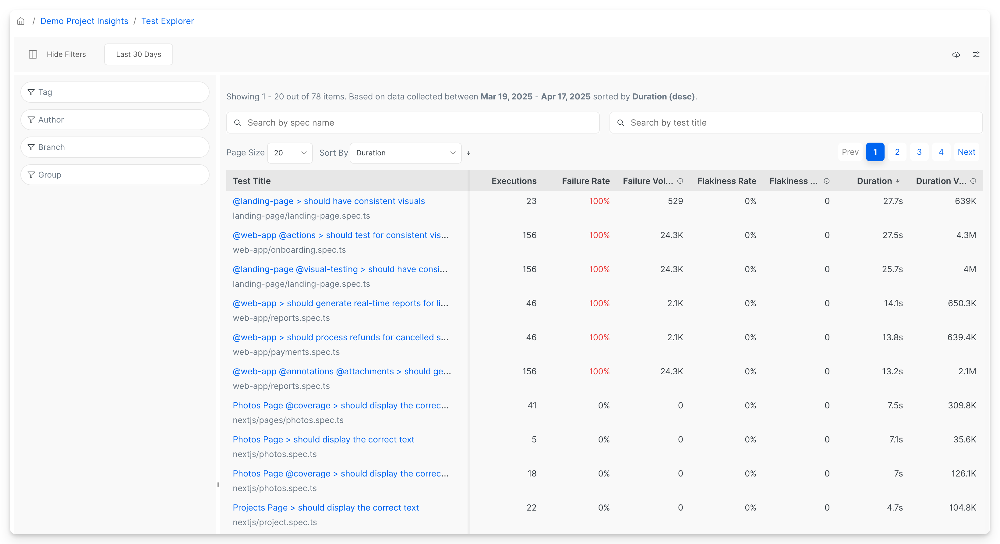
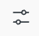
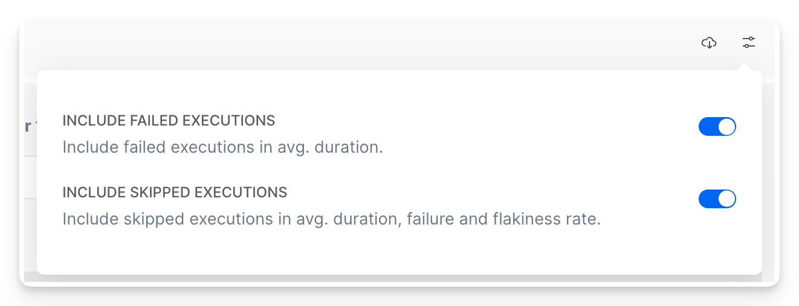

# Test Explorer

The Test Explorer view shows performance and health metrics like:

* flakiness rate
* failure rate&#x20;
* duration

Use it to effectively identify problematic tests, explore the trends and changes in tests behaviour. You can explore each individual test details by clicking on a test title and opening [tests-performance.md](tests-performance.md "mention") view and also schedule [automated-reports.md](../../automated-reports.md "mention") with the top items from the Test Explorer to be delivered to your inbox.


Tests Explorer health and performance dashboard - flakiness, failure rate, duration.


***

Currents calculates the metrics by aggregating the reported test results. You can fine-tune the aggregations by applying various filters, for example:

* what are the 30-day flakiest tests from the `main` branch?
* what are the 14-fay most failing tests tagged `onboarding` ?
* what are the longest tests for  `mobile`  viewport?

<figure><figcaption>
Test Explorer View - 30-day data with no filters, sorted by duration (longests tests first)
</figcaption></figure>

## Test Explorer Metrics


**Volume Metrics vs Value Metrics**

Metrics like **Duration Volume**, **Flakiness Volume** and **Failure Volume** measure the impact of a test on overall suite performance. The scores are calculated by multiplying the corresponding metric by the number of samples. The actual number has no real meaning. See example below.



Use **Explorer Settings** to exclude or include certain executions from being included in calculating the metrics.


The Test Explorer metrics help you to evaluate the health and speed of your testing suite.

### Duration&#x20;

The average execution time **for fully completed tests**, excluding tests that were canceled or skipped during execution.

### Duration Volume

Duration Volume measures how much total time a test is contributing to the overall runtime of the test suite. It’s not just about how long a test takes per run, but also how often it runs.

`Duration Volume = Avg.Duration × Executions`

The raw number isn’t important on its own — it helps prioritize which tests are the biggest time sinks across all runs.

### Failure Rate

It measures the percentage of times a test fails when it is executed and provides insights into the reliability and stability of the test. A higher failure rate may indicate potential issues or bugs within the test or the system under test.

### Failure Volume

Failure Volume measures how much a test contributes to the total number of failures in your test suite — combining how often it runs with how likely it is to fail. It’s calculated as:

`Failure Volume = Failure Rate × Executions`

This metric helps you spot which tests are the biggest contributors to failure noise, even if their failure rate isn’t super high.

### Flakiness Rate

It measures the percentage of times a test produces an inconsistent pass/fail results. Analyzing the Flakiness Rate metric allows users to focus on improving the reliability and stability of flaky tests, reducing false positives or negatives, and enhancing the overall trustworthiness of the test suite.

### **Flakiness Volume**

Quantify how much a test’s flakiness impacts the overall stability of your test suite. It combines how often a test runs with how flaky it is, giving a sense of how much the test is likely to cause inconsistencies or unreliable results. A test that runs frequently with a low flakiness rate could cause more issues overall than a test that rarely runs but is highly flaky.

`Flakiness Volume = Flakiness Rate × Executions`

### Executions

How many recordings were included for calculating the metrics — i.e. matched the period and the filters.

## Value Metrics vs Volume Metrics

Metrics like **Duration Volume**, **Flakiness Volume** and **Failure Volume** measure the impact of the associated test on overall suite performance. The scores are calculated by multiplying the corresponding metric by the number of samples. The actual number has no real meaning - it's just a numerical expression&#x20;

\
For example, consider two tests:

* Test A runs rarely, reported `10` samples, with a `15%` flakiness rate.
* Test B runs often, reported `40` samples, with a  `5%`  flakiness rate.

\
Test A Flakiness Volume is `10 x 0.15 = 1.5`

Test B Flakiness Volume is `50 x 0.05 = 2`

Test B has a higher Flakiness Volume because it affects the overall test suite flakiness more, although its rate is lower.

In short, a test that’s a little flaky but runs a lot can be a bigger problem than a test that’s very flaky but rarely runs. The actual number doesn’t matter on its own — it’s just useful to compare tests and see which ones are dragging down reliability the most.

## Filters

Only test recordings matching the filters are included for metric calculation.

* **Date Range** - include items recorded within the specified period
* **Tag** - include items with the matching [playwright-tags.md](../../../guides/playwright-tags.md "mention")
* **Author** - include items with the matching Git Author (see [commit-information.md](../../runs/commit-information.md "mention"))
* **Branch** - include items with the matching Git Branch (see [commit-information.md](../../runs/commit-information.md "mention"))
* **Group** - include items recorded for particular group (e.g. `Firefox` or `Chromium`)
* **Search by spec name** - narrow down the results by test spec name&#x20;
* **Search by test title** - narrow down the results by test title

## Controls & Settings

* Click on a column header to sort the tests by the corresponding column, click again to change the sorting order.
* Click on the **Export**  icon to download the data in JSON format
* Click in the **Settings**  icon to customize the view:&#x20;
  * **Include Failed Executions** - include or exclude the failed execution in calculating the avg.duration
  * **Include Skipped Executions** - include or exclude skipped tests from being included in metrics

<figure><figcaption>
Test Explorer Settings
</figcaption></figure>

## Use Cases

Here are a few examples of what information you can get from the Test Explorer.

* The flakiest tests from the last months for a specific branch.
* The top failing tests in the suite.
* The failure rate change for specific branches for the past months.
* The lowest tests and how they changed their duration over time.

Clicking on an individual test will reveal a comprehensive drill-down of the specific test's performance, including a detailed history of execution, top errors, etc.&#x20;

## Next Steps

* Explore individual tests performance in the [tests-performance.md](tests-performance.md "mention") section.
* Schedule [automated-reports.md](../../automated-reports.md "mention") with the top items from the Test Explorer view to automatically arrive to your inbox for proactive monitoring of test suite health.

