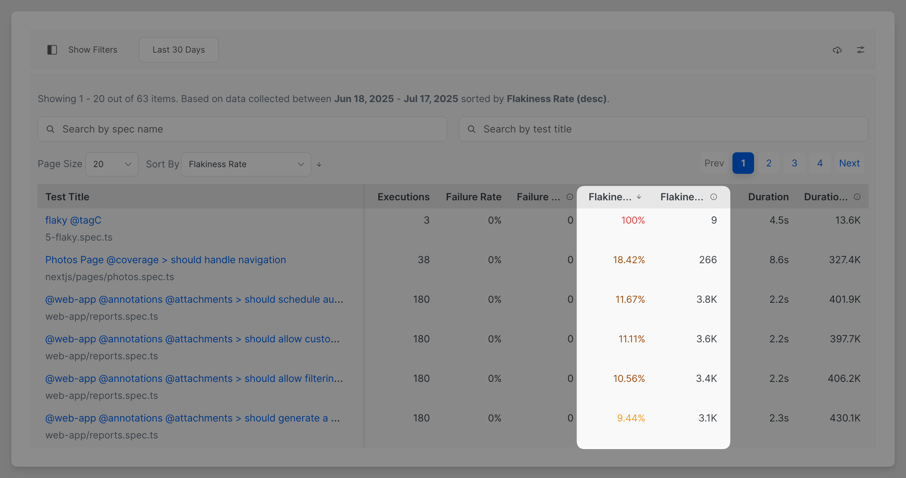
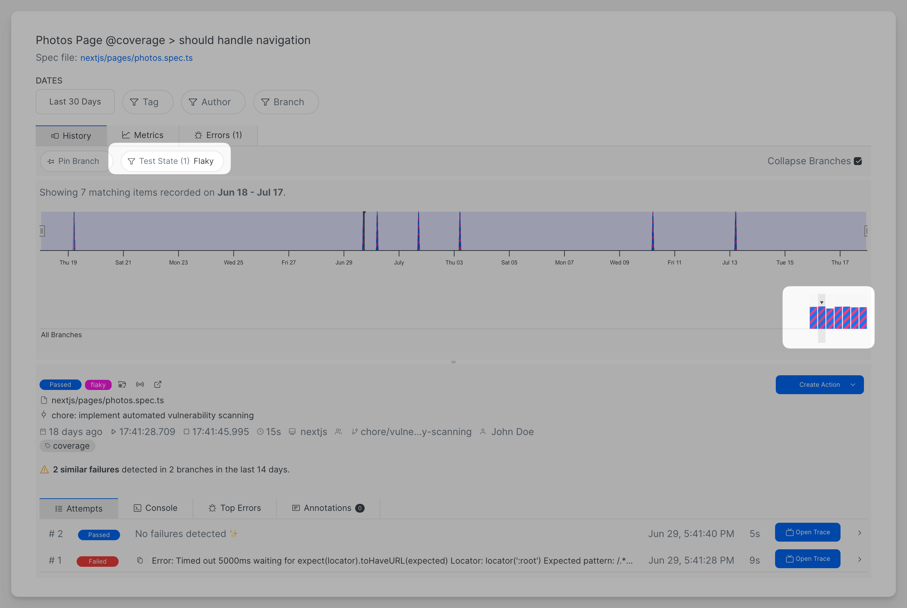
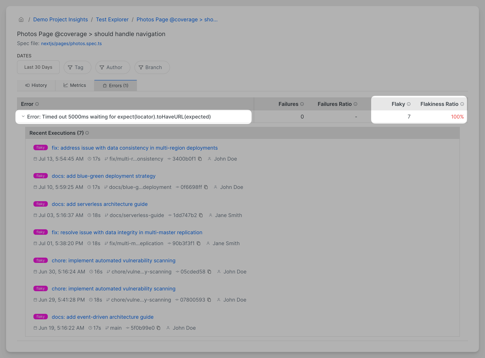

# Flaky Tests

## What is a flaky test?

A flaky test is a test that did not succeed on the first attempt. It fails only occasionally: one time it passes, another time fails, and the next time pass again, without any changes.&#x20;


Flaky tests are marked with a dedicated badge.

.png>)

## How to activate flaky test detection?

Flaky tests are automatically activated for [when](https://playwright.dev/docs/test-retries) retries are enabled. When a test has retries enabled and it doesn't pass on the first attempt, it is marked as flaky.&#x20;

## Why are flaky tests bad?

A flaky test **can block a CI/CD pipeline**, making feature delivery slower than it needs to be. Flaky tests are not deterministic — making them useless and expensive to repair.

In summary, flaky tests are considered harmful because:

* You cannot trust them - neither system / component under test nor the test itself is reliable
* Even if flaky tests passes, your end users can experience intermittent issues
* Flaky tests increase the duration of your testing suite
* Flaky tests are expensive to repair and maintain

## How to get rid of flaky tests?

### Measure and Identify Flakiness

Use [tests-explorer.md](../test-suite-performance-explorer/tests-explorer.md "mention") to see the tests with the highest flakiness rate.&#x20;

<figure><figcaption></figcaption></figure>

## Eliminate Flaky Tests

Brows past test executions  and examine what error messages cause flakiness using [#individual-test-analysis](../test-suite-performance-explorer/tests-explorer.md#individual-test-analysis "mention").

<figure><figcaption><p>Test history tab show flaky execution for a particular test</p></figcaption></figure>

<figure><figcaption><p>The error above is a 100% cause of flakiness for the test</p></figcaption></figure>

Most common reason for flakiness&#x20;

* Using fixed wait times
* Long complex and fragile&#x20;
* Sharing data and state between tests

## Fail on Flaky Tests


`failOnFlakyTests` property is available in Playwright **v1.52+**, and in `@currents/playwright` starting from **v1.12.3**.


Starting with Playwright v1.52, the runner can be configured to exit with an error if any test has been marked as flaky [see the official docs](https://playwright.dev/docs/api/class-testconfig#test-config-fail-on-flaky-tests). This is particularly useful on CI systems where the presence of flaky tests should block the pipeline.

#### Configuration

In your `playwright.config.ts`, enable the option by setting `failOnFlakyTests` to `true` (for example, based on the `CI` environment variable):

```ts
import { defineConfig } from '@playwright/test';

export default defineConfig({
  // Exit with an error if any test is marked flaky.
  failOnFlakyTests: Boolean(process.env.CI),
});
```

#### Command-Line Option

Alternatively, the same behavior can be enabled via the CLI flag:

```bash
# Using Playwright test command
npx playwright test --fail-on-flaky-tests

# Using the Playwright wrapper
npx pwc --fail-on-flaky-tests

# Using the orchestration
npx pwc-p --fail-on-flaky-tests
```

When this flag is present, the test run will exit with a non-zero status if any tests are detected as flaky, ensuring flaky tests block your CI pipeline.
