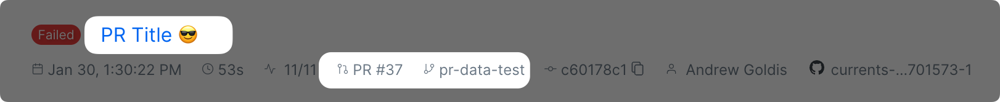

# Commit data for GitHub Actions

### GitHub Pull Request Title, Issue Link and Branch Name


**Update Jan 30, 2024**

`@currents/playwright@0.12.0` and `cypress-cloud@1.10.0` automatically detect Pull Request information when running in GitHub Actions.


The recent (Jan 30, 2024) releases of `@currents/playwright@0.12.0` and `cypress-cloud@1.10.0` better handle git information when running in GitHub Actions triggered by `` `pull_request` `` trigger.

* PR title becomes Run Title (instead of a generic message PR #XX)
* Effective Branch becomes the PR HEAD branch name - allowing more meaningful usage in analytics and notification filters
* UI will display a direct link to GitHub Pull Request issue

<figure><figcaption><p>Capturing GitHub PR data</p></figcaption></figure>

### Merge commit in pull request runs


`@currents/playwright@2.5.1` and `@currents/cmd@1.11.0` record the last commit of the pull request when GitHub Actions checks out a merge commit.


On [`pull_request`](https://docs.github.com/en/actions/writing-workflows/choosing-when-your-workflow-runs/events-that-trigger-workflows#pull_request) events, `actions/checkout` checks out a merge commit that GitHub creates by merging the pull request into the base branch. Its message looks like this:

```
Merge de7282540ac30ee4e32a0b1fede4f6391b4cc321 into fa58941d8a807b83ec5a3e5bfb83418ce12173c7
```

The reporter detects the merge commit and records the last commit of the pull request instead: its SHA, message, author and timestamp.

With the default `actions/checkout` settings, the clone has only the merge commit, so the reporter fetches the pull request commit:

```
git fetch --depth=1 --no-tags origin <pull request commit SHA>
```

The fetch uses the credentials that `actions/checkout` stores in the clone, and times out after 3 seconds. If it fails, the run shows the merge commit's message and author, as with earlier versions. For example, the fetch fails in a private repository checked out with `persist-credentials: false`. The commit SHA and branch still come from the pull request, so PR comments and commit statuses are not affected.

To turn the fetch off, set `CURRENTS_DISABLE_HEAD_COMMIT_FETCH=true`. See [commit-information.md](../../../dashboard/runs/commit-information.md "mention") for other CI providers.

#### Earlier versions and Cypress

`cypress-cloud` and earlier versions of the reporters record the merge commit. To record the last commit of the pull request, check out that commit:

```yaml
- uses: actions/checkout@v4
  with:
    ref: ${{ github.event.pull_request.head.sha }}
```

The workflow then tests the last commit of the pull request, not the result of merging it into the base branch. It does not catch conflicts or failures that appear only after the merge.
