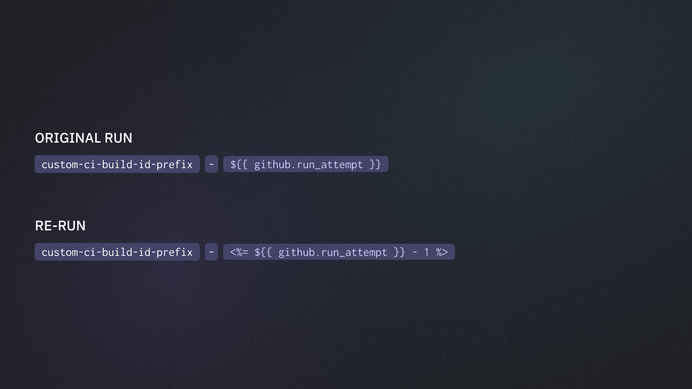

# Custom CI Build ID for Reruns

The [Last Failed GitHub Action](https://github.com/currents-dev/playwright-last-failed) gets the previous run information using the default CI build ID pattern:

`${{ github.repository }}-${{ github.run_id }}-${{ github.run_attempt }}`

When a different [ci-build-id.md](../../../guides/parallelization-guide/ci-build-id.md "mention") is used for sharded or orchestrated runs, set `previous-ci-build-id`.

<figure><figcaption><p>Using custom CI build ID for reruns</p></figcaption></figure>

For example:


```yaml

# an example for custom value like:
# currents-${{ github.run_id }}-${{ github.run_attempt }}
- name: Compute previous run attempt
  id: previous-attempt
  run: echo "previous=$(( ${{ github.run_attempt }} - 1 ))" >> "$GITHUB_OUTPUT"
- name: Playwright Last Failed action
  uses: currents-dev/playwright-last-failed@v1
  with:
    # if a custom CI build id is used, set "previous-ci-build-id" accordingly
    previous-ci-build-id: currents-${{ github.run_id }}-${{ steps.previous-attempt.outputs.previous }}
    pw-output-dir: basic/test-results
    matrix-index: ${{ matrix.shard }}
    matrix-total: ${{ strategy.job-total }}
```


For orchestrated runs, keep the `or8n` input and skip the matrix values:


```yaml
- name: Compute previous run attempt
  id: previous-attempt
  run: echo "previous=$(( ${{ github.run_attempt }} - 1 ))" >> "$GITHUB_OUTPUT"
- name: Playwright Last Failed action
  uses: currents-dev/playwright-last-failed@v1
  with:
    or8n: true
    previous-ci-build-id: currents-${{ github.run_id }}-${{ steps.previous-attempt.outputs.previous }}
    pw-output-dir: basic/test-results
```

