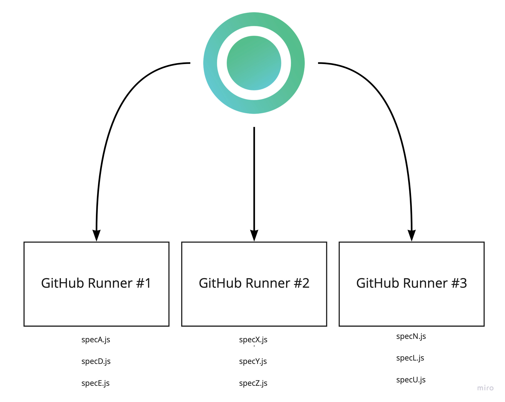
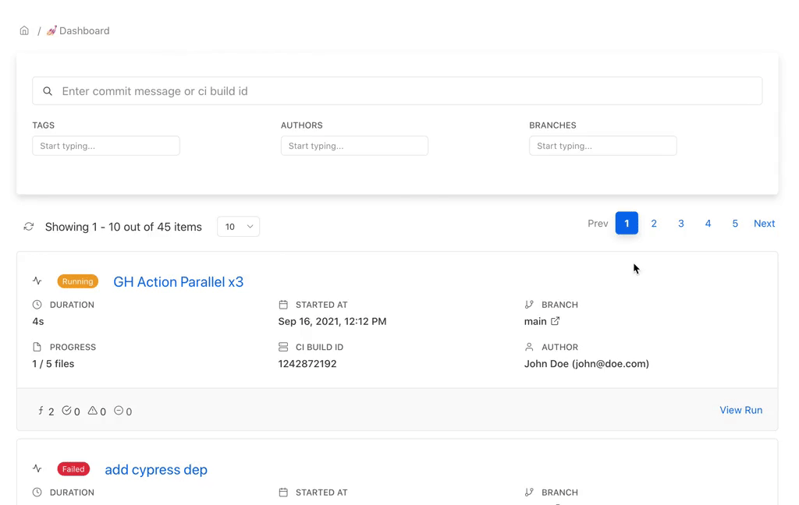

# Cypress - GitHub Actions


TL;DR Check out the GitHub repository:

[https://github.com/currents-dev/gh-actions-example](https://github.com/currents-dev/gh-actions-example)


By using [GitHub Actions matrix execution strategy](https://docs.github.com/en/actions/using-workflows/workflow-syntax-for-github-actions#jobsjob\_idstrategymatrix), you can create multiple containers that will run  Cypress tests in parallel. Currents orchestrates the tests between multiple containers, applying intelligent optimizations to reduce the overall runtime of your workflow, and records screenshots and videos for later troubleshooting.



Please take a look at the [example repository](https://github.com/currents-dev/gh-actions-example) that showcases running cypress tests in parallel using GitHub Actions.&#x20;


```yaml
name: Cypress Tests

on:
  push:

jobs:
  cypress-tests:
    runs-on: ubuntu-20.04
    strategy:
      fail-fast: false
      matrix:
        # 👉🏻 run 3 copies of the current job in parallel
        containers: [1, 2, 3]
    steps:
      - name: Checkout
        uses: actions/checkout@v3
        # 👉🏻  populate commit message for merge commits
        # see https://currents.dev/readme/ci-setup/github-actions
        # with:
        #  ref: ${{ github.event.pull_request.head.sha }}

      - uses: actions/setup-node@v3
        with:
          node-version: 18

      - name: Install dependencies
        run: |
          npm ci

      # More about the blocking:
      # - https://currents.dev/posts/v13-blocking
      # - https://currents.dev/readme/integration-with-cypress/alternative-cypress-binaries
      - name: Unblock Cypress
        run: |
          echo 🕊️ Download Free Cypress
          CYPRESS_DOWNLOAD_MIRROR=https://cy-cdn.currents.dev npx cypress install --force

          echo ✅ Verify Cypress
          npx cypress verify

          echo 👀 Cypress Cache
          npx cypress cache list
          npx cypress cache path

      # 
      - name: Run Cypress on Currents.dev
        env:
          # enable verbose logging for cypress-io/github-action
          DEBUG: \@cypress/github-action
        uses: cypress-io/github-action@v6
        continue-on-error: true

        with:
          # 🔥 Set to false to prevent restoring cachedCypress binary
          install: false
          command: |
            npx cypress-cloud --record --parallel --browser chrome --key ${{ secrets.CURRENTS_RECORD_KEY }} --ci-build-id "${{ github.repository }}-${{ github.run_id }}-${{ github.run_attempt}}"

      - name: Cancel the run if workflow is cancelled
        if: ${{ cancelled() }}
        uses: currents-dev/cancel-run-gh-action@v1
        with:
          api-token: ${{ secrets.CURRENTS_API_KEY }}
          github-run-id: ${{ github.run_id }}
          github-run-attempt: ${{ github.run_attempt }}
```


The example [workflow config file](https://github.com/currents-dev/gh-actions-example/blob/main/.github/workflows/currents.yml):

* runs 3 containers with cypress tests in parallel
* uses [Custom Test Command](https://github.com/cypress-io/github-action#custom-test-command) to run `cypress-cloud` for recording test results and parallelization with [Currents.dev](https://currents.dev)
* Note: set the `projectId` in `currents.config.js` (you can obtain the project id from [Currents.dev](https://app.currents.dev) in Project Settings)
* Note: install `cypress-cloud/plugin` in `cypress.config.js`
* Note: use CLI arguments to customize your cypress runs, e.g.: `cypress-cloud run --parallel --record --key <your currents.dev key> --group groupA`
* Note: create an organization, get your record key on [Currents.dev](https://app.currents.dev) and set [GH secret](https://docs.github.com/en/actions/reference/encrypted-secrets) variable `CURRENTS_RECORD_KEY`

Here's an example of how the demo workflow appears in Currents dashboard


