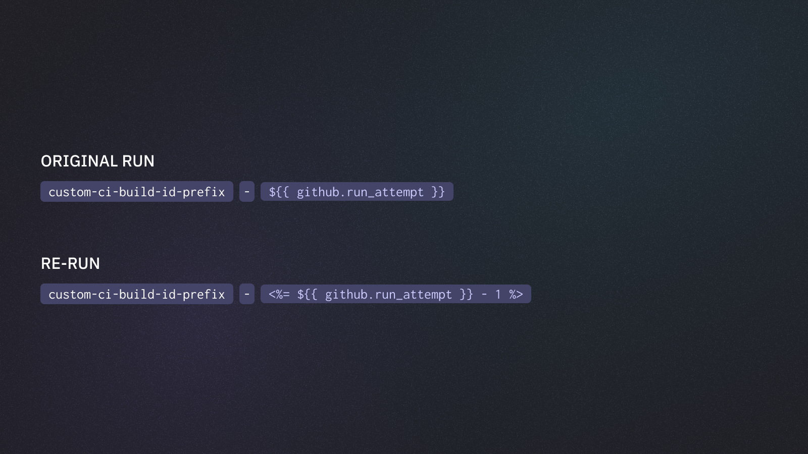

# Re-run Only Failed Tests

When a workflow fails in GitHub Actions you have the option to re-run the failed jobs. However, an additional setup is required for properly configure Playwright for rerunning only the failed tests.&#x20;

See [re-run-only-failed-tests.md](../../../guides/ci-optimization/re-run-only-failed-tests.md "mention") guide for more details on re-runs.

For GitHub Actions, we provide the [Last Failed GitHub Action](https://github.com/currents-dev/playwright-last-failed) to simplify the re-runs.


We recommend you install [@currents/cmd](../../../resources/reporters/currents-cmd/) as a dev dependency in your `package.json`, and using `npm ci` or your package manager's **frozen lockfile** install method in your GitHub Actions.  If you do not the [Last Failed GitHub Action](https://github.com/currents-dev/playwright-last-failed) will instead install and use a global package, which will not respect your package's version lock files, and instead always pull in the latest of `@currents/cmd`and it's dependencies.


#### Playwright Sharding

If you're using [playwright-sharding.md](../../../guides/parallelization-guide/playwright-sharding.md "mention") for running your tests in parallel, you can use the [Last Failed GitHub Action](https://github.com/currents-dev/playwright-last-failed) to include the data from the last run.

Step-by-step guide:

<details>

<summary>Install the @currents/cmd package</summary>

```bash
npm i -D @currents/cmd
```

</details>

<details>

<summary>Add the currents-dev/playwright-last-failed step</summary>

Add a step to your workflow before you run your tests

<pre class="language-yaml"><code class="lang-yaml">- name: Playwright Last Failed action
<strong>  id: last-failed-action
</strong><strong>  uses: currents-dev/playwright-last-failed@v1
</strong>  with:
    # if you're using a custom CI build id, set "previous-ci-build-id" accordingly 
    # previous-ci-build-id: default is ${{ github.repository }}-${{ github.run_id }}-&#x3C;%= ${{ github.run_attempt }} - 1 %>
    pw-output-dir: basic/test-results
    matrix-index: ${{ matrix.shard }}
    matrix-total: ${{ strategy.job-total }}
</code></pre>

See the [action configuration for details](https://github.com/currents-dev/playwright-last-failed/blob/main/action.yml).

</details>

<details>

<summary>A full example</summary>


```yaml
name: failed-only-reruns

on:
  push:

jobs:
  test-reporter:
    strategy:
      fail-fast: false
      matrix:
        shard: [1, 2, 3]
    timeout-minutes: 60
    runs-on: ubuntu-latest
    container: mcr.microsoft.com/playwright:latest
    env:
      CURRENTS_PROJECT_ID: bnsqNa
      CURRENTS_RECORD_KEY: ${{ secrets.CURRENTS_RECORD_KEY }}
      CURRENTS_CI_BUILD_ID: ${{ github.repository }}-${{ github.run_id }}-${{ github.run_attempt }}
    steps:
      - uses: actions/checkout@v4
        with:
          ref: ${{ github.ref }}
      - run: |
          echo "$GITHUB_WORKSPACE"
          git config --global --add safe.directory "$GITHUB_WORKSPACE"
      - uses: actions/setup-node@v4
        with:
          node-version: "20.x"
      - name: Install dependencies
        run: |
          npm ci
          npx playwright install chrome
      - name: Playwright Last Failed action
        id: last-failed-action
        uses: currents-dev/playwright-last-failed@v1
        with:
          pw-output-dir: basic/test-results
          matrix-index: ${{ matrix.shard }}
          matrix-total: ${{ strategy.job-total }}
      - name: Playwright Tests
        working-directory: ./basic
        run: |
          COMMAND="npx playwright test --config playwright.config.reporter.ts ${{ steps.last-failed-action.outputs.extra-pw-flags }}"
          echo "Running command: $COMMAND"
          $COMMAND
```


</details>


Note the use of [#custom-ci-build-id-for-reruns](re-run-failed-only-tests.md#custom-ci-build-id-for-reruns "mention").


Full examples:

* [rerun-shards-pwc.yml](https://github.com/currents-dev/playwright-gh-actions-demo/blob/main/.github/workflows/rerun-shards-pwc.yml) - rerun only the tests that failed in the previous run, using `pwc` helper command that is included in `@currents/playwright` package.
* [rerun-shards-reporter.yml](https://github.com/currents-dev/playwright-gh-actions-demo/blob/main/.github/workflows/rerun-shards-reporter.yml) - rerun only the tests that failed in the previous run, using reporter explicitly configured in `playwright.config.ts`

#### Currents Orchestration

If you're using [#currents-orchestration](re-run-failed-only-tests.md#currents-orchestration "mention") for running your Playwright tests you can also fetch the results of from [Runs](https://app.gitbook.com/s/lcxad7NaXT7D2V6owvHN/resources/runs "mention").


Currents Orchestration dynamically assigns tests to all the available CI runners, that's why you should select **Re-run all jobs** when using Currents Orchestration. Read more at [re-run-only-failed-tests.md](../../../guides/ci-optimization/re-run-only-failed-tests.md "mention") guide.


Step-by-step guide:

<details>

<summary>Install the @currents/cmd package</summary>

```bash
npm i -D @currents/cmd
```

</details>

<details>

<summary>Set <code>CURRENTS_API_KEY</code> CI environment variable</summary>

Obtain an API key (see [Broken link](/broken/pages/yM3FI9oI5kJQSfe9LZCy "mention")) from Currents Dashboard (in addition to Record Key) and set [GitHub Actions Secret](https://docs.github.com/en/actions/security-for-github-actions/security-guides/using-secrets-in-github-actions)

```yaml
env:
  CURRENTS_RECORD_KEY: ${{ secrets.CURRENTS_RECORD_KEY }}
  CURRENTS_API_KEY: ${{ secrets.CURRENTS_API_KEY }}
```

</details>

<details>

<summary>Add the currents-dev/playwright-last-failed step</summary>

Add a step that fetches the last-run information prior to running tests

```yaml
- name: Playwright Last Failed action
  id: last-failed-action
  uses: currents-dev/playwright-last-failed@v1
  with:
    or8n: true
    # debug: true
    # previous-ci-build-id: default is ${{ github.repository }}-${{ github.run_id }}-%<= ${{ github.run_attempt }} - 1 %>
    pw-output-dir: basic/test-results
```

See the [action configuration for details](https://github.com/currents-dev/playwright-last-failed/blob/main/action.yml) on the inputs.

</details>

<details>

<summary>A full example</summary>


```yaml
name: failed-only-or8n

on:
  push:

jobs:
  test-or8n:
    strategy:
      fail-fast: false
      matrix:
        shard: [1, 2, 3]
    timeout-minutes: 60
    runs-on: ubuntu-latest
    container: mcr.microsoft.com/playwright:latest
    env:
      CURRENTS_PROJECT_ID: bnsqNa
      CURRENTS_RECORD_KEY: ${{ secrets.CURRENTS_RECORD_KEY }}
      CURRENTS_CI_BUILD_ID: ${{ github.repository }}-${{ github.run_id }}-${{ github.run_attempt }}
      CURRENTS_API_KEY: ${{ secrets.CURRENTS_API_KEY }}
    steps:
      - uses: actions/checkout@v4
        with:
          ref: ${{ github.ref }}
      - run: |
          echo "$GITHUB_WORKSPACE"
          git config --global --add safe.directory "$GITHUB_WORKSPACE"
      - uses: actions/setup-node@v4
        with:
          node-version: "20.x"
      - name: Install dependencies
        run: |
          npm ci
          npx playwright install chrome
      - name: Playwright Last Failed action
        id: last-failed-action
        uses: currents-dev/playwright-last-failed@v1
        with:
          or8n: true
          # previous-ci-build-id: default is ${{ github.repository }}-${{ github.run_id }}-<%= ${{ github.run_attempt }} - 1 %>
          pw-output-dir: basic/test-results
      - name: Playwright Tests
        working-directory: ./basic
        run: |
          COMMAND="npx pwc-p ${{ steps.last-failed-action.outputs.extra-pw-flags }}"
          echo "Running command: $COMMAND"
          $COMMAND
```


</details>

Example workflow:

* [reruns-or8n.yml](https://github.com/currents-dev/playwright-gh-actions-demo/blob/main/.github/workflows/reruns-or8n.yml) - rerun only the tests that failed in the previous orchestrated run.


Note the use of [#custom-ci-build-id-for-reruns](re-run-failed-only-tests.md#custom-ci-build-id-for-reruns "mention").


### Custom CI Build ID for Reruns

The last-failed-action gets the previous run information using the default CI build ID pattern:

`${{ github.repository }}-${{ github.run_id }}-${{ github.run_attempt }}`

If you are using a different [ci-build-id.md](../../../guides/ci-build-id.md "mention"), specify the `previous-ci-build-id` configuration property.&#x20;

<figure><figcaption><p>Using custom CI build ID for reruns</p></figcaption></figure>

For example:


```

# an example for custom value like:
# currents-${{ github.run_id }}-${{ github.run_attempt }}
with:
    # if you're using a custom CI build id, set "previous-ci-build-id" accordingly 
    previous-ci-build-id: currents-${{ github.run_id }}-<%= ${{ github.run_attempt }} - 1 %>
    pw-output-dir: basic/test-results
    matrix-index: ${{ matrix.shard }}
    matrix-total: ${{ strategy.job-total }}
```

