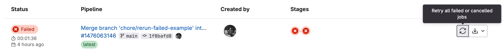

# Re-run Only Failed Tests

When a workflow fails in GitLab CI/CD you have the option to re-run the failed jobs. However, an additional setup is required for properly configuring Playwright for rerunning only the failed tests. See [Re-run Only Failed Tests](https://docs.currents.dev/guides/re-run-only-failed-tests) guide for details.

<figure><figcaption><p>Rerunning only the failed jobs on GitLab CI/CD</p></figcaption></figure>

#### Playwright Sharding

If you're using [Playwright Sharding](https://docs.currents.dev/guides/parallelization-guide/pw-parallelization/playwright-sharding) for running your tests in parallel, use [currents cache](https://docs.currents.dev/resources/reporters/currents-cmd/currents-cache) command to store the last run results and simplify re-run workflows.

Example workflows are available in our GitLab repositories:

* [reruns-pwc.yml](https://gitlab.com/currents.dev/gitlab-playwright-currents/-/blob/main/.gitlab/ci/with-reruns-pwc.yml?ref_type=heads) - re-run only failed tests on GitLab CI using 3 parallel runners and Playwright Shards + Currents `pwc` command
* [reruns-reporter.yml](https://gitlab.com/currents.dev/gitlab-playwright-currents/-/blob/main/.gitlab/ci/with-reruns-reporter.yml?ref_type=heads) - re-run only failed tests on GitLab CI using 3 parallel runners and Playwright Shards + Currents reporter in `playwright.config.ts`

<details>

<summary>Install the @currents/cmd package</summary>

```bash
npm i -D @currents/cmd
```

</details>

<details>

<summary>Add an after_script to upload the cache</summary>

Add an `after_script` to the end of your job that uploads run information to the cache

```yaml
after_script:
    # Save the last-run.json to cache after the run
    - npx currents cache set --pw-output-dir basic/test-results --preset last-run
```

See the [configuration for details](../../../resources/reporters/currents-cmd/#cache-test-artifacts) on the flags.

</details>

<details>

<summary>Add a download cache step to you script</summary>

Update your job script to download the cache prior to running tests

```yaml
script:
    - npm ci
    # Grab the last run from cache. CacheId is automatically calculated for GitLab, and a .currents_env file is created with extra env variables
    # $EXTRA_PW_FLAGS will contain the correct --shard flag, as well as --last-failed if this was a retried job
    # $RUN_ATTEMPT will be populated with a value 1+ based on how many times this job has been retried
    - npx currents cache get --preset last-run --continue
    - cat .currents_env >> $GITLAB_ENV && source .currents_env
    - npx playwright install
    # Run playwright, provide a build id with the run-attempt included and also pass $EXTRA_PW_FLAGS 
    - export CURRENTS_CI_BUILD_ID="reporter-$CI_PIPELINE_ID-$RUN_ATTEMPT"
    - npx playwright test -c playwright.config.reporter.ts $EXTRA_PW_FLAGS

```

See the [configuration for details](../../../resources/reporters/currents-cmd/#cache-test-artifacts) on the flags.

</details>

<details>

<summary>A full example</summary>


```yaml
test-rerun-reporter:
  image: mcr.microsoft.com/playwright:v1.47.0
  stage: test
  parallel: 3
  variables:
    CURRENTS_PROJECT_ID: bnsqNa
    # CURRENTS_RECORD_KEY: <set in your CI/CD variables>
  script:
    - npm ci
    # Grab the last run from cache. CacheId is automatically calculated for GitLab, and a .currents_env file is created with extra env variables
    # $EXTRA_PW_FLAGS will contain the correct --shard flag, as well as --last-failed if this was a retried job
    # $RUN_ATTEMPT will be populated with a value 1+ based on how many times this job has been retried
    - npx currents cache get --preset last-run --continue
    - cat .currents_env >> $GITLAB_ENV && source .currents_env
    - npx playwright install
    - cd ./basic
    # Run playwright, provide a build id with the run-attempt included and also pass $EXTRA_PW_FLAGS 
    - export CURRENTS_CI_BUILD_ID="reporter-$CI_PIPELINE_ID-$RUN_ATTEMPT"
    - npx playwright test -c playwright.config.reporter.ts $EXTRA_PW_FLAGS
  after_script:
    # Save the last-run.json to cache after the run
    - npx currents cache set --pw-output-dir basic/test-results --preset last-run

```


</details>

#### Currents Orchestration

In case you're using [playwright-orchestration.md](../../../guides/ci-optimization/playwright-orchestration.md "mention") for running your Playwright tests in parallel, use [currents-api.md](../../../resources/reporters/currents-cmd/currents-api.md "mention") command to fetch the results of the last run from the [Broken link](/broken/pages/EwuSYaqQeTFQaCaDrIzz "mention").

\
An example workflow is available in our GitLab demo repository

* [rerun-or8n.yml](https://gitlab.com/currents.dev/gitlab-playwright-currents/-/blob/main/.gitlab/ci/with-reruns-pwcp.yml?ref_type=heads) - rerun only failed tests on GitLab CI/CD with Currents Orchestration

<details>

<summary>Install the @currents/cmd package</summary>

```bash
npm i -D @currents/cmd
```

</details>

<details>

<summary>Set <code>CURRENTS_API_KEY</code> environment variable</summary>

Obtain an API key (see [Broken link](/broken/pages/yM3FI9oI5kJQSfe9LZCy "mention")) and [record-key.md](../../../guides/record-key.md "mention") from Currents Dashboard and set [GitLab CI/CD variable](https://docs.gitlab.com/ee/ci/variables/) accordingly

```yaml
variables:
    CURRENTS_PROJECT_ID: bnsqNa
    CURRENTS_RECORD_KEY: # set CI/CD variable
    CURRENTS_API_KEY: # set  CI/CD variable
```

</details>

<details>

<summary>Add an after_script to upload the cache</summary>

Add an `after_script` to the end of your job that uploads GitLab retry information to the cache

```yaml
after_script:
    # Save the last-run.json to cache after the run
    - npx currents cache set --pw-output-dir basic/test-results --preset last-run
```

See [currents-cache.md](../../../resources/reporters/currents-cmd/currents-cache.md "mention") documentation for all the available options

</details>

<details>

<summary>Add an api get-run step to you script</summary>

Update your job script to download the cache prior to running tests, and then also grab the previous run.


```yaml
script:
    - npm ci
    # Grab the last run from cache. CacheId is automatically calculated for GitLab, and a .currents_env file is created with extra env variables
    # $EXTRA_PWCP_FLAGS will contain the the --last-failed if this was a retried job
    # $RUN_ATTEMPT will be populated with a value 1+ based on how many times this job has been retried
    - npx currents cache get --preset last-run --continue
    - cat .currents_env >> $GITLAB_ENV && source .currents_env
    # Grab the complete last run from the API so orchestration can find all the failures
    - npx currents api get-run --branch=$CI_COMMIT_REF_NAME --pw-last-run --output=basic/test-results/.last-run.json || true
    - npx playwright install
    # Run pwc-p, provide a build id with the run-attempt included, and also pass EXTRA_PWCP_FLAGS
    - npx pwc-p --ci-build-id=or8n-$CI_PIPELINE_ID-$RUN_ATTEMPT $EXTRA_PWCP_FLAGS

```


See [currents-api.md](../../../resources/reporters/currents-cmd/currents-api.md "mention") documentation to explore all the available options

</details>

<details>

<summary>A full example</summary>


```yaml
test-rerun-pwcp:
  image: mcr.microsoft.com/playwright:v1.47.0
  stage: test
  parallel: 3
  variables:
    CURRENTS_PROJECT_ID: bnsqNa
    # CURRENTS_RECORD_KEY: <set in your CI/CD variables>
    # CURRENTS_API_KEY: <set in your CI/CD variables>
  script:
    - npm ci
    # Grab the last run from cache. CacheId is automatically calculated for GitLab, and a .currents_env file is created with extra env variables
    # $EXTRA_PWCP_FLAGS will contain the the --last-failed if this was a retried job
    # $RUN_ATTEMPT will be populated with a value 1+ based on how many times this job has been retried
    - npx currents cache get --preset last-run --continue
    - cat .currents_env >> $GITLAB_ENV && source .currents_env
    # Grab the complete last run from the API so orchestration can find all the failures
    - npx currents api get-run --branch=$CI_COMMIT_REF_NAME --pw-last-run --output=basic/test-results/.last-run.json || true
    - npx playwright install
    # Run pwc-p, provide a build id with the run-attempt included, and also pass EXTRA_PWCP_FLAGS
    - npx pwc-p --ci-build-id=or8n-$CI_PIPELINE_ID-$RUN_ATTEMPT $EXTRA_PWCP_FLAGS
  after_script:
    # Save the last-run to cache in order to track the run attempts
    - npx currents cache set --preset last-run --pw-output-dir basic/test-results


```


</details>
