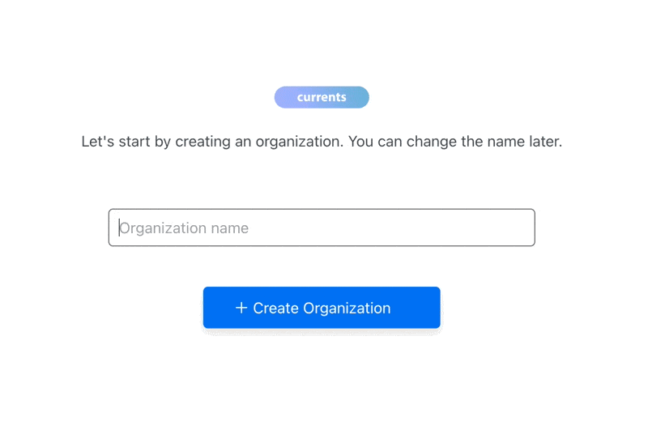

# Your First Vitest Run

Vitest doesn't have a dedicated Currents reporter. Instead, Vitest writes a JUnit XML report using its built-in `junit` reporter, and [currents-cmd](../../../resources/reporters/currents-cmd/ "mention") converts and uploads it to Currents.

## Prerequisites

<details>

<summary>Create an Organization and a Project</summary>

After signing up for the dashboard service, you will be prompted to create a new organization and a project. You can change their names later.



After creating a new organization and a project, you'll see on-screen instructions with your newly created **Project ID** and **Record Key.**

</details>

<details>

<summary>Install @currents/cmd package</summary>

```bash
npm install @currents/cmd --save-dev
```

</details>

<details>

<summary>Enable the JUnit reporter</summary>

**Option 1**: Update the Vitest configuration file:


```javascript
import { defineConfig } from "vitest/config";

export default defineConfig({
  test: {
    reporters: ["default", "junit"],
    outputFile: {
      junit: "./results.xml",
    },
  },
});
```


**Option 2**: Pass the reporter as an argument when executing Vitest.


```json
{
  ...
  "scripts": {
    ...
    "test": "vitest run --reporter=default --reporter=junit --outputFile.junit=./results.xml",
  },
  ...
}
```


See [Vitest reporters documentation](https://vitest.dev/guide/reporters#junit-reporter) for the full list of the JUnit reporter options.

</details>

<details>

<summary>Update your .gitignore</summary>

Add the converted reports directory and the JUnit XML file to your .gitignore to avoid pushing temporary generated reports to your repository.

```
.currents
results.xml
```

</details>

## Your First Vitest Run

#### Step 1: Run the tests

```sh
npx vitest run
```

Vitest saves the JUnit XML report at the location configured by `outputFile.junit` — `./results.xml` in the examples above.

#### Step 2: Convert the results

Run [currents-convert.md](../../../resources/reporters/currents-cmd/currents-convert.md "mention") to convert the JUnit XML report to a Currents-compatible format. Set `--framework-version` to the Vitest version you're running.

```sh
npx currents convert \
  --input-format=junit \
  --input-file=./results.xml \
  --output-dir=.currents \
  --framework=vitest \
  --framework-version=v3.2.4
```

#### Step 3: Upload the results

Run [currents-upload.md](../../../resources/reporters/currents-cmd/currents-upload.md "mention") to send the results to Currents dashboard.

```sh
npx currents upload --key=XXX --project-id=YYY
```

Set the [**Record Key**](../../../guides/record-key.md) and [**Project ID**](../../../dashboard/projects/project-settings.md) obtained from Currents dashboard in the previous step.

## Explore Your First Run

The execution results will show on the Currents dashboard. A link to the run is printed when the upload completes.

<figure><figcaption><p>A link to the recorded results</p></figcaption></figure>

## Good To Know

`vitest run` exits with a non-zero code when tests fail, which stops a CI job before the results are converted and uploaded. Run the conversion and upload steps unconditionally — see [vitest-github-actions.md](ci-setup/vitest-github-actions.md "mention") for an example.

## Example

Check out the [Vitest example](https://github.com/currents-dev/currents-junit-xml-example/tree/main/packages/vitest) in the JUnit XML example repository.
