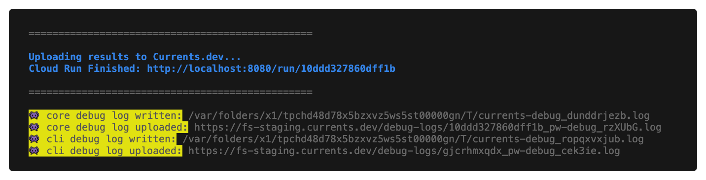

# Troubleshooting Playwright

If you are experiencing issues with using `@currents/playwright`,  enable debug mode to collect more information about the failure and submit a support request via our support channels.&#x20;


<mark style="color:yellow;">**TL;DR share the following information**</mark>

Collect environment information


* Package Versions
* Currents Run ID or Dashboard URL associated with the issue
* Screenshots or video recordings if applicable
* Full error message, including the stack trace, if available
* Full and relevant CI execution logs with sensitive information redacted
* CI pipeline configuration
  * The exact commands used during the execution
  * Relevant configuration of the CI setup stages

\
Collect and share the debug logs

* `npx pwc --pwc-debug=full ...` OR
* `npx pwc-p --pwc-debug=remote ...` OR
* `DEBUG=currents* playwright test ...`


### 1. Collecting Environment Information

Please collect the following information to help us effectively debug the problem:

* The associated dashboard Run URL
* Screenshots if applicable
* Your setup method and configuration files
* The exact command used to run playwright
* Environment information (use the command below)

Use the following command to print information about your CI environment

```bash
npx envinfo --system --binaries --browsers --npmPackages --duplicates --npmGlobalPackages
```

### 2. Activate Debug Mode


Capture and share the **full** debug log - that will help the support person identify the root cause faster


`@currents/playwright` simplifies collecting the debug information by automatically uploading the logs to Currents.&#x20;

To enable uploading the debug logs:

* For `pwc` command-line executable run `pwc --pwc-debug=full` OR
* For `pwc-p` run `pwc-p --pwc-debug=full` OR
* Set environment variable `DEBUG=currents* playwright test...`


`--pwc-debug`  enables uploading the debug logs to our servers (see [#pwc-debug-boolean-or-remote-or-full](../../resources/reporters/currents-playwright/pwc-p-orchestration.md#pwc-debug-boolean-or-remote-or-full "mention"):

* `remote` uploads the debug logs to Currents servers;
* `full` prints the logs to stdout and also upload them to Currents.


For example:



```
npx pwc --pwc-debug=full ... 
```



```
npx pwc-p --pwc-debug=full ... 
```



```
# on Linux
CURRENTS_PROJECT_ID=PROJECT_ID \ // the projectId from https://app.currents.dev
CURRENTS_RECORD_KEY=RECORD_KEY \ // the record key from https://app.currents.dev
CURRENTS_CI_BUILD_ID=hello-currents \ // a unique CI build ID
CURRENTS_DEBUG=full \
npx playwright test

# on Windows
## - set the environment variables first
cmd /V /C ^
set CURRENTS_DEBUG=full ^
set CURRENTS_PROJECT_ID=project_id&& ^
set CURRENTS_RECORD_KEY=record_key&& ^
set CURRENTS_CI_BUILD_ID=unique_build_id

## - the run the command
npx playwright test ...
```



When enabled, the debug logs will be uploaded to Currents servers and a confirmation message will be shown after the run's completion, for example:

<figure><figcaption><p>Remote debug logs notification example</p></figcaption></figure>

