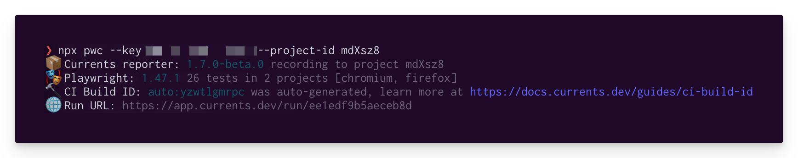

# Your First Playwright Run

Integrate Currents with Playwright to enable recording test results together with screenshots, videos, and traces, unlocking more effective troubleshooting, analytics and proactive monitoring. Automate your team's workflows using REST API, WebHooks and built-in integration with Slack, GitHub, and more.&#x20;

## **Overview**


Setting Up Playwright in 2 minutes


Here's an overview of what steps you'll need to take to start running Playwright tests using the Currents dashboard and a CI:

1. Create an organization and a project
2. Install `@currents/playwright` npm package
3. Enable traces, videos and screenshots in `playwright.config.js|ts` to enhance the dashboard test results
4. Run the tests using `pwc` CLI command or by configuring an extra reporter

## Prerequisites

<details>

<summary>Create an Organization and a Project</summary>

After signing up for the dashboard service, you will be prompted to create a new organization and a project. You can change their names later.


After creating a new organization and a project, you'll see on-screen instructions with your newly created **Project ID** and **Record Key.**&#x20;

Select Playwright from the framework selection list and then choose the preferred installation method (see below).

</details>

<details>

<summary>Install @currents/playwright package</summary>

```bash
npm i -D @currents/playwright
```

</details>

<details>

<summary>Enable traces, videos and screenshots (Recommended)</summary>

Enable traces, videos and screenshots in `playwright.config.js|ts` to enhance the dashboard test results.

```javascript
use: {
    // ...
    trace: "on",
    video: "on",
    screenshot: "on",
}
```


</details>

## Create your first Playwright run&#x20;

There are two ways to integrate Currents to your Playwright project. You can use our CLI, or integrate using reporter configuration.

### Using the CLI

`@currents/playwright` provides an executable script named `pwc` - it runs `playwright` with a predefined configuration.&#x20;

Run `pwc` to create your first Playwright run in Currents dashboard - use the **Record Key**, and **Project ID** obtained in the previous step.&#x20;

```
npx pwc --key RECORD_KEY --project-id PROJECT_ID
```

Explore [@currents/playwright](../../resources/reporters/currents-playwright/) npm package documentation for configuration options.

### Using reporter configuration

Add `@currents/playwright` reporter to `playwright.config.js|ts`

Explicitly add the reporter to Playwright configuration:

```typescript
import { defineConfig, devices } from "@playwright/test";
import { 
  CurrentsConfig, 
  CurrentsFixtures, 
  CurrentsWorkerFixtures,
  currentsReporter 
} from "@currents/playwright";

const currentsConfig: CurrentsConfig = {
  recordKey: "secret record key", // 📖 https://currents.dev/readme/guides/record-key
  projectId: "project id", // get one at https://app.currents.dev
};

const config = defineConfig<CurrentsFixtures, CurrentsWorkerFixtures>({
  use: {
    trace: "on",
    video: "on",
    screenshot: "on",
  },
  
  reporter: [currentsReporter(currentsConfig)], // 👈🏻 add Currents reporter

  projects: [
    {
      name: "chromium",
      retries: 2,
      use: {
        ...devices["Desktop Chrome"],
      },
    },
  ],

});

export default config;
```

You can also set environment variables to provide the configuration options to Currents reporter:



```javascript
CURRENTS_PROJECT_ID=PROJECT_ID \ // the projectId from https://app.currents.dev
CURRENTS_RECORD_KEY=RECORD_KEY \ // the record key from https://app.currents.dev
CURRENTS_CI_BUILD_ID=hello-currents \
npx playwright test
```



```typescript
cmd /V /C "set CURRENTS_PROJECT_ID=PROJECT_ID // the projectId from https://app.currents.dev
&& set CURRENTS_RECORD_KEY=RECORD_KEY // the record key from https://app.currents.dev
&& set CURRENTS_CI_BUILD_ID=hello-currents 
&& npx playwright test"
```



With the reporter configured, you can run `npx playwright test` to start sending the results to Currents dashboard.

## Explore the Newly Created Run

The execution results will show on the Currents dashboard. Additionally, a link to the recorded run will also be available at the end of the execution:

<figure><figcaption><p>Execution details of Playwright reporting for Currents</p></figcaption></figure>

## Explore

Learn more about our platform features - setup the CI environment, integrations, coverage reports, classify and manage your tests with Playwright tags, add metadata using annotoations and much more.

<table data-view="cards"><thead><tr><th></th><th></th><th></th><th data-hidden data-card-target data-type="content-ref"></th></tr></thead><tbody><tr><td>Setup CI</td><td></td><td></td><td><a href="../ci-setup/">ci-setup</a></td></tr><tr><td>Speed Up CI</td><td></td><td></td><td><a href="../../guides/parallelization-guide/pw-parallelization/">pw-parallelization</a></td></tr><tr><td>Playwright Tags</td><td></td><td></td><td><a href="../../guides/playwright-tags.md">playwright-tags.md</a></td></tr><tr><td>Playwright Annotations</td><td></td><td></td><td><a href="../../guides/playwright-annotations.md">playwright-annotations.md</a></td></tr><tr><td>Coverage Reports</td><td></td><td></td><td><a href="../../guides/coverage/">coverage</a></td></tr><tr><td>Integrations</td><td></td><td></td><td><a href="../../resources/integrations/">integrations</a></td></tr><tr><td>Test Status</td><td></td><td></td><td><a href="../../dashboard/tests/test-status.md">test-status.md</a></td></tr><tr><td>Insights and Analytics</td><td></td><td></td><td><a href="../../insights-and-analytics.md">insights-and-analytics.md</a></td></tr><tr><td>Run Details</td><td></td><td></td><td><a href="../../dashboard/runs/run-details.md">run-details.md</a></td></tr></tbody></table>

