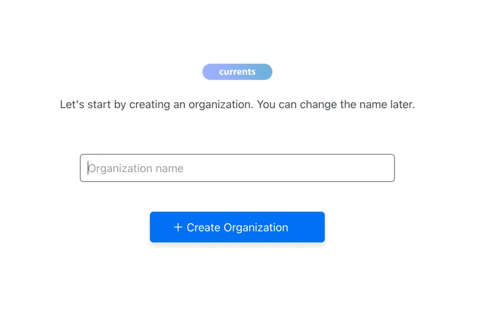

# Your First Playwright Run

Integrate Currents with Playwright to enable recording test results together with screenshots, videos, and traces, unlocking more effective troubleshooting, analytics and proactive monitoring. Automate your team's workflows using REST API, WebHooks and built-in integration with Slack, GitHub, and more.&#x20;


## **Overview**

1. Create an organization and a project at&#x20;
2. Install `@currents/playwright` npm package
3. Create Currents configuration file `currents.config.ts`
4. Enable traces, videos and screenshots in `playwright.config.js|ts`&#x20;
5. Run  `pwc` CLI command OR by configuring an extra reporter


## Prerequisites

<details>

<summary>Create an Organization and a Project</summary>

After signing up for the dashboard service, you will be prompted to create a new organization and a project. You can change their names later.



After creating a new organization and a project, you'll see on-screen instructions with your newly created **Project ID** and **Record Key.**&#x20;

Select Playwright from the framework selection list and then choose the preferred installation method (see below).

</details>

<details>

<summary>Install @currents/playwright package</summary>

```bash
npm i -D @currents/playwright
```

</details>

<details>

<summary>Create <code>currents.config.ts</code></summary>

Create `currents.config.ts` ( or `.mjs` / `.js` )

```typescript
import { CurrentsConfig } from "@currents/playwright";

const config: CurrentsConfig = {
  recordKey: process.env.CURRENTS_RECORD_KEY || "your-record-key",
  projectId: process.env.CURRENTS_PROJECT_ID || "currents-project-id"
};

export default config;
```

</details>

<details>

<summary>Enable traces, videos and screenshots (recommended)</summary>

Enable traces, videos and screenshots in `playwright.config.ts`&#x20;

```javascript
use: {
    // ...
    trace: "on",
    video: "on",
    screenshot: "on",
}
```


</details>


## Create Your First Playwright Run

Choose one of the following methods:

* Run `pwc` command
* Manually add Currents reporter


### Run `pwc` command

`pwc` is a lightweight command-line executable included in `@currents/playwright` npm package — it runs `playwright` with a predefined configuration.&#x20;

```
npx pwc
```

* `pwc` reads the configuration from `currents.config.ts` file. See additional configuration options [configuration.md](../../resources/reporters/currents-playwright/configuration.md "mention").
* `pwc` injects Currents reporter into Playwright configuration.
* You can also provide CLI configuration parameters, e.g.
  * `npx pwc --key RECORD_KEY --project-id PROJECT_ID`


### Manually Add Currents Reporter

You can manually add Currents reporter to `playwright.config.ts` and keep using `playwright test` command.&#x20;

```typescript
// playwright.config.ts
import { defineConfig, devices, PlaywrightTestConfig } from "@playwright/test";
import { currentsReporter } from "@currents/playwright";

export default defineConfig({
  // ...
  reporter: [currentsReporter()], // 👈🏻 add Currents reporter
})
```

* Run `npx playwright test` to start sending the results to Currents dashboard.
* The reporter reads the configuration from `currents.config.ts` file. See [currents-playwright](../../resources/reporters/currents-playwright/ "mention") for more configuration options.


## Explore the Newly Created Run

🎉 Hooray! As your tests run, the results are being streamed in real-time to Currents.

<figure><figcaption><p>Example of a newly created run</p></figcaption></figure>

You can see the run details in the dashboard. A link to the recorded run will also be available at the end of the execution:

```
> npx pwc --key XXX --project-id YYY

📦 Currents reporter: 1.12.0 recording to project WlKqJ0
🎭 Playwright: 1.52.0 5 tests in 1 project [chromium]
🔨 CI Build ID: auto:tzwgltasm
🌐 Run URL: https://app.currents.dev/run/cfc7ab8fcaaz10157

================================================================
```


## Next Steps

Finalize your setup — enable Currents in CI:

* Get familiar with [ci-build-id.md](../../guides/ci-build-id.md "mention")
* Setup Currents on CI — [ci-setup](../ci-setup/ "mention")
* Explore [currents-playwright](../../resources/reporters/currents-playwright/ "mention") configuration and options


Learn more about Currents:

* Enable [integrations](../../resources/integrations/ "mention") with [slack.md](../../resources/integrations/slack.md "mention"), [github](../../resources/integrations/github/ "mention"), [gitlab.md](../../resources/integrations/gitlab.md "mention") and more
* Speed up your CI by exploring [ci-optimization](../../guides/ci-optimization/ "mention") guides
* Customize the reporting with [playwright-tags.md](../../guides/playwright-tags.md "mention")
* Assign test ownership and personal notifications with [playwright-annotations.md](../../guides/playwright-annotations.md "mention")
* Replace your ad-hoc scripts with [actions.md](../../guides/currents-actions/reference/actions.md "mention")

<table data-view="cards"><thead><tr><th></th><th></th><th></th><th data-hidden data-card-target data-type="content-ref"></th></tr></thead><tbody><tr><td>Setup Currents in CI</td><td></td><td></td><td><a href="../ci-setup/">ci-setup</a></td></tr><tr><td>Optimize CI</td><td></td><td></td><td><a href="../../guides/ci-optimization/">ci-optimization</a></td></tr><tr><td>Playwright Tags</td><td></td><td></td><td><a href="../../guides/playwright-tags.md">playwright-tags.md</a></td></tr><tr><td>Playwright Annotations</td><td></td><td></td><td><a href="../../guides/playwright-annotations.md">playwright-annotations.md</a></td></tr><tr><td>Currents Actions</td><td></td><td></td><td><a href="../../guides/currents-actions/reference/actions.md">actions.md</a></td></tr><tr><td>Integrations</td><td></td><td></td><td><a href="../../resources/integrations/">integrations</a></td></tr></tbody></table>

