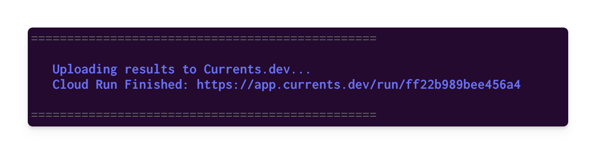

# Your First Playwright Run

Integrating Currents with Playwright enables recording test results together with screenshots, videos, and traces to the cloud dashboard. That unlocks more effective troubleshooting, analytics and proactive monitoring, extending your team's workflows using REST API, WebHooks and built-in integration with Slack, GitHub etc.


The Playwright integration is in public beta mode. Some functionality is limited and not all aspects are fully documented.


## **Playwright tests using a Continuous Integration (CI)**

Here's an overview of what steps you'll need to take to start running Playwright tests using the Currents dashboard and a CI:

* Create an organization and a project
* Install `@currents/playwright` npm package
* Enable traces, videos and screenshots in `playwright.config.js|ts` to enhance the dashboard test results
* Run the tests using `pwc` CLI command or by configuring an extra reporter
* Update your CI provider configuration

### Create an Organization and a Project

After signing up for the dashboard service, you will be prompted to create a new organization and a project. You can change the name later.


After creating a new organization and a project, you'll see on-screen instructions with your newly created  `projectId` and record key. Selec.t Playwright from the framework selection list and then choose the preferred installation method (see below)

### Install `@currents/playwright` package

```bash
npm i -D @currents/playwright
```

### Update `playwright.config.js|ts`

Enabled traces, videos and screenshots in `playwright.config.js|ts` to enhance the dashboard test results.

```javascript
use: {
    // ...
    trace: "on",
    video: "on",
    screenshot: "on",
  }
```

### Create your first Playwright run&#x20;

`@currents/playwright` provides an executable script named `pwc` - it runs `playwright` with a predefined configuration. Alternatively, you can add `@currents/playwright` reporter to Playwright configuration file.&#x20;

#### Using `pwc` CLI command

Run `pwc` to create your first Playwright run in Currents dashboard. Set the record key, and project id obtained from Currents dashboard in the previous step. Learn more about [CI Build ID](../guides/cypress-ci-build-id.md).

```
npx pwc --key RECORD_KEY --project-id PROJECT_ID --ci-build-id hello-currents
```

#### Manually configuring `@currents/playwright` reporter

Alternatively, you can manually add the reporter to Playwright configuration:

```javascript
reporter: [
  // ... other reporters, if exist
  ["@currents/playwright"],
]
```

Preset environment variables&#x20;



```javascript
CURRENTS_PROJECT_ID=PROJECT_ID \ // the projectId from https://app.currents.dev
CURRENTS_RECORD_KEY=RECORD_KEY \ // the record key from https://app.currents.dev
CURRENTS_CI_BUILD_ID=hello-currents \
npx playwright test
```



```typescript
cmd /V /C "set CURRENTS_PROJECT_ID=PROJECT_ID // the projectId from https://app.currents.dev
&& set CURRENTS_RECORD_KEY=RECORD_KEY // the record key from https://app.currents.dev
&& set CURRENTS_CI_BUILD_ID=hello-currents 
&& npx playwright test"
```



With the reporter configured, you can run `npx playwright test` to start sending the results to Currents dashboard.

### Exploring Newly Created Run

A link to the newly generated run will appear at the end of the execution:

<figure><figcaption><p>A link the recorded results appearing at the end of Playwright execution</p></figcaption></figure>

### Update CI Provider Configuration

In order to collect results from multiple CI runners, please make sure that  `--ci-build-id` is **similar across parallel machines, but is unique for each build.**

Please reach out to our in-app support chat to get help with setting up the CI pipeline.

Currents support collecting results from parallel executions on multiple machines using the built-in [Playwright Sharding](https://playwright.dev/docs/test-parallel#shard-tests-between-multiple-machines). The results will be kept as a single dashboard run as long as they share the same CI build ID.

Check out the example for popular CI providers below, more examples for different providers will be added in future.

#### GitHub Actions setup example

Check out the example repository for integrating with GitHub Actions: [https://github.com/currents-dev/playwright-gh-actions-demo](https://github.com/currents-dev/playwright-gh-actions-demo). Here’s a quick reference to configuration files:

* [test-basic-pwc.yml](https://github.com/currents-dev/playwright-gh-actions-demo/blob/main/.github/workflows/test-basic-pwc.yml) - using `pwc` executable script
* [test-basic-reporter.yml](https://github.com/currents-dev/playwright-gh-actions-demo/blob/main/.github/workflows/test-basic-reporter.yml) - using `reporter` configuration

### Good To Know

#### Screenshots

By default, Playwright only captures screenshots at the end of a test, according to the provided [screenshot](https://playwright.dev/docs/screenshots) option. Manually created screenshots are hidden by default and won't be attached to any test.

To send screenshots to Currents, they have to be attached to the test. For example, you can attach a screenshot to a test like this

```jsx
const { test, expect } = require("@playwright/test");

test("basic test", async ({ page }, testInfo) => {
  await page.goto("<https://playwright.dev>");
  const screenshot = await page.screenshot();
  await testInfo.attach("screenshot", {
    body: screenshot,
    contentType: "image/png",
  });
});
```

For more information see the Playwright [test info attachment](https://playwright.dev/docs/api/class-testinfo#test-info-attach) documentation.

#### Limitations

* We recommend using the native [Playwright Shards](https://playwright.dev/docs/test-parallel#shard-tests-between-multiple-machines) while we are working on other types of orchestration-related features.
* Reruns are not supported - rerunning with the same CI build ID would generate a warning and new results would not be uploaded. Please use a new CI build ID.
* Cross-machines auto-cancellation is not currently supported
* Full parallel mode and [parallelizing tests in a single file](https://playwright.dev/docs/test-parallel#parallelize-tests-in-a-single-file) are not currently supported
