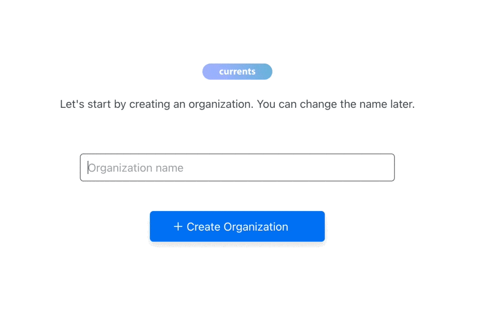
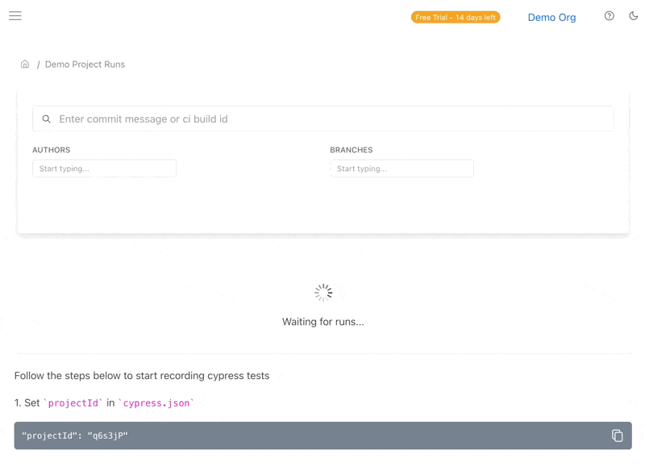

# Your First Cypress Run

Setting up Currents for running and recording cypress tests in parallel can be done seamlessly within a few minutes.

Here's an overview of what steps you'll need to take to start running cypress tests in parallel using the Currents dashboard:

* Create an organization and a project
* Install `cypress` and [`cypress-cloud`](https://github.com/currents-dev/cypress-cloud) npm packages
* Create a  new configuration file `currents.config.js` with the newly created `projectId` and a record key
* Update `cypress.config.js` to include the `cypress-cloud/plugin` plugin
* Use `cypress-cloud`  CLI command to create your cypress run
* Update your CI provider configuration

### Create New Organization and a Project

After signing up for the dashboard service, you will be prompted to create a new organization and a project. You can change the name later.



After creating a new organization and a project, you'll see on-screen instructions with your newly created  `projectId`

### Install `cypress` and `cypress-cloud`

```bash
npm install cypress cypress-cloud
```

### Create `currents.config.js`

Create a new configuration file and put it in your project's root folder:

```javascript
// currents.config.js
module.exports = {
  projectId: "Ij0RfK", // the projectId from https://app.currents.dev
  recordKey: "xxx", // the record key from https://app.currents.dev
};
```

### Install cypress-cloud plugin



```javascript
const { defineConfig } = require('cypress')
const { cloudPlugin } = require("cypress-cloud/plugin");

module.exports = defineConfig({
  // ...
  e2e: {
    setupNodeEvents(on, config) {
      return cloudPlugin(on, config);
    },
  }
})
```



```typescript
import { defineConfig } from 'cypress'
import { cloudPlugin } from 'cypress-cloud/plugin'
export default defineConfig({
  // ...
  e2e: {
    setupNodeEvents(on, config) {
      return cloudPlugin(on, config);
    },
  }
})
```



`cypress-cloud` requires cypress version 10.0.0+. Please refer to our [legacy integration](../integration-with-cypress/currents-cli.md) for the setup instructions&#x20;



### Create your first cypress run

Run `currents` command to create your first cypress run in Currents dashboard.

```
npx cypress-cloud run \
--parallel \
--record \
--key RECORD_KEY \
--ci-build-id hello-currents
```

Running this command will create a new run in Currents dashboard.




Learn more about

* [Integration with Cypress](../integration-with-cypress/integrating-with-cypress.md)
* [Record Key](../guides/record-key.md)
* [CI Build ID](../guides/ci-build-id.md)


### Update your CI provider configuration <a href="#update-your-ci-provider-configuration" id="update-your-ci-provider-configuration"></a>

To unlock the full power of Currents dashboard, update your CI provider configuration to use Currents for running your cypress tests in parallel. Please read our [Parallelization Guide](https://currents.dev/readme/guides/parallelization) and check out few [CI Setup examples](https://currents.dev/readme/ci-setup) for popular CI tools.\
\


###
